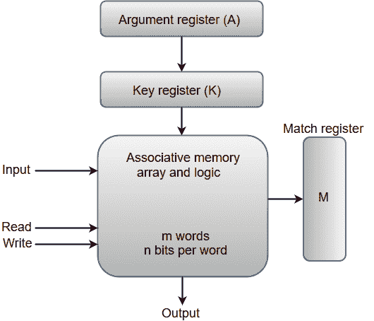
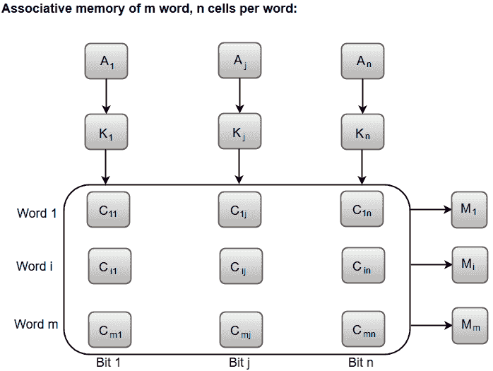

# 相联存储器

> 原文：<https://www.javatpoint.com/coa-associative-memory>

关联存储器可以被认为是一种存储单元，其存储的数据可以通过数据本身的内容而不是通过地址或存储位置来识别以供访问。

联想存储器通常被称为**内容可寻址存储器(CAM)** 。

当在关联存储器上执行写操作时，没有地址或存储位置给字。存储器本身能够找到一个空的未使用的位置来存储单词。

另一方面，当要从关联存储器中读取单词时，指定单词的内容或单词的一部分。与指定内容匹配的单词由存储器定位，并标记为可读。

下图显示了关联存储器的块表示。

从框图中，我们可以说一个关联存储器由一个存储器阵列和每个字有 n 位的 m 字逻辑组成。

像变元寄存器 **A** 和键寄存器 **K** 这样的功能寄存器都有 **n** 位，一个字的每个位一个。匹配寄存器 **M** 由 **m** 位组成，每个存储字一位。

保存在存储器中的字与自变量寄存器的内容并行比较。

密钥寄存器(K)为选择自变量字中的特定字段或密钥提供了一个掩码。如果密钥寄存器包含所有 1 的二进制值，则整个参数与每个存储字进行比较。否则，只比较参数中那些在密钥寄存器的相应位置有 1 的位。因此，密钥提供了一个掩码，用于识别一条指定如何引用存储器的信息。

下图可以表示存储器阵列和关联存储器中的外部寄存器之间的关系。

内存阵列中的单元由两个下标的字母 C 标记。第一个下标给出单词编号，第二个下标指定单词中的位位置。例如，单元格 C ij 是单词 **i** 中位 **j** 的单元格。

参数寄存器中的位 A j 与数组的列 **j** 中的所有位进行比较，前提是 K j = 1。对所有列 **j** = 1，2，3 进行该过程......，n。

如果参数的所有未屏蔽位与字 **i** 中的位匹配，则匹配寄存器中相应的位 M i 设置为 1。如果参数的一个或多个未屏蔽位与单词不匹配，M i 被清 0。