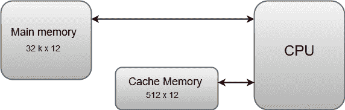

# 高速缓冲存储器

> 原文：<https://www.javatpoint.com/coa-cache-memory>

中央处理器经常使用的主存储器的数据或内容存储在高速缓冲存储器中，以便处理器可以在更短的时间内轻松访问这些数据。每当中央处理器需要访问内存时，它首先检查缓存内存。如果在高速缓冲存储器中没有找到数据，则中央处理器移动到主存储器中。

高速缓冲存储器位于中央处理器和主存储器之间。高速缓冲存储器的框图可以表示为:

缓存是内存层次结构中速度最快的组件，接近 CPU 组件的速度。

高速缓冲存储器的基本操作如下:

*   当中央处理器需要访问内存时，会检查缓存。如果在高速缓存中找到该字，则从快速存储器中读取该字。
*   如果在高速缓存中没有找到由中央处理器寻址的字，则访问主存储器来读取该字。
*   一个刚刚被访问的字块然后从主存储器转移到高速缓冲存储器。块大小可以从一个字(刚访问的那个)变化到与刚访问的那个相邻的大约 16 个字。
*   高速缓冲存储器的性能经常用一个称为**命中率**的量来衡量。
*   当 CPU 引用内存并在缓存中找到该字时，据说会产生**命中**。
*   如果在高速缓存中没有找到该字，则该字在主存储器中，并计为**未命中**。
*   命中数除以总的 CPU 对内存的引用(命中加上未命中)的比率就是命中率。