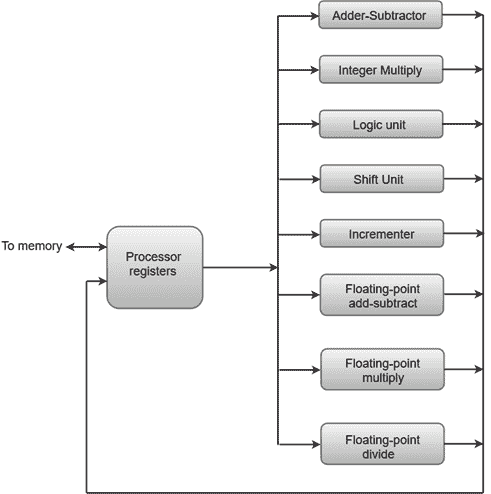

# 并行处理

> 原文：<https://www.javatpoint.com/parallel-processing>

并行处理可以描述为一类技术，它使系统能够同时完成数据处理任务，以提高计算机系统的计算速度。

并行处理系统可以同时进行数据处理，以获得更快的执行时间。例如，当一条指令在中央处理器的算术逻辑单元组件中处理时，下一条指令可以从内存中读取。

并行处理的主要目的是增强计算机的处理能力并增加其吞吐量，即在给定的时间间隔内可以完成的处理量。

并行处理系统可以通过具有同时执行相同或不同操作的多个功能单元来实现。数据可以分布在不同的多个功能单元中。

下图显示了将执行单元分成并行运行的八个功能单元的一种可能方式。

如果图表:

*   加法器和整数乘法器用整数执行算术运算。
*   浮点运算被分成三个并行操作的电路。
*   逻辑、移位和增量操作可以在不同的数据上同时执行。所有单位都是相互独立的，因此一个数字可以移动，而另一个数字可以递增。