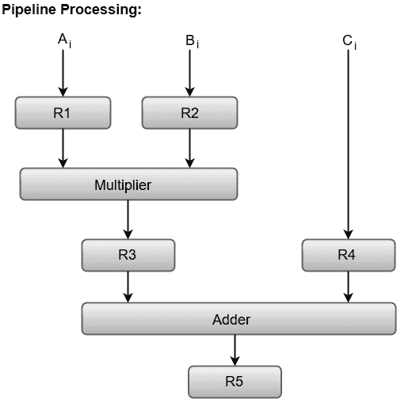

# 管道铺设

> 原文：<https://www.javatpoint.com/pipelining>

术语“流水线”指的是一种将顺序过程分解成子操作的技术，每个子操作在一个专用段中执行，该段与所有其他段同时操作。

流水线技术最重要的特点是几个计算可以同时在不同的段中进行。通过将寄存器与流水线中的每个段相关联，使得计算的重叠成为可能。寄存器在每个段之间提供隔离，以便每个段可以同时处理不同的数据。

流水线结构的结构可以简单地表示为每个段包括一个输入寄存器，后跟一个组合电路。

让我们考虑一个组合乘法和加法运算的例子，以更好地理解流水线组织。

乘法和加法的组合运算是通过一系列数字完成的，例如:

```
     Ai* Bi + Ci for i = 1, 2, 3, ......., 7

```

要对数字执行的操作被分解为子操作，每个子操作在流水线内的一个段中实现。

在流水线的每个段中执行的子操作被定义为:

```
R1  ← Ai,  R2 ← Bi		Input Ai, and Bi
R3 ← R1 * R2, R4 ← Ci	    Multiply, and input Ci
R5 ← R3 + R4			Add   Ci to product

```

下面的框图表示在流水线的每个部分中执行的组合操作和子操作。



寄存器 R1、R2、R3 和 R4 保存数据，组合电路在特定的段中运行。

由给定段中的组合电路产生的输出被用作下一段的输入寄存器。例如，从框图中，我们可以看到寄存器 R3 被用作组合加法器电路的输入寄存器之一。

一般来说，管道组织适用于计算机设计的两个领域，包括:

1.  [算术流水线](arithmetic-pipeline)
2.  [指令流水线](instruction-pipeline)

我们将在后面的章节中讨论它们。