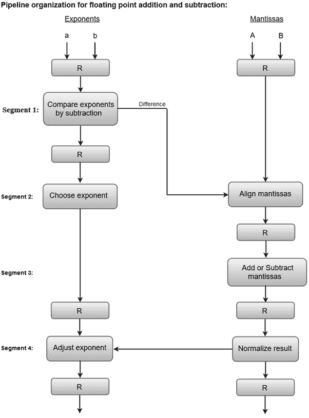

# 算术流水线

> 原文：<https://www.javatpoint.com/arithmetic-pipeline>

算术流水线主要用于高速计算机。它们用于实现浮点运算、定点数乘法以及科学问题中遇到的类似计算。

为了更方便地理解算术流水线的概念，让我们考虑一个浮点加法和减法流水线单元的例子。

浮点加法器流水线的输入是两个归一化的浮点二进制数，定义如下:

```
    X = A * 2a = 0.9504 * 103
    Y = B * 2b = 0.8200 * 102

```

其中 **A** 和 **B** 是代表尾数的两个分数， **a** 和 **b** 是指数。

浮点加减法的组合运算分为四段。每个段包含要在给定管道中执行的相应子操作。四个部分中显示的子操作是:

1.  用减法比较指数。
2.  对齐尾数。
3.  增加或减少尾数。
4.  将结果标准化。

我们将在本节后面更详细地讨论每个子操作。

下面的方框图表示在管道的每个段中执行的子操作。



#### 注意:寄存器位于每个子操作之后，用于存储中间结果。

### 1.通过减法比较指数:

通过减去指数来比较它们的差异。选择较大的指数作为结果的指数。

指数的差，即 **3** - **2** = **1** 决定了与较小指数相关的尾数必须向右移动多少次。

### 2.对齐尾数:

与较小指数相关联的尾数根据在段一中确定的指数差而移动。

```
	X = 0.9504 *  103
	Y = 0.08200 * 103

```

### 3.添加支架:

这两个尾数在第三段相加。

```
Z = X + Y = 1.0324 * 103

```

### 4.标准化结果:

规范化后，结果写成:

```
Z = 0.1324 * 104

```