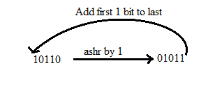

# 布斯乘法算法

> 原文：<https://www.javatpoint.com/booths-multiplication-algorithm-in-coa>

booth 算法是一种乘法算法，它允许我们将两个有符号的二进制整数分别乘以 2 的补码。它也用于加速乘法过程的性能。它也非常高效。它对乘法器中的字符串位 0 起作用，不需要额外的位，只需将乘法器位权重 2 k 中最右边的字符串位和一串 1 移动到权重 2 m ，该权重可被视为 **2 k+ 1 - 2 m** 。

以下是布斯算法的图示:

在上面的流程图中，最初， **AC** 和 **Q n + 1** 位被设置为 0，而 **SC** 是一个序列计数器，表示设置的总位 **n，**等于乘法器中的位数。有 **BR** 代表**被乘数位，**和 QR 代表**乘数位**。之后，我们遇到了乘法器的两个位为 Q n 和 Q n + 1 ，其中 Qn 表示 QR 的最后一位，Q n + 1 表示 Qn 的递增位为 1。假设乘法器的两位等于 10；这意味着我们必须从累加器 AC 中的部分乘积中减去乘数，然后执行算术移位操作(ashr)。如果两个乘数等于 01，意味着我们需要在累加器 AC 中对部分乘积进行被乘数的加法运算，然后进行算术移位运算( **ashr** )，包括 **Q n + 1** 。布斯算法中使用算术移位操作将交流和 QR 位向右移位 1，并保持交流中的符号位不变。并且连续递减序列计数器，直到重复计算循环，等于位数(n)。

### 致力于布斯算法

1.  将被乘数和乘数二进制位分别设置为 M 和 Q。
2.  最初，我们将交流和交流 n + 1 寄存器的值设置为 0。
3.  SC 代表乘数位数(Q)，它是一个连续递减的序列计数器，直到等于位数(n)或达到 0。
4.  一个 Qn 代表 Q 的最后一位，Q n+1 显示 Qn 的递增位为 1。
5.  在布斯算法的每个周期中，Q n 和 Q n + 1 位将在以下参数上进行检查:
    1.  当两位 Q n 和 Q n + 1 为 00 或 11 时，我们只需对部分积 AC 执行算术右移运算(ashr)。并且 Qn 和 Q n + 1 的位增加 1 位。
    2.  如果 Q n 和 Q n + 1 的位显示为 01，被乘数位(M)将被添加到 AC(累加器寄存器)中。之后，我们对交流和 QR 位执行右移操作 1。
    3.  如果 Q n 和 Q n + 1 的位显示为 10，被乘数位(M)将从 AC(累加器寄存器)中减去。之后，我们对交流和 QR 位执行右移操作 1。
6.  该操作持续工作，直到我们在 booth 算法中达到 n - 1 位。
7.  乘法二进制位的结果将存储在交流和快速响应寄存器中。

布斯算法中使用了两种方法:

### 1.右移位循环

它移动二进制数的最右位，然后将其添加到二进制位的开头。

### 2.右移算术

它将两个二进制位相加，然后将结果向右移动 1 位。

**示例** : 0100 + 0110 = > 1010，在加上二进制数后，将每一位向右移动 1，并将结果的第一位放在新位的开头。

**示例:使用布斯的乘法算法将两个数字 7 和 3 相乘。**

**Ans** 。这里有两个数字，7 和 3。首先，我们需要把 7 和 3 转换成像 7 = (0111)和 3 = (0011)这样的二进制数。现在将 7(二进制 0111)设置为被乘数(M)，将 3(二进制 0011)设置为乘数(Q)。而 SC(序列计数)代表位数，这里我们有 4 位，所以设置 SC = 4。此外，它还显示了布斯算法的迭代循环数，然后循环运行 SC = SC - 1 次。

| Q n | Q n + 1 | M = (0111)
M' + 1 = (1001) &运行 | 英亩 | Q | Q n + 1 | 南卡罗来纳州 |
| one | Zero | 最初的 | 0000 | 0011 | Zero | four |
|  |  | **减去**(M’+1) | One thousand and one |  |  |  |
|  |  |  | One thousand and one |  |  |  |
|  |  | 执行算术右移操作 | One thousand one hundred | One thousand and one | one | three |
| one | one | 执行算术右移操作 | One thousand one hundred and ten | 0100 | one | Two |
| **0** | **1** | 加法(A + M) | 0111 |  |  |  |
|  |  |  | 0101 | 0100 |  |  |
|  |  | 执行算术右移操作 | 0010 | One thousand and ten | Zero | one |
| Zero | Zero | 执行算术右移操作 | **0001** | **0101** | Zero | Zero |

布斯乘法算法的数值例子是 7×3 = 21，21 的二进制表示是 10101。这里，我们得到二进制 00010101 的结果。现在我们换算成十进制，为(000010101)10= 2 * 4+2 * 3+2 * 2+2 * 1+2 * 0 =>21。

**示例:使用布斯的乘法算法将两个数字 23 和-9 相乘。**

这里，M = 23 = (010111)和 Q = -9 = (110111)

| Q n Q n + 1 | M = 0 1 0 1 1
M '+1 = 1 0 1 0 1 | 英亩 | Q | Q n + 1 SC |
|  | 最初 | 000000 | One hundred and ten thousand one hundred and eleven | 0             6 |
| 1             0 | 减去 M | One hundred and one thousand and one |  |  |
|  |  | One hundred and one thousand and one |  |  |
|  | 执行算术右移操作 | One hundred and ten thousand one hundred | One hundred and eleven thousand and eleven | 1             5 |
| 1             1 | 执行算术右移操作 | One hundred and eleven thousand and ten | 011101 | 1             4 |
| 1             1 | 执行算术右移操作 | One hundred and eleven thousand one hundred and one | 001110 | 1             3 |
| 0              1 | 加法(A + M) | 010111 |  |  |
|  |  | 010100 |  |  |
|  | 执行算术右移操作 | 001010 | 000111 | 0             2 |
| 1             0 | 减去 M | One hundred and one thousand and one |  |  |
|  |  | One hundred and ten thousand and eleven |  |  |
|  | 执行算术右移操作 | One hundred and eleven thousand and one | One hundred thousand and eleven | 1             1 |
| 1             1 | 执行算术右移操作 | **111100** | **110001** | **1** 0 |

**Q n + 1** = 1，表示输出为负。

因此，23 *-9 = 111100110001 的 2 的补码=> **(00001100111)**

* * *