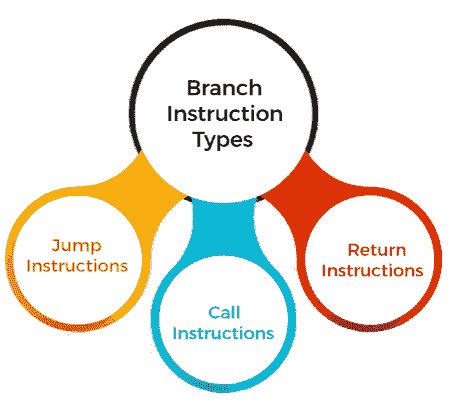
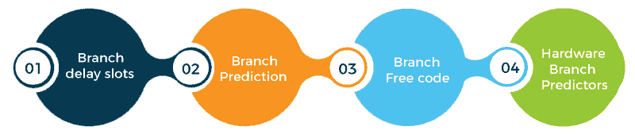

# 计算机组织中的分支指令

> 原文：<https://www.javatpoint.com/branch-instruction-in-computer-organization>

***分支*** 是计算机程序中的一条指令，它可以使计算机开始执行不同的指令序列，从而偏离其按顺序执行指令的默认行为。分支也可以指作为执行分支指令的结果将执行切换到不同指令序列的动作。分支指令用于在程序循环和条件中实现控制流(即，仅当满足某些条件时才执行特定的指令序列)。

分支指令可以是总是导致分支的 ***无条件分支*** ，也可以是根据某种条件可能导致分支也可能不导致分支的 ***条件分支*** 。此外，取决于它如何指定新指令序列的地址(目标地址)。

分支指令一般分为 ***直接、间接*** 或 ***相对*** 。它意味着指令包含目标地址，指定目标地址的位置(例如，寄存器或存储位置)，或者指定当前地址和目标地址之间的差异。分支指令以四种方式之一计算目标地址:

*   目标地址是常数和分支指令本身的地址之和。
*   目标地址是作为指令的操作数给出的绝对地址。
*   目标地址是在链接寄存器中找到的地址。
*   目标地址是计数寄存器中的地址。

使用前两种方法，可以在分支之前充分计算目标地址，以沿着目标路径预取指令。

使用第三和第四种方法，如果链接寄存器或计数寄存器在分支指令之前足够早地被加载，沿分支路径预取指令也是可能的。

### 分支指令的类型

计算机组织中有三种类型的分支指令:

**1。跳转说明**

跳转指令根据指定的标志将程序序列转移到操作数中给定的内存地址。跳转指令进一步分为两部分，无条件跳转指令和条件跳转指令。

*   **无条件跳转指令:**将程序序列转移到描述的内存地址。
*   **条件转移指令:**仅当条件满足时，将程序序列转移到所述存储器地址。

**2。通话说明**

调用指令将程序序列转移到操作数中给定的内存地址。在传送之前，CALL 之后的下一条指令的地址被推到堆栈上。调用指令也有两种:无条件调用指令和条件调用指令。

*   **无条件调用指令:**它将程序序列转移到操作数中给定的内存地址。
*   **条件调用指令:**只有满足条件，指令才会执行。

**3。退货说明**

返回指令将程序序列从子程序转移到调用程序。返回指令有两种类型:无条件跳转指令和条件跳转指令。

*   **无条件返回指令:**程序序列从子程序无条件转移到调用程序。
*   **条件返回指令:**只有满足条件，程序序列才会无条件地从子程序转移到调用程序。

### 分支指令的实现

从机械上讲，分支指令可以改变中央处理器的程序计数器。程序计数器存储要执行的下一条指令的存储器地址。因此，分支会导致中央处理器开始从不同的存储单元序列中获取指令。机器级分支指令有时被称为 ***跳转指令*** 。

1.  机器级跳转指令通常有无条件和有条件两种形式，根据某些条件，后者可以是*或 ***而不是*** 。通常，单向跳转有不同的形式，称为 ***跳转*** ，子程序调用称为 ***调用*** ，它自动将起始地址保存为堆栈上的返回地址，允许从代码中的多个位置调用单个子程序。

    *   当一个分支为 ***取*** 时，CPU 的程序计数器设置为跳转指令的参数。因此，下一条指令成为内存中该地址的指令。因此，控制流发生了变化。
    *   当一个分支是 ***不取*** 时，CPU 的程序计数器不变。因此，执行的下一条指令是分支指令之后的指令。因此，控制流程不变。* 
**   术语 ***分支*** 可以指高级语言和用机器代码或汇编语言编写的程序。
    *   在高级编程语言中，分支通常采用各种形式的条件语句的形式，这些条件语句封装了指令序列，如果条件得到满足，这些指令序列将被执行。
    *   无条件分支指令，如 GOTOare，用于无条件“跳转”到(开始执行)不同的指令序列。*   在带标志寄存器的中央处理器中，较早的指令在标志寄存器中设置一个条件。较早的指令可能是算术或逻辑。它通常靠近分支，尽管不一定是紧接在分支之前的指令*。

    *   然后在分支中使用存储的条件，如溢出标志设置 时的 ***跳转。***
    *   该临时信息通常存储在标志寄存器中，但也可以位于其他地方。
    *   在速度较慢、简单的计算机中，标志寄存器设计很简单。标志寄存器会对快速计算机的速度造成瓶颈，因为可以并行操作的指令需要以特定的顺序设置标志位。* **   也有机器或特定指令可以通过跳转指令本身检查条件，如 ***分支<标签>如果寄存器 X 为负*** 。在简单的计算机设计中，比较分支比标志寄存器分支执行更多的运算并使用更多的功率。
    *   计算机设计比较分支可以比标志寄存器分支运行得更快，因为比较分支可以更并行地访问寄存器，使用与计算相同的中央处理器机制。*   一些早期简单的中央处理器架构，仍然存在于微控制器中，可能不实现条件跳转，而是实现条件“跳过下一条指令”操作。因此，条件跳转或调用被实现为无条件跳转或调用指令的条件跳转。**

 **### 分支指令的处理

分支指令可以通过几种方式进行处理，以减少它们对指令执行速度的负面影响。

**1。分支延迟槽**

处理器在确定当前指令是否是分支指令之前获取下一条指令。当当前指令的执行完成，并且要进行分支时，处理器必须丢弃剩余的指令，并在分支目标处获取新的分支指令。分支指令之后的位置称为 ***分支延迟槽*** 。根据执行分支指令的时间，可能有多个分支延迟槽。

一种称为延迟分支的技术可以将条件分支指令导致的损失降至最低。延迟槽中的指令总是被取出。因此，无论分支机构是*还是 ***未被采取*** ，我们都愿意安排他们全面执行。目标是能够在这些槽中放置有用的指令。如果在延迟槽中没有有用的指令，这些槽必须用 NOP 指令填充。*

 ***2。分支预测**

分支预测采用统计数据，并使用结果来优化代码。程序员会编译一个程序的测试版本，并用测试数据运行它。

*   测试代码统计了如何获取分支。
*   然后，编译器使用测试代码的统计数据来优化发布代码的分支。优化将安排最快的分支方向(采用或不采用)总是最常采用的控制流路径。
*   为了实现这一点，中央处理器必须设计有可预测的分支时序。有些中央处理器的指令集设计有“分支提示”，这样编译器就可以告诉中央处理器如何处理每个分支。

软件分支预测的问题在于它需要复杂的软件开发过程。

**3。无分支代码**

有些逻辑可以不用分支或者用更少的分支来写。通常可以使用按位运算、条件移动或其他预测来代替分支。由于时序攻击，无分支代码是密码学的必备。

**4。硬件分支预测器**

为了运行任何软件，硬件分支预测器将统计数据转移到电子设备中。分支预测器是处理器中猜测条件分支结果的部分。然后，处理器的逻辑通过开始执行预期的指令流来赌这个猜测。

简单硬件分支预测方案的一个例子是假设所有后向分支(到较小的程序计数器)被采用(因为它们是循环的一部分)，而所有前向分支(到较大的程序计数器)不被采用(因为它们离开循环)。

更好的分支预测器是通过在各种测试程序上模拟运行来开发和统计验证的。好的预测器通常计算分支先前执行的结果。

* * ****