# 计算机组织中的外部存储器

> 原文：<https://www.javatpoint.com/external-memory-in-computer-organization>

**永久内存**也可以称为二级内存或后备存储器。它被用来存储大量的数据，因为它有巨大的容量。目前，它可以测量数百兆字节甚至千兆字节的数据。外部存储器的重要特性是，每当计算机关机时，存储的信息就不会丢失。外部存储器可分为四个部分:

1.  磁盘
2.  搜捕
3.  光存储器
4.  磁带

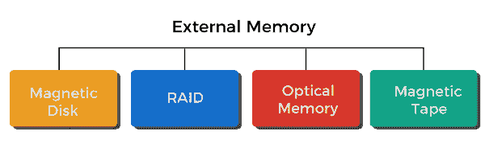

## 磁盘

磁盘是一种由非磁性材料构成的圆形盘，被称为**衬底。**上面覆盖着一层用来保存信息的磁性涂层。基底传统上由铝或铝合金材料构成。但是最近，另一种被称为**玻璃基板的材料被引入。**玻璃基板有多种好处，描述如下:

*   它能够通过改善磁性薄膜表面的均匀性来提高磁盘的可靠性。
*   它通过显著减少整体表面缺陷来减少读写错误。
*   它具有更好的刚度，这将有助于减少磁盘动态。它有很强的抵抗冲击和破坏的能力。

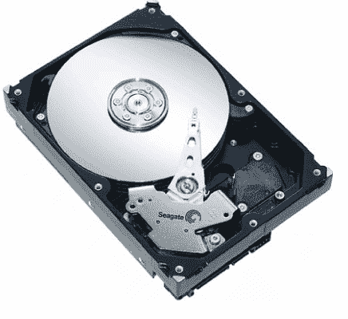

### 磁性读写存储器

外部存储器最重要的组成部分仍然是磁盘。许多系统，如超级计算机、个人计算机和大型机，都包含可移动和固定硬盘。我们可以传导一个名为**头**的线圈，这样我们就可以在稍后恢复数据，然后从磁盘中检索数据。很多系统都有两个磁头，分别是**读磁头**和**写磁头。**读写操作时，盘片旋转，磁头静止。

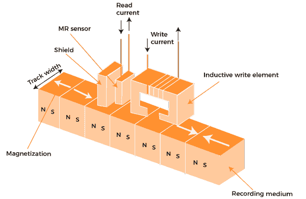

如果电流流经**线圈，****写入机构**将利用线圈会产生磁场的事实。写头将接收电脉冲，下表面将记录产生的磁图案。它将被记录为负电流和正电流的不同模式。如果电流流过**线圈，****读取机构**将利用它将在线圈中产生电流的事实。当磁盘表面经过磁头下方时，它会产生一个与已经记录的电流极性相同的电流。

在这种情况下，读写头的结构是一样的。因此，我们可以对两者使用相同的头。这些类型的单磁头可以用在旧的刚性磁盘系统和软盘系统中。一种部分屏蔽磁阻 **(MR)** 传感器包含在**读取头中。**电阻包含在磁共振材料中，这取决于在它下面移动的介质的磁化方向。

### 数据组织和格式化

磁头被认为是一个小型设备，它能够读取或写入在它下面旋转的盘片部分。每个轨道的宽度与磁头相同。我们每个表面有成千上万的轨迹。**间隙**用于显示相邻轨道的分离。这可以防止或最小化由于磁场干扰或磁头未对准而产生的误差。**扇区**用于在磁盘之间传输数据。

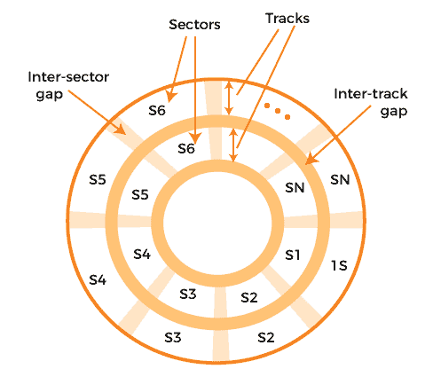

固定长度的扇区将用于 512 字节的最新系统，这几乎是一个通用的扇区大小。交叉间隙将相邻扇区分开，这样我们就可以避免对系统提出不合理的精度要求。以同样的速率，我们可以借助于以固定的速度旋转圆盘来扫描信息，这被称为**恒定角速度(CAV)。**

磁盘可以分为多种类型。因此，它可以分成一系列同心轨道和许多饼形扇区。CAV 的优势在于磁道和扇区能够在 CAV 的帮助下直接寻址数据。CAV 还有一个缺点，即存储在短的内部磁道和长的外部磁道上的数据量是相同的。

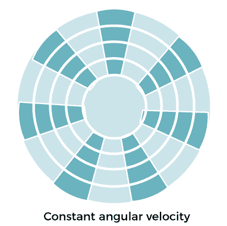

现代硬盘引入了一种增加密度的技术，称为**多区记录。**使用这种技术，表面能够分成许多同心区域，通常等于 16，这意味着 16 个区域。在一个区域内，每个磁道的位数是恒定的。与离中心较远的区域相比，离中心较近的区域具有较少的比特或扇区数量。

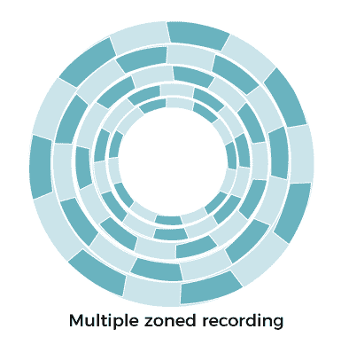

### 物理性质

如果有固定磁头磁盘，那么每个磁道将包含一个读写磁头。所有这些磁头都安装在一个刚性臂上，该臂能够延伸到所有磁道。如果有一个可移动的磁头磁盘，那么它将只包含一个读写磁头。这里，头部也安装在手臂上。头部可以位于任何轨道上方。由于这个目的，臂可以缩回或伸出。

磁盘驱动器始终或永久包含不可移动磁盘。比如在个人电脑中，**硬盘**永远无法取出，或者我们可以说它是**一个不可取出的磁盘。****可拆卸磁盘**是一种可以拆卸并更换为其他磁盘的磁盘。大部分磁盘的两面都有可磁化涂层，也称为双面。单面磁盘用于一些较便宜的磁盘系统。

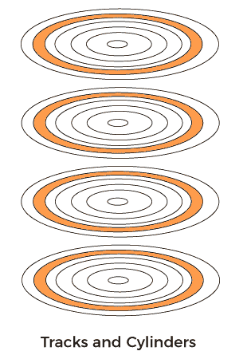

多个盘片采用可移动磁头，每个盘片表面有一个读写磁头。从磁盘的中心开始，所有的磁头都包含相同的距离，并一起移动，因为所有的磁头都是机械固定的。在拼盘中，位于相同相对位置的一组所有轨道将被称为**圆柱体。**

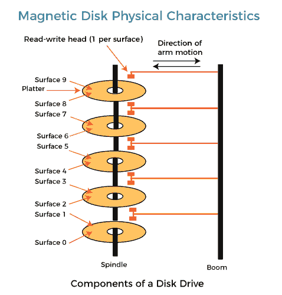

这种机制主要用于**软盘。**这种类型的磁盘最便宜，体积小，还包含一个灵活的拼盘。密封的驱动组件几乎没有污染物，它包含温彻斯特的头部。IBM 使用术语温彻斯特作为代号，它在 IBM 发布之前用于 3340 磁盘型号。工作站和个人电脑通常包含一个内置磁盘，被称为**温彻斯特磁盘。**这个磁盘也被称为**硬盘。**

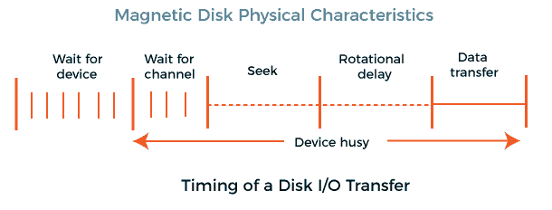

在可移动系统上，会有一个**寻道时间**，该时间可以定义为将磁头定位在磁道上所花费的时间。还会有**旋转延迟**或**旋转延迟**，这可以定义为从扇区开始到到达磁头所花费的时间。进入写入或读取位置所需的时间称为访问时间，等于旋转延迟和寻道时间(如果有)之和。

一旦磁头定位，当扇区在磁头下移动时，我们就能够执行读或写操作。这个过程可以称为操作的数据传输部分，传输数据所花费的时间将被称为**传输时间。**

## 袭击

磁盘阵列也被称为独立磁盘冗余阵列。它是一种数据虚拟化技术，用于将多个磁盘的组件组合成一个逻辑单元，以便它们可以提高性能或创建冗余。如果有多个磁盘/驱动器，它将允许使用各种技术，如磁盘镜像、奇偶校验和磁盘条带化。我们不能将 RAID 视为数据备份的替代品。如果 RAID 正在处理关键数据，它将被备份到一组逻辑磁盘或其他物理磁盘。当我们与 RAID 建立连接时，我们通常会使用以下术语:

**条带化:**在这种情况下，数据将在多个磁盘之间分割。

**镜像:**在这种情况下，数据将在多个磁盘之间镜像。

**奇偶校验:**也可以称为校验和。它可以描述为一个计算值，用于数学重建数据。

通常，磁盘阵列有 7 个级别。其中级别 0、1 和 3 用于高传输速率。级别 4、5 和 6 用于高交易率。所有级别的磁盘阵列描述如下:

### RAID 0

**RAID 0** 也可以称为**磁盘条带化。**在 RAID 0 技术中，数据被均匀地分成两个或两个以上的存储设备，如硬盘或 SDD。在这种技术中，我们将以用户可以更快地读取或写入文件的方式来组织数据。由于这个过程，性能会加快。如果我们有大量的应用程序和巨大的数据，最好的解决方案将是磁盘剥离。RAID 0 的设置非常简单。它也可以被称为最经济的冗余磁盘组织类型。

然而，这种类型的安排无法处理故障或错误，我们不能使用它来处理关键数据。这是因为它将第一个数据块写入第一个磁盘，将第二个数据块写入下一个磁盘，依此类推。这个过程将重复进行，直到它击中所有磁盘。最后，它将回到第一个磁盘。这意味着所有磁盘都是并行工作的，因此我们能够看到磁盘的全部性能。

不利的一面是，将没有冗余，这意味着如果任何磁盘**出现故障，**我们将丢失所有磁盘上的所有数据。因此，RAID 0 为我们提供了高性能和扩展存储，但与单个磁盘相比，它实际上不太可靠。

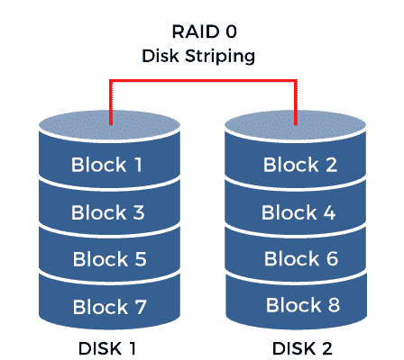

**RAID 0 的优势**

*   在读写操作中，它为我们提供了出色的性能。
*   不会有开销，因为 RAID 0 使用了所有的存储容量。
*   在 RAID 0 中，我们可以轻松实现该技术。

**RAID 0 的缺点**

*   RAID 0 不能用于关键系统，因为它不能容忍故障。
*   如果 RAID 0 中的一个磁盘出现故障，那么其他磁盘的所有数据也会丢失。

### RAID 1

**RAID 1** 也可以称为**镜像。**它将从一个磁盘中取出所有数据，然后将其写入第二个磁盘，该磁盘与第一个磁盘平行。在 RAID 1 中，冗余度非常高，因为每个磁盘都包含另一个磁盘上数据的精确拷贝。它至少需要**两个圆盘**才能工作。RAID 1 的设置提供了防止数据丢失的保护，或者我们可以说它具有容错能力。如果一个磁盘**出现故障，**则该磁盘的副本提供所需的数据。

在这里，系统可以同时从两个磁盘读取数据。由于这项功能，它还将能够加快性能和可用性。尽管如此，写操作的性能不受影响。与读取操作相比，它需要更多的时间，因为 RAID 1 包含两个并行写入的磁盘，写入操作使用一个磁盘的容量，并且它们必须两次写入相同的数据。在 RAID 1 中，磁盘的缺点是成本高，因为一个磁盘必须构建两倍于此级别实际需要的容量。

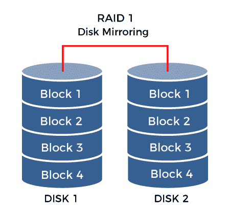

**RAID 1 的优势**

*   与单个磁盘相比，RAID 1 提供了出色的读写速度。
*   它具有容错能力。如果一个磁盘出现故障，我们不需要再次构建数据，我们只需将数据复制到替换磁盘中。
*   这是一项非常简单的技术，RAID 1 的实现也非常简单。

**RAID 1 的缺点**

*   在 RAID 1 中，数据必须写入两次。这就是为什么有效存储容量只有总磁盘容量的一半，这也是 RAID 1 的主要缺点。
*   与 RAID 0 相比，RAID 1 更昂贵，因为它需要两个磁盘来镜像数据。
*   软件 RAID 1 不总是允许故障磁盘的热交换。当我们关闭攻击故障磁盘的计算机时，故障磁盘只能被替换。
*   很多人同时使用服务器，这种断电过程可能不被他们接受。这就是为什么这些类型的系统通常使用硬件控制器，因为它们支持热插拔。

### RAID 2

**RAID 2** 也可以称为**位级剥离。**在 RAID 2 中，我们在磁盘上剥离位，而不是在磁盘上剥离块。在这个级别，我们需要两组磁盘。第一组磁盘将用于写入数据，第二组磁盘将用于写入纠错码。

在这一级，我们将使用**汉明纠错码** (ECC)，然后使用冗余磁盘来存储 ECC 码的信息。汉明码是一种线性纠错码，能够检测高达(d - 1)位的错误并纠正(d -1)/2 位的错误。其中 d 是一种码字类型，由所有对之间的最小汉明距离给出。如果 d 大于或等于发送和接收的位模式之间的汉明距离，只有这样可靠的通信才是可能的。相比之下，简单的奇偶校验码只能检测奇数个错误，并且不能纠正错误。

当我们将数据写入磁盘时，它会动态评估数据的纠错码。之后，它会将数据位剥离到数据磁盘，最后，它会将 ECC 代码写入冗余磁盘。当我们从磁盘读取数据时，它使用冗余磁盘来读取相应的 ECC 代码。现在它将验证数据是否一致。如果需要，它将在运行中执行适当的修正。

此过程使用许多磁盘。它将以各种磁盘配置进行配置。现在这一次，RAID 2 不再有用，因为它成本高，并且 RAID 2 在 RAID 控制器中的实现很困难。现在这个时候，ECC 也是多余的，因为硬盘本身就有能力做 ECC 的工作。

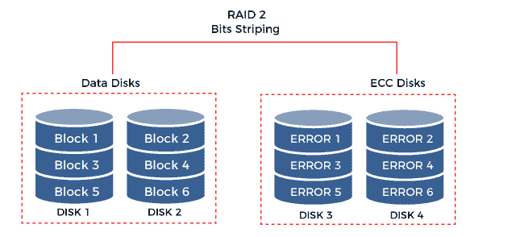

**RAID 2 的优势**

*   RAID 2 在纠错时使用汉明码。
*   它可以在一个指定驱动器的帮助下存储奇偶校验。

**RAID 2 的缺点**

*   RAID 2 需要额外的驱动器来进行错误检测。
*   它包含一个额外的驱动器。这就是为什么它很贵，而且结构复杂。

### RAID 3

**RAID 3** 也可以称为**字节级剥离。**RAID 3 的工作方式与 RAID 0 相同，都是使用字节级剥离，但在阵列中还需要一个额外的磁盘。RAID 3 用于支持奇偶校验码计算中的一种特殊类型的处理器，可以称为**‘奇偶校验磁盘’。**在 RAID 3 中，我们在磁盘上剥离字节，而不是在磁盘上剥离数据块。在这个级别，我们需要多个数据磁盘和一个专用磁盘，以便存储奇偶校验。在 RAID 3 的配置过程中，数据会被分成单独的字节，然后保存在磁盘上。对于每一行数据，将确定奇偶校验磁盘，之后，它将被保存在上述奇偶校验磁盘中。如果出现**故障，**有能力借助与之对应的**奇偶字节**以及剩余字节的适当计算来恢复数据。

虽然这个等级在实际中很少使用，但是它有很多**的好处**那就是如果排列中的盘面有任何损伤，它都可以抵抗。**其次，**阅读速度非常高。可惜的是，RAID 3 也有很多**的弊端。首先，**与读取速度相比，写入速度非常慢，因为需要计算校验和。(RAID 硬件控制器也无法解决这个问题)。**第二个问题**就是如果有任何磁盘**出现故障，**那么整个系统就会工作的非常慢。RAID 3 具有抗崩溃的能力，这意味着如果阵列中的任何磁盘出现故障，它将替换损坏的磁盘，但替换过程非常昂贵。**第三个问题**是我们用磁盘来计算校验和，这是整个阵列性能的瓶颈。

虽然以上描述，RAID 3 无法显示一个好的、可靠的和便宜的解决方案。这就是为什么 RAID 3 在实践中很少使用的原因。基于 RAID 3 的系统主要用于实现的目的，其中很大的文件被少数用户引用。

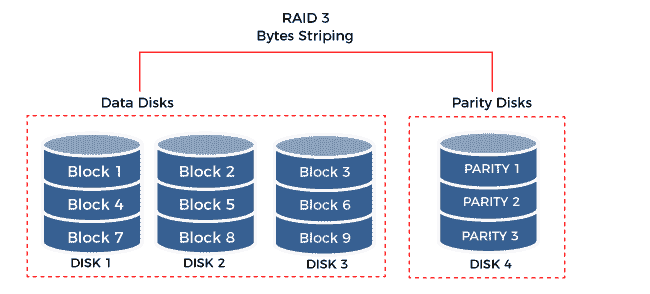

**RAID 3 的优势**

*   RAID 3 提供高吞吐量来传输巨大的数据。
*   它解决了 RAID 2 的主要缺点，这意味着它可以抵抗磁盘故障和崩溃。

**RAID 3 的缺点**

*   如果我们只需要传输一个小文件，配置可能会太多。
*   如果出现任何磁盘故障，将会显著降低吞吐量。

### RAID 4

**RAID 4** 可以称为**块级条带化。**RAID 4 的工作原理与 RAID 3 相同。它们之间的主要区别是共享数据的过程。它们分为 16、32、64 或 128 GB 等块。与 RAID 0 相同，它将被写入磁盘。对于每一行写入的数据，奇偶校验磁盘用于写入任何记录的数据块。这意味着该级别使用数据块级条带化来代替字节级条带化。RAID 5 和 RAID 4 有很多相似之处，但 RAID 4 将所有奇偶校验数据限制在一个磁盘上。所以我们可以说它不使用分配奇偶校验。

在 RAID 4 中，我们可以借助最少的**三个磁盘来完成实现和配置。** RAID 4 还需要硬件支持来执行奇偶校验计算。因此，我们能够借助适当的数学运算来恢复数据。

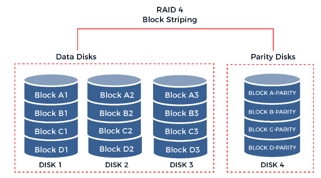

**RAID 4 的优势**

*   RAID 4 允许数据块级条带化，这为同时发送输入/输出请求提供了便利。
*   它提供了低存储开销。如果我们增加不同的磁盘，它会变得更低。
*   这个级别不需要同步控制器或主轴。

**RAID 4 的缺点**

*   它包含奇偶校验驱动器，这可能会导致瓶颈。
*   如果我们尝试同时执行写操作，操作将会变慢，因为奇偶校验信息被写入一个磁盘。

### RAID 5

**RAID 5** 可以称为**带奇偶剥离。**它使用块级进行数据分条，也使用分布式奇偶校验。RAID 5 至少需要三个磁盘，但最多可以工作 16 个磁盘。这是最安全的 RAID 级别。奇偶校验是一种原始二进制数据。RAID 系统计算奇偶校验值，并使用这些值创建奇偶校验块。如果 RAID 系统中的任何磁盘**出现故障**，它将使用奇偶校验块来恢复条带化数据。大多数具有奇偶校验功能的 RAID 系统使用阵列将奇偶校验块存储在磁盘中。在此级别，数据块跨驱动器分条。所有数据块的奇偶校验和只写入一个驱动器。奇偶校验校验和不使用固定驱动器，但它们分布在所有驱动器上。如果任何数据块的数据不再可用，在奇偶校验数据的帮助下，计算机可以重新计算数据。这意味着，如果存在任何单个驱动器**故障，** RAID 5 能够抵御阵列中任何磁盘的故障，而不会访问数据或丢失数据。

虽然我们可以在软件中使用 RAID 5，但是推荐的控制器是硬件控制器。这些控制器可以通过经常使用额外的高速缓存来提高写入性能。在这个级别中，RAID 0 的性能与 RAID 1 的冗余相结合，但在这个过程中，它需要大量的存储空间，大约是可用容量的三分之一。在阵列中，所有驱动器同时服务于写请求。这就是为什么这个级别会提高写入性能。但是写操作可能会影响整个磁盘的性能，因为如果对条带进行微小的更改，我们需要执行多个步骤并重新计算。

简而言之，我们可以说 RAID 5 提供了可靠性和高性能。它能够平衡读取和写入，并且是安全的。RAID 5 通过使用整个磁盘的空间来存储奇偶校验，它还减少了用户可以保存的数据总量。RAID 5 是一种出色的全能系统，用于提供出色的性能，并将高效存储与出色的安全性相结合。它主要用于包含有限数量数据驱动器的文件和应用服务器。

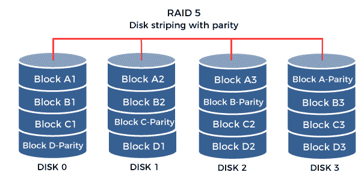

**RAID 5 的优势**

*   在 RAID 5 中，由于奇偶校验的计算，写数据事务很慢，而读数据事务非常快。
*   如果 RAID 5 中出现任何磁盘故障，无论故障驱动器是否被替换，以及数据是否由存储控制器在新磁盘上重建，我们仍然有能力访问所有数据。

**RAID 5 的缺点**

*   如果出现任何磁盘故障，都会影响吞吐量，但这个过程还是可以接受的。
*   RAID 5 是复杂的技术。假设在各种磁盘阵列中有一个 4TB 的磁盘，它出现了故障。在这种情况下，根据控制器的速度和阵列上的负载，替换和恢复故障磁盘的数据可能需要一天或更长时间。此时，如果任何磁盘出现故障，数据将永远丢失。

### RAID 6

**RAID 6** 也可以称为**双奇偶校验条带化。**RAID 5 的工作方式与 RAID 6 相同，两者的区别在于系统在 RAID 6 中的每张桌子上额外存储了一个奇偶校验块。因此，将启用一种配置，在阵列不可用之前，这两个磁盘可能会出现故障。它需要两组不同的奇偶校验计算，即使两个驱动器同时出现故障，它也能够重建阵列。RAID 6 至少需要四个磁盘，它可以承受两个磁盘同时死亡。这两个磁盘将用于数据，其余两个磁盘将用于奇偶校验信息。如果磁盘数量增加，将增加多次故障的机会，也增加了重建磁盘集的复杂性。

与 RAID 5 相比，它提供了更高的冗余度，并提高了读取性能。如果有密集的写操作，这个级别也会遭受相同的服务器性能开销。这种性能取决于磁盘阵列系统的体系结构，即软件还是硬件。如果系统借助包含处理软件进行高性能奇偶校验计算，如果位于固件中，会影响性能。

在 RAID 6 中，两个磁盘同时出现故障的可能性非常小。在 RAID 5 系统中，如果任何磁盘出现故障，则需要数小时、数天或更长时间才能用新磁盘替换它。到那时，如果另一个磁盘出现故障，我们将永远失去所有数据。但是在 RAID 6 中，RAID 阵列甚至会从第二次故障中幸存下来。

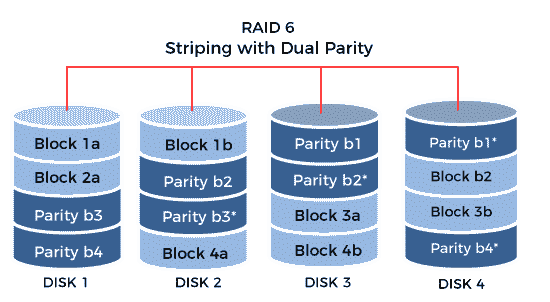

**RAID 6 的优势**

*   在 RAID 6 中，读取数据事务非常快，就像 RAID 5 一样。
*   它比 RAID 5 更安全，因为如果两个磁盘出现故障，即使系统被故障磁盘替换，我们仍然能够访问所有数据。

**RAID 6 的缺点**

*   在 RAID 6 中，我们必须计算额外的奇偶校验。这就是为什么 RAID 6 中的写数据事务比 RAID 5 慢的原因。与 RAID 5 相比，它可以慢 20%。
*   如果有任何磁盘故障，那么它将影响吞吐量，但是这个过程仍然是可以接受的。
*   RAID 6 是复杂的技术。如果任何 RAID 阵列中出现磁盘故障，重建阵列可能需要很长时间。

## 光存储器

光学存储器于 1982 年发布，由索尼和飞利浦开发。这些存储器在光束的帮助下执行它们的操作，并且它还需要用于操作的选项驱动。我们可以使用光存储器来存储备份、音频、视频以及相关数据。与读/写速度相比，闪存驱动器和硬盘驱动器的速度更快。光存储器有各种各样的例子，如光盘、蓝光光盘和数字多功能光盘。

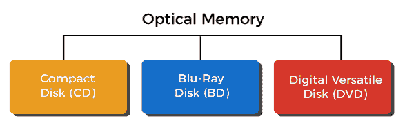

### 光盘

它是一种数字音频系统，用于存储数据。它由圆形塑料组成，其中**铝合金**用于涂覆塑料的单面，塑料用于存储数据。它还包含一个额外的薄塑料外壳，用于保护数据。光盘将在光驱的帮助下执行操作。光盘可以称为不可擦除光盘。这里我们用激光束把数据印在磁盘上。最初，光盘用于保存 60 到 75 分钟的音频信息，能够存储大约 700 兆字节的数据。但现在，它可以单面存储 60 分钟的音频信息。现在已经开发了许多与光盘相比成本低、容量大的设备。

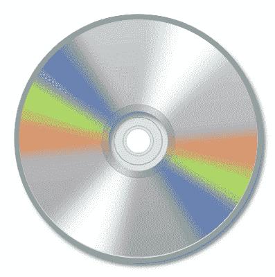

**光盘类型**

**光盘:T1**

**光驱**也称**光驱只读存储器。**主要用于存储电脑数据。正如我们前面所知道的，光盘是用来存储视频和音频数据的，但是它使用数字形式来存储数据，所以我们也可以使用光盘来存储计算机数据。

如果音频和视频设备中存在一些错误，它将忽略该错误，并且该错误不会反映在生成的视频和音频中。但是如果计算机数据包含任何错误，那么光盘将不会容忍它，并且该错误将反映在产生的数据中。在光盘上压印药丸时，不可能防止物理缺陷。因此，为了检测和纠正错误，我们必须添加一些额外的位。

光盘(CD)和光盘只读存储器(CD-ROM)包含一个螺旋轨道，从轨道中心开始，向外边缘螺旋延伸。光盘使用块或扇区来存储数据。根据磁道的不同，扇区的数量也不同。光盘的内磁道包含较少的扇区，光盘的外磁道包含较多的扇区。磁盘内边缘和外边缘的扇区长度相同。

当磁盘旋转时，低功率激光束将以相同的速度扫描扇区。磁盘的转速可能会有变化。如果我们试图访问靠近磁盘中心的扇区，磁盘将旋转得相对较快。如果扇区位于外边缘附近，则与靠近磁盘中心的扇区相比，磁盘的旋转速度会较慢。

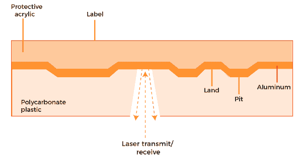

**CD-R:**

**CD-R** 也被称为**可刻录光盘。**它是一次写入多次读取的类型，或者我们可以说它允许在磁盘上进行单次记录。它用于需要一组数据的一份或少量副本的应用程序。可刻录光盘由聚碳酸酯塑料基底、薄反射金属涂层和保护性外涂层组成。在金属层和聚碳酸酯之间，有一层有机**聚合物染料，**作为记录介质。在染料的帮助下，反射率可以改变。当暴露在特定频率的光下时，染料会永久地转变。高强度激光用于激活染料。在染料中，标记由激光产生，用于模拟传统光盘的平台(最高区域)和小球(较低区域)的反射特性。

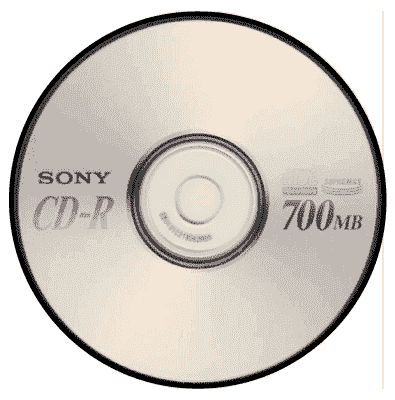

**CD-RW:**

**CD-RW** 也被称为**CD-可重写。**它是一种光盘格式，允许我们在磁盘上重复记录。可重写光盘和可刻录光盘都由相同的材料组成。所以它也是由聚碳酸酯塑料基材、薄反射金属涂层和保护性外涂层组成。CD-RW 中的染料将被一种**合金**代替。当合金加热冷却后，就会表现出一些有趣的行为。

如果有一个熔点，并且合金被加热到该点以上并冷却下来，在这种情况下，它将变成一种被称为**非晶态的状态，**用于吸收光。如果存在合金在 200℃下加热并保持一定时间的情况，那么将发生称为**退火**的过程，它将合金转变为晶态。

在控制激光温度的帮助下，将形成非晶态和晶态的区域。晶体区域用于反射激光，而另一个区域用于吸收激光。这些差异将被记录为数字数据。我们可以进一步使用退火过程来删除存储的数据。CR-RW 相对于 CD-R 和 CD-ROM 有一个优势，那就是我们可以重写 CD-RW，之后就可以作为真正的二次存储使用。

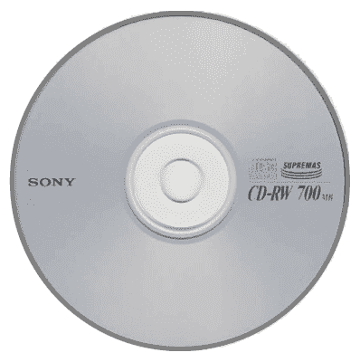

### 数字多功能光盘

DVD(数字多功能盘)技术于 1996 年首次推出。光盘和数字多功能盘的外观是一样的。存储大小是光盘和 DVD 的主要区别。所以 DVD 的存储空间比 CD 大得多。在设计数字视盘时，为了增大存储空间，在设计上做了一些改变。

DVD 使用比光盘激光束波长更短的激光束波长来压印数据。在较短激光束波长的帮助下，光线能够聚焦在一个小点上。光盘的坑比 DVD 的坑大得多。DVD 上的轨道比 CD 上的轨道更近。通过在 DVD 设计中做所有的改变，它有一个 4.7GB 的存储空间。我们可以通过使用双面磁盘和双层磁盘来进一步提高存储能力。

**双层圆盘**

双层光盘的第一个底座与光盘相同，这意味着它也由圆形塑料组成。但是在这个圆盘中，我们使用**半透明材料**而不是铝来覆盖第一个底座的平台和凹坑。这种材料能够解决反射器的用途。半透明层的程序是这样做的，它可以通过在其上缩进凹坑来存储数据。第二层平台和凹坑包含反射材料。为了检索二元图案，当激光束聚焦在第一层上时，足够的光将被半透明材料反射，这将被检测器捕获。之后第二层会反射一点光，那光就是噪音。这就是为什么它会被探测器取消。

同样的，激光的焦点在第二层，想要读取，第一层会反射一点光，那点光会在探测器的帮助下被抵消。

**双面盘**

在双面光盘中，磁道的实现将应用于光盘的两面。这种结构也被称为两个单面圆盘。这些圆盘将被放在一起，这样它们就可以形成一个三明治。但是最上面的磁盘将会颠倒过来。

### 蓝光光盘

蓝光光盘是一种高容量光盘介质，用于存储大量数据以及记录和回放高清视频。蓝光旨在取代 DVD。虽然一张光盘可以存储 700 兆字节的数据，一张 DVD 可以存储 4.7 千兆字节的数据，但一张蓝光光盘最多可以存储 25 千兆字节的数据。双层蓝光光盘可以容纳 50 GB 的数据。这个存储量相当于 4 个小时的高清电视。还有双面双层 DVD，常用的，能存储 17 GB 的数据。

蓝光光盘使用蓝色激光，与其他光学介质相比，蓝色激光有助于保存更多信息。这种激光实际上被称为“蓝紫”，但显影剂会把舌头卷下来，使“蓝紫射线”比“蓝光”早一点。光盘和 DVD 使用红色激光，其波长(650 纳米)大于蓝紫色激光(405 纳米)。在小波长的帮助下，激光可以聚焦在小区域。在蓝光光盘中，我们可以使用相同的大小，这是由光盘或 DVD 使用的，并在磁盘上存储大量数据。与 DVD 相比，蓝光能够提供非常高的分辨率。在标准清晰度的基础上，一张 DVD 可以提供 720x480 像素的清晰度。相比之下，蓝光高清包含 1920X1080 像素分辨率。

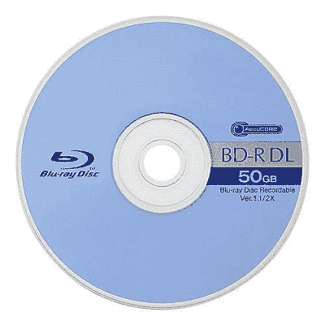

## 磁带

磁带系统中的读写技术与磁盘系统相同。在这种情况下，介质是涂有**可磁化材料的**柔性聚酯**带。**磁带的数据可以被构造成许多将纵向运行的平行磁道。在这种形式下，数据的记录可以称为**平行记录。**现代系统大多采用串行记录，而不是并行记录。**串行记录**使用比特序列和每个轨道来铺设数据。这是在磁盘的帮助下完成的。在串行记录中，磁盘包含磁带上的物理记录，可以描述为在连续块中读写的数据。

间隙用于分隔磁带上的块，也可以称为**记录间间隙。**使用磁盘，我们格式化磁带，以便帮助定位物理记录。当数据用串行磁带技术记录时，我们记录第一组位以及整个磁带的长度。当我们到达磁带的末尾时，磁头将被重新定位，这样他们就可以记录新的磁道。这一次，磁带将沿着相反的方向再次记录它的整个长度。此过程将一直持续到磁带满为止。

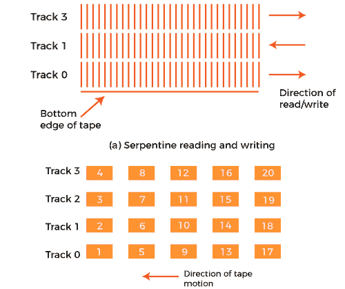

磁带机可以作为顺序访问设备进行访问。如果磁头的当前位置超出了期望的结果，我们必须将磁带倒回一定的距离，并开始向前读取。仅在读写操作期间，磁带处于运动状态。磁带和磁盘驱动器的区别在于磁盘驱动器可以称为直接访问设备。磁盘驱动器不需要顺序读取磁盘上的所有扇区就能获得所需的结果。它只需要等到中间扇区到达一个轨道内。在那之后，它能够连续访问任何轨道。

磁带也可以称为一种第二存储器。它也可以用作内存层次结构中速度最慢、成本最低的成员。还有一种线性磁带技术，这是一种盒式系统。它发展于 20 世纪 90 年代末。在市场上，LTO 可以说是各种房产系统的替代品。

* * *