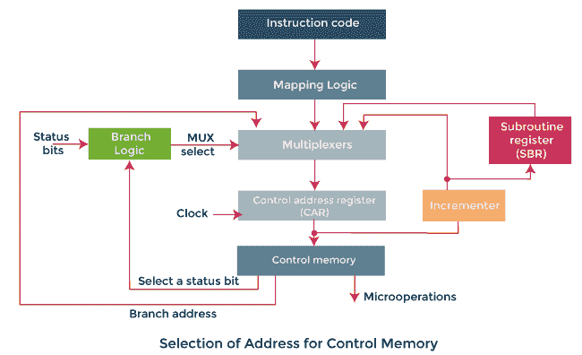
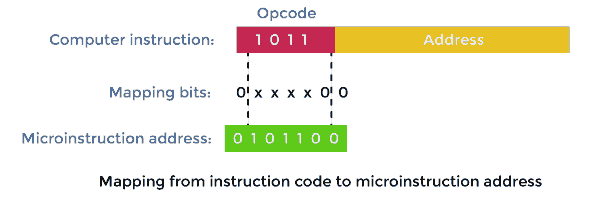
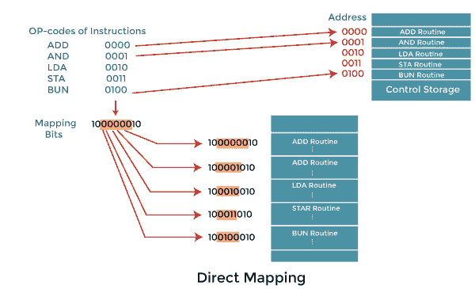
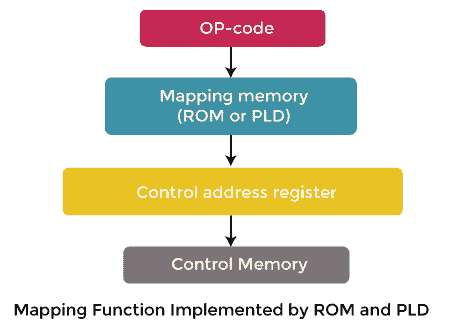

# 计算机组织中的寻址排序

> 原文：<https://www.javatpoint.com/addressing-sequencing-in-computer-organization>

控制存储器用于分组存储微指令。在这里，每个组用于指定一个例程。每台计算机的控制存储器都有包含微程序例程的指令。这些微程序用于生成微操作，这些微操作将用于执行指令。假设控制存储器的地址排序由硬件控制。在这种情况下，硬件必须能够从一个例程转移到另一个例程，并且能够在一个例程中应用微指令的排序。当我们试图执行计算机的单个指令时，控制必须经历以下步骤:

*   当计算机电源打开时，我们必须首先将一个初始地址加载到 CAR(控制地址寄存器)中。这个地址可以被描述为第一微指令地址。在这个地址的帮助下，我们能够激活取指令例程。
*   然后，控制存储器将通过例程，用于找出操作数的有效地址。
*   下一步，将生成一个微操作，用于执行从内存中提取的指令。

借助例程所在的控制存储器，我们能够将指令代码的位转换成地址。这个过程可以称为映射过程。控制存储器需要地址排序功能，描述如下:

*   根据状态位条件，地址排序选择条件分支或无条件分支。
*   寻址序列能够增加控制地址寄存器。
*   它为子程序调用和返回提供了便利。
*   从指令位到控制存储器地址的寻址序列提供了映射过程。

在上图中，我们可以看到一个控制存储器和关联硬件的框图，这是选择下一条微指令的地址所必需的。微指令用于在控制存储器中包含一组位。在一些位的帮助下，我们能够在计算机寄存器中启动微操作。微指令的剩余位用于指定我们获取下一个地址的方法。

在该图中，我们还可以看到控制地址寄存器能够在四个不同方向的帮助下恢复它们的地址。CAR 在递增器的帮助下递增，然后选择下一条指令。分支地址将在微指令的多个字段中确定，以便它们能够提供分支结果。

如果微指令中有状态位，我们想对它们施加条件，在这种情况下，我们可以使用条件分支。外部地址可以在映射逻辑电路的帮助下共享。返回地址将由一个特殊的寄存器保存。当微程序需要从子程序返回时，这个保存的地址将会很有帮助。此时，它需要来自唯一寄存器的值。

## 条件分支

在上图中，**分支逻辑**用于在控制单元中提供决策能力。系统中有**特殊位**，由状态条件描述。这些位用于提供参数信息，如模式位、符号位、进位输出和输入或输出状态。

如果这些状态位与微指令字段一起出现，它们就能够控制在分支逻辑中产生的条件分支的决定。这里微指令字段将指定一个分支地址。多路复用器用于实现**分支逻辑硬件**。如果满足条件，它将分支到初始地址。否则，它将增加地址寄存器。

如果我们把分支地址从控制存储器载入控制地址寄存器，我们就能实现无条件分支微指令。如果条件为真，它将转到分支，这被称为来自当前微指令的下一个地址字段的地址。不然就泡汤了。需要测试的条件有多种类型:Z(零)、C(进位)、O(溢出)、N(负)等。

## 指令映射

在控制存储器中，如果微指令指定一个分支到第一个工作，在这种情况下，将有一个特殊类型的分支。这里的一条指令包含了它们的微程序例程。对于这个特殊的分支，状态位将是操作码中的位，操作码是指令的一部分。

上图显示了一种简单的映射过程，即将 4 位操作码转换为控制存储器的 7 位地址。在映射过程中，0 将被置于地址的最高有效位。之后，将传输四个操作码位。最后，CAR 的两个最低有效位将被清除。

在这个过程的帮助下，将为每一条计算机指令提供一个微程序。微程序包含四个微指令的容量。如果例程使用的微指令少于四个，未使用的内存位置可以用于其他例程。如果例程使用了四个以上的微指令，它将使用地址 1000000 到 1111111。

借助可编程逻辑器件或只读存储器，这个概念可以扩展到更一般的映射规则。

上图显示了微指令地址到指令操作码的映射。在执行程序中，这个微指令就是起始微指令。

## 子程序

子例程可以被称为由其他例程用来完成特定任务的程序。借助子程序，我们可以保存微指令。这些子程序使用微码的公共部分，如有效地址计算。主例程能够在子例程寄存器的帮助下获得返回地址。换句话说，我们可以说它成为了一个将地址转移到主例程的来源。寄存器文件用于存储子程序的地址。这些寄存器文件的结构可以是寄存器被组织在“后进先出”堆栈中。

* * *