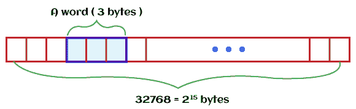
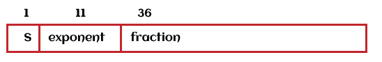
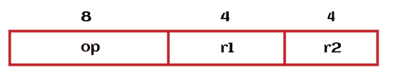
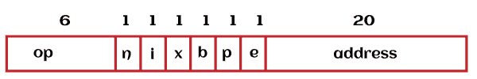
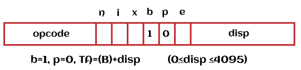
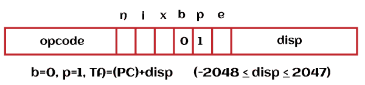
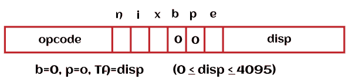
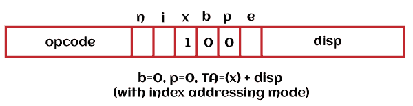
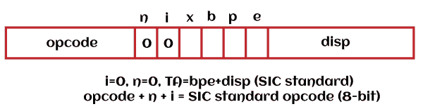

# 简化教学计算机

> 原文：<https://www.javatpoint.com/simplified-instructional-computer>

SIC 是一种假设的计算机，它包含一些硬件特性。真正的机器通常包含这些特征。简化教学计算机基本上有两个版本，即，

*   标准模型
*   SIC/XE(额外昂贵或设备)

## 1.机器架构/组件

简化指令计算机包含许多组件，描述如下:

### 记忆

简化教学计算机中的存储器被组织成 8 位字节序列(1 字节= 8 位)。一个字可以由 3 个连续的字节组成(1 个字= 24 位)。这意味着在 24 位的帮助下，简化的教学计算机被设计出来。低位字节用于寻址一个字，寻址从 0 字节开始。一个计算机内存包含 2 <sup>15</sup> 字节。



### 登记

简化指令计算机包含 5 种类型的寄存器。每个寄存器都有一个地址，这个地址被称为**寄存器号。**每个寄存器只能包含 3 个字节，这意味着它的大小是 3 个字节。整数的大小取决于寄存器的大小。SIC 中没有栈，基本上是借助链接寄存器来存储地址的。如果我们想写递归程序，在 SIC 中是非常困难的。如果我们编写一个具有多个层的函数调用，程序员需要为返回地址维护内存。

| 记忆的 | 数字 | 特殊用途 |
| (累加器) | Zero | 该寄存器用于执行算术运算。 |
| 十(索引寄存器) | one | 该寄存器用于寻址。 |
| 链接寄存器 | Two | 如果有子程序的情况，这个寄存器将保存指令的返回地址。 |
| 程序计数器 | eight | 该寄存器用于存储将要执行的下一个指令地址。 |
| 状态字 | nine | 该寄存器用于包含各种信息，如条件码(CC)。 |

**状态字寄存器**有五种类型，描述如下:

**模式:****监管模式**(值= 1)或**用户模式**(值= 0)由该模式位引用。模式位占用 1 位。[0]

**状态:**在此，我们将看到进程是处于**空闲状态**(值= 1)还是**运行状态**(值= 0)。状态位占用 1 位。[1]

**标识:****进程标识** (PID)由标识位引用。3 位由标识位占据。[2-5]

**CC:****条件码**由 CC 位引用。意味着 CC 位将显示设备是否准备好。CC 位占用 2 位。[6-7]

**屏蔽:****中断屏蔽**由屏蔽位引用。掩码位占用 4 位。[8-11]

**X:****未使用的位**被 X 引用。4 位被 X 占用[12-15]

**ICode:****中断代码**由 ICode 引用。其余位由 ICode 占据。[16-23]

### 数据格式

*   借助于 24 位，整数被表示出来。
*   借助 8 位 ASCII 值来表示字符。
*   没有可用的位来表示浮点数，但它存在于 SIC/XE 中。
*   借助于 2 的补码，负数被表示出来。这意味着-N ⇔ 2 <sup>n</sup> - N. **例如:**如果 n = 4，那么-1 ⇔ 2 <sup>4</sup> -1 = (1111) <sub>2</sub> 。

### 指令格式

在简化的教学计算机中，所有指令总共包含 24 位格式。简化教学计算机的内存大小为 2 <sup>15</sup> 超级字节。


在此图像中，X 用于显示索引地址模式。

### 寻址模式:

SIC 只能支持 2 种模式，描述如下:

*   编入索引的
*   直接的

如果 **X = 0，**将显示**直接寻址模式。**如果 **X = 1，**将显示**索引寻址模式，**如下所示:

| 方式 | 表明 | 目标地址计算 |
| 直接的 | X = 0 | TA =地址 |
| 编入索引的 | X = 1 | TA =地址+ (X) |

这里寄存器的内容由()表示。

### 指令集:

SIC 中的指令集描述如下:

**算术指令:**

SIC 使用内存和寄存器 A 来执行操作。借助寄存器，结果将被存储。算术指令借助于加法、MUL、SUB、DIV 等来表示。**例如:**

```

ADD    ALPHA   ⇔   (A)   ←   (A)  +  (ALPHA)

```

**算术示例**

```

LDA     ALPHA      It uses register A to load the ALPHA. 
ADD     INCR         It is used to add the value of INCR. 
LDA     GAMMA   It is used to load the GAMMA into register A.
SUB      ONE          It is used to subtract 1\. 
STA      DELTA     It is used to store in DELTA. 

```

**加载和存储指令:**

它用于将数据从存储器存储或移动到累加器或从累加器移动到存储器。加载和存储指令借助于 LDX、STA、LDA、STX 等来表示。**例如:**

```

LDA    ALPHA   ⇔   (A)   ←   (ALPHA)
STA     ALPHA   ⇔   (ALPHA)   ←   (A)

```

**对比说明:**

它用于比较寄存器 A 中的内容和存储器中的数据。它使用软件的 CC(条件代码)来保存结果。比较指令是在 COMP 的帮助下表示的。**例如:**

```

COMP    ALPHA   ⇔   CC   ←   () of (A) ? (ALPHA)

```

**子程序联动指令:**

它用于显示与子程序相关的指令。子程序链接指令借助 RSUB、JSUB 来表示。这里 **RSUB** 将借助跳转寄存器 L 中的地址进行返回， **JSUB** 用于跳转并将返回地址放置在 L 中

**条件跳转指令:**

它首先用于比较内存和累加器的内容。之后，在条件的基础上，它将执行任务。条件跳转指令是在 JLT、JGT 和 JEQ 的帮助下表示的。例如:

```

Test CC and jump accordingly 

```

### 输入和输出

每个器件包含一个 8 位地址。数据以单字节的形式传输到寄存器 a 最右边的字节或从寄存器 a 最右边的字节传输。输入和输出指令有三种类型，描述如下:

**测试设备(TD):** 它使用状态字和条件码来测试设备是否准备好发送或接收一个字节的数据。如果 CC(条件代码)为，在这种情况下，设备将繁忙。

**读取数据(RD):** 在 RD 的帮助下，可以从设备中读取一个字节。该字节将存储在寄存器 a 中

**写数据(WD):** 在 WD 的帮助下，一个字节可以从寄存器 a 写入存储设备指定的 d。

**碳化硅输入输出示例**

```

INLOOP     TD        INDEV      It is used to test the input device
                    JEQ      INLOOP    It is used to maintain a loop until the device is ready. 
                    RD       INDEV      It is used to read a single data byte from register A
                    STCH  DATA        It is used to store the byte that was read.  
                    .
                    .
OUTLP       TD         OUTDEV It is used to test the output device
                    JEQ       OUTLP     It is used to maintain a loop until the device is ready. 
                    LDCH   DATA       It uses register A to load the data byte. 
                    WD       OUTDEV  It uses the output device to write one byte.  

```

## 2.碳化硅/氙

SIC/XE 是 SIC(简化教学计算机)的高级版本，代表**额外昂贵或额外设备。**SIC(简化教学计算机)和 SIC/XE 都是向上兼容的，因为它们彼此密切相关。

### SIC/XE 机器架构/组件

SIC/XE 包含许多组件，描述如下:

### 记忆

这 8 个字节通常包含在内存中。在 SIC/XE 系统中，最大可用内存为 1 兆字节，也就是 2 <sup>20</sup> 字节。标准 SIC 的内存大小很小。由于这些内存大小的变化，在简化的教学计算机额外昂贵(SIC/XE)中寻址模式和指令格式被改变。就像 SIC 一样，在 SIC/XE 的架构中，一个字(24 位)可以借助于 3 个连续的字节形成。在 SIC/XE 中，所有的地址都是字节地址。借助于一个字的较低字节数的位置，一个字可以被寻址。

### 登记

代替 SIC(简化教学计算机)的寄存器，SIC/XE 中有 4 个附加的通用寄存器。这意味着总共有 9 个寄存器(4 个附加寄存器+ 5 个 SIC 寄存器)。SIC/XE 的四个附加寄存器描述如下:

| 记忆的 | 数字 | 特殊用途 |
| 基本寄存器 | three | 这种类型的寄存器主要用于寻址。 |
| S | four | 这种类型的寄存器是通用寄存器，没有特殊用途。 |
| T | five | 这种类型的寄存器也是通用寄存器，没有特殊用途。 |
| F | six | 这是一个浮点寄存器。 |

在 SIC 和 SIC/XE 的所有 9 个寄存器的帮助下，最简单的任务能够以定制的汇编语言执行。S 和 T 寄存器只能用于存储。我们无法将这些寄存器用于累加器。**例如:**

```

ADD          S, A	       A ← A + S
COMPR     X, T

```

### 数据格式:

SIC 标准版和 SIC/XE 的数据格式几乎一样。数据格式存在一些差异，描述如下:

*   符号位 0 和 1 用 s 表示，这里 1 表示负，位 0 表示正。
*   在二进制数的帮助下，整数被表示出来。
*   在 ASCII 码的帮助下，字符被表示出来。
*   指数是一种无符号二进制数，用 0 到 2047 之间的值来表示。
*   分数是借助 0 到 1 之间的值来表示的。

SIC/XE 包含一个额外的 48 位浮点数据类型，如下所示:



该值将通过以下公式来表示:

```

Value = (s) * f * 2(exponent-1024)

```

**例如:**

```

5 = 22+ 20 = (2-1 + 2-3) * 23 = (2-1 + 2-3) * 21027-1024
0,10000000011, 1010000....0

```

### 指令格式:

简化指令格式的指令格式对于 SIC/XE 来说是不够的，因为 SIC/XE 的可用内存大小为 2 <sup>20</sup> 字节。这意味着 SIC/XE 的地址不能放入 15 位的字段。

有两种方法可以解决与内存相关的问题，描述如下:

*   借助指令格式 3 所示的**相对寻址**可以解决。
*   可以通过**将地址字段**扩展到 20 位来解决，如指令格式 4 所示。

SIC/XE 包含四种类型的格式。其中，格式 1 和格式 2 不能用于引用内存。“e”位用于区分格式 3 和格式 4。

**格式 1:** 是 1 字节格式。例如:HIO、诺姆、SIO、TIO。


**格式 2:** 是 2 字节格式。



寄存器由上述两个地址表示。所以我们不需要访问内存来执行。

**格式 3:** 是 3 字节格式。


当且仅当“n 位”和“I 位”均为 0 时，指令将以简单 SIC 指令的形式解释。

**格式 4:** 是 4 字节格式。



这里

*   **n** 用于显示**间接位**
*   **i** 用于显示**即时位**
*   **x** 用于显示**索引位**
*   **b** 用于显示**基位**
*   **p** 用于显示 **PC 相对位**
*   **e** 用于显示**扩展位**

指令的变化可以在上述位的单独或组合的帮助下被解释，如下所示:

| 位表示 | 使用 |
| x = 1 | 它用于显示索引寻址 |
| e = 0 | 它用于显示 3 字节格式 |
| e = 1 | 它用于显示 4 字节格式 |
| b = 0，p = 1 | 用于显示电脑相对寻址 |
| b = 1，p = 0 | 它用于显示基址或位移寻址 |
| n = 1，i = 1 | 它用来表示直接寻址 |
| n = 1，i = 0 | 它用来表示间接寻址 |
| n = 0，i = 1 | 它用于显示立即寻址 |
| n = 0，i = 0 | 它用于显示简单的 SIC 解释。 |

因此，最后 15 位以及 bpe 位被视为一个地址。

### 寻址模式

对于格式 3，SIC/XE 中引入了两种新的寻址模式，描述如下:

| 方式 | 指示 | 目标地址 | 计算 |
| 基本相对 | b = 1，p = 0 | A = (B) +处置 | (0 ≤可用≤ 4095) |
| 程序计数器相对值 | b = 0，p = 1 | TA = （PC） + Disp | (-2048 ≤调度≤ 2047) |

如果在格式 3 中 **b 位**和 **p 位**都设置为 0，则 **disp** 采用**目标地址的形式。**这个过程被称为**直接寻址模式。**借助直接、间接和相对寻址模式，以及许多其他寻址模式，我们可以计算目标地址，描述如下:

**基本相对寻址**

如果我们使用基本相对模式，在这种情况下，disp 将是 12 位无符号整数。



在这张图片中，b 代表基地。

**程序计数器相对**

如果我们使用程序计数器相对模式，在这种情况下，disp 将是 12 位有符号整数。



在这张图片中，p 代表程序。

**直接寻址**

在直接寻址模式下，当且仅当位 b 和 p 设置为 0 时，目标地址可直接取自地址或 disp 字段。



对于直接寻址中的格式 3 和格式 4，指示、目标地址和计算描述如下:

```

Format 3 (e = 0): n = 1, i = 1, b = 0, p = 0, TA = disp (0 ≤ disp ≤ 4095)
Format 4 (e = 1): n = 1, i = 1, b = 0, p = 0, TA = address 

```

**索引寻址**

在索引寻址中添加了术语(x)来计算目标地址。如果位 X 设置为 1，在这种情况下，寄存器 X 的值将被添加到目标地址的计算中。



对于直接索引寻址中的格式 3 和格式 4，指示和目标地址描述如下:

格式 3: n = 1，i = 1，x = 1，TA = (X) + disp

格式 4: n = 1，i = 1，x = 1，TA = (X) +地址

现在我们将看到目标地址在 I 位和 n 位的帮助下的使用，描述如下:

| 方式 | 指示 | 操作数值 |
| 直接选址 | i = 1，n = 0 | TA =将以操作数值的形式使用，没有内存引用 |
| 间接寻址 | i = 0，n = 1 | TA =提取目标地址的字。以操作数值地址的形式，取 TA 值。 |
| 简单寻址 | 情况 1: i = 0，n = 0 | 它将显示标准的 SIC |
|  | 情况 2: i = 1，n = 1 | (TA) =以操作数值的地址形式，取 TA(目标地址)。 |

立即索引模式描述如下:


在这张图片中，我代表立即。

间接索引模式描述如下:


在这张图片中，n 代表间接。

简单寻址模式描述如下:

**案例 1:**



**案例 2:**


**寻址模式示例**

| 十六进制 | 过强；管理员 | n | 我 | x | b | P | e | 显示/地址 | 目标地址 | 载入寄存器 A 的值 |
| 032600 | 000000 | one | one | Zero | Zero | one | Zero | 0110 0000 0000 | Three thousand six hundred | One hundred and three thousand |
| 03C300 | 000000 | one | one | one | one | Zero | Zero | 0011 0000 0000 | Six thousand three hundred and ninety | 00C303 |
| 022030 | 000000 | one | Zero | Zero | Zero | one | Zero | 0000 0011 0000 | Three thousand and thirty | One hundred and three thousand |
| 010030 | 000000 | Zero | one | Zero | Zero | Zero | Zero | 0000 0011 0000 | Thirty | 000030 |
| 003600 | 000000 | Zero | Zero | Zero | Zero | one | one | 0110 0000 0000 | Three thousand six hundred | One hundred and three thousand |
| 0310C303 | 000000 | one | one | Zero | Zero | Zero | one | 0000 1100 0011 0000 0011 | C303 | 003030 |

### 指令组

SIC 和 SIC/XE 的指令集几乎相同，但由于额外的浮点数据格式，SIC/XE 中还有一些额外的指令集。所以 SIC/XE 也提供了很多附加指令，包括浮点算术指令。所有附加说明描述如下:

*   简易教学计算机标准教学
*   借助以下操作加载和存储新寄存器:
*   LDB、STB 等

浮点运算的操作描述如下:

```

ADDF, MULF, SUBF, DIVF

```

寄存器移动的操作描述如下:

```

RMO

```

寄存器对寄存器运算的操作描述如下:

```

ADDR, MULR, SUBR, DIVR

```

监督呼叫的操作描述如下:

```

SVC

```

监督调用用于为操作系统生成中断

输入/输出通道的操作描述如下:

```

SIO (Start)
TIO (Test)
 HIO (Halt)

```

在附录 A 的帮助下，我们能够得到所有说明的清单。附录的符号描述如下:

c:条件码 CC

优先指令

a↓(x。x+2):它会将从 x 开始的单词移动到 a。

徐:这个说明只有 SIC/XE 才有

### 输入和输出

碳化硅/氙提供输入/输出通道。在这个通道的帮助下，我们可以在中央处理器执行其他指令的同时执行输入和输出操作。它还允许输入或输出和计算的重叠。由于这种重叠，SIC/XE 的架构变得更加有效。输入输出的指令集是 SIO、TIO 和 HIO，它们分别具有启动、测试和停止输入输出通道操作的能力。

* * *