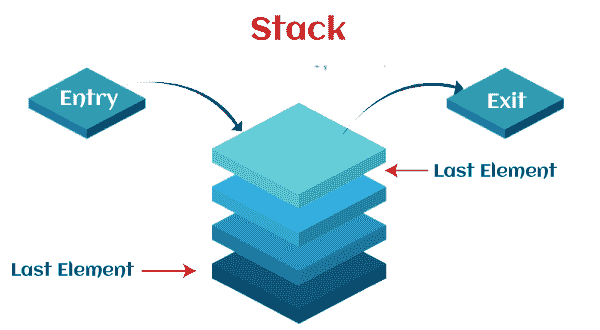
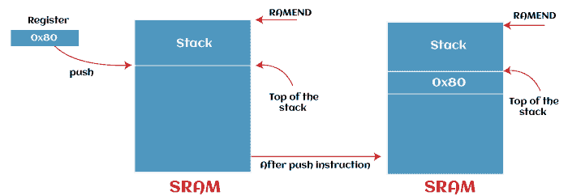
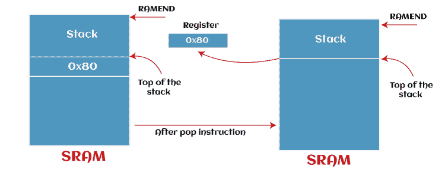

# 自动电压调节器微控制器中的调用指令和堆栈

> 原文：<https://www.javatpoint.com/call-instructions-and-stack-in-avr-microcontroller>

呼叫可以用控制转移指令的形式来描述。在 CALL 指令的帮助下，我们能够调用特定的子程序。子程序包含一个指令块。这些类型的指令将在子程序的帮助下频繁执行。因为有了这个子程序特性，程序会变得更加结构化，也会节省大量的内存空间。AVR (Alf 和 Vegard 的 RISC 处理器)微控制器包含调用子程序的四种指令，即 call(调用子程序)、RCALL(相对调用子程序)、ICALL(对 Z 的间接调用)和 EICALL(对 Z 的扩展间接调用)。

## 呼叫指令

调用指令是 4 字节的。**操作码**用 10 位表示，而**目标子程序**的地址用 22 位表示，就像 JMP 指令一样。对于 AVR，它提供了 000000-3FFFFF 的 4M 地址空间。它能够在提供的地址范围内调用子程序。

子程序执行后，AVR 不强制知道地址从哪里回来。因此，指令的地址由微控制器保存在堆栈上，该堆栈位于 CALL 指令的正下方。当子程序执行完成后，控制将借助 **RET** 指令转移回调用方。因此，在子程序结束时，RET 指令必须放在每个子程序中。

## 堆

STACK 是一种常用的内存区域，用于临时存储寄存器的信息。当我们调用子程序时，它会返回地址。它是中央处理器随机存取存储器的一部分。有几个寄存器，这就是为什么中央处理器总是需要这个存储空间。当我们调用一个函数时，该值将存储在这个临时存储(堆栈)中。在暂存寄存器的帮助下，我们不能存储这些值，因为它们可以被函数改变。

还有一个堆栈指针(SP)寄存器，可用于访问堆栈。我们可以借助两个寄存器，即 SPH(堆栈指针的高字节)、SPL(堆栈指针的低字节)，在输入输出内存空间中实现堆栈指针。堆栈在后进先出法上工作。这意味着检索到的最后一个值将首先从堆栈中弹出。当某物被推入堆栈时，该堆栈将增长到更高的地址。当有东西从堆栈中弹出时，它会减少。



如果 AVR**(Alf 和 Vegard 的 RISC 处理器)**包含超过 256 字节，将有两个 8 位寄存器。只有当 AVR 包含少于 256 字节的内存时，堆栈指针才会由 SPL 构成，因为 8 位寄存器只能寻址 256 字节的内存。还有一个 PUSH 操作，用于将 CPU 的信息存储在堆栈上。还有一个 POP 操作，用于将堆栈的内容加载回 CPU。这些 PUSH 和 POP 操作是使用堆栈最常见和最简单的方式。现在我们将分别描述推送和弹出操作。

### 推到堆栈上

推送可以称为“将某物放在堆栈顶部”。开始时，SP 有能力指向堆栈的顶部。它基本上将 64 位寄存器或常数存储到堆栈中。寄存器“rax”或“r8”称为 64 位寄存器，“eax”或“r8d”称为 32 位寄存器。当我们试图将数据推或添加到堆栈上时，它总是保存在堆栈指针指向的地方。之后，堆栈指针将递减 1。

**例如:**在下面的例子中，我们将使用 PUSH 指令将寄存器推入堆栈。执行此操作的命令描述如下:

```

PUSH Rr;
Rr is specified as any general-purpose register from R0 to R31\.     

```



### 从堆栈中弹出

弹出可以被称为“从堆栈中取出最上面的东西”。爆胎的功能和推的功能完全相反。这里，堆栈的内容从堆栈中弹出，并放回寄存器中。当我们试图从堆栈中弹出数据时，堆栈的顶部位置被复制回寄存器，堆栈指针增加 1。当调用 POP 时，SP 会自动递增 1。POP 操作使用后进先出法。这意味着检索到的最后一个值将首先从堆栈中弹出。

**例如:**在本例中，我们将使用 POP 指令弹出堆栈的内容并将其放入寄存器。执行此操作的命令描述如下:

```

POP Rr;
Rr is specified as any general-purpose register from R0 to R31\.          

```

当我们将寄存器推入堆栈时，寄存器的内容不会被擦除。在这种情况下，数据将被简单地放置或复制到静态随机存取存储器中。当我们从堆栈中弹出一个值时，该地址上存在的内容不会被堆栈擦除。



**PUSH 和 POP 操作示例:**

在这个例子中，我们将 30 装入 rax，然后 45 装入 rex。执行此操作的命令描述如下:

```

PUSH 30
PUSH 45
POP rax
POP rcx
ret 

```

在执行第一次推送后，堆栈将只有一个值，即

```

30

```

执行第二次推送后，堆栈将有两个值

```

30, 45

```

在执行第一个 POP 之后，它将首先获取值 45 并将其放入寄存器 rax。之后，堆栈将只有一个值

```

17 

```

在执行第二次 POP 后，它将获取值 17 并将其放入寄存器 rcx。之后，它将保持堆栈干净。如果堆栈不干净，最后一条指令“ret”将无法完美运行。在这种情况下，除了“ret”之外，所有其他指令都将正常工作。不管栈顶包含什么数据，这条指令都会跳到栈顶。

#### 注意:如果我们推送的项目数和弹出的项目数不一样，我们的程序就会崩溃。所以我们应该小心推和拉。

当我们试图将多个寄存器推入堆栈时，我们应该以相反的顺序调用 POP 指令，以便恢复其原始寄存器的值，如下所述:

```

Push r0
Push r1
Push r2
Pop r2
Pop r1
Pop r0

```

如我们所见，上面的第一、第二和第三 Push 指令分别将 r0、r1 和 r3 的内容存储到堆栈中。在 Pop 操作中，第一个 Pop 操作是在 r2 上执行的，因为它是在最后一个中输入的，而 Pop 操作是基于后进先出操作的。这就是为什么我们首先弹出 r2，然后是 r1 和 r0。

如果我们错误地以错误的顺序调用 POP 指令，在这种情况下，该值将被恢复到错误的寄存器中。所以我们在调用 POP 的时候要小心，描述如下:

```

ldi r20, 0x01		It is used to load r20 with 0x01
ldi r21, 0x02		It is used to load r21 with 0x02
Push r20		It is used to save r20 to the stack
Push r21		It is used to save r21 to the stack 
Pop r20		It is used to restore r20 (result = 0x02)
Pop 21			It is used to restore r21 (result = 0x01)

```

正如我们所看到的，Pop 指令的调用不是以 Push 调用的相反顺序执行的。这就是结果中 r20 和 r21 的数据被交换的原因。但是如果我们想在不使用第三个寄存器的情况下交换两个寄存器的内容，这个特性会很棒。

#### 注意:寄存器必须按照与它们被推入的相反顺序从堆栈中取出，以便它们能够恢复其原始值。

### 栈指示器

堆栈指针可以定义为输入/输出存储器中的一个特殊寄存器，用于指向静态随机存取存储器中分配的空间。SP 包含 16 位寄存器，其中也包含 SPL 和 SPH。如果微控制器包含非常少量的静态随机存取存储器，则不需要 SPH。在这种情况下，将只使用 SPL。从静态随机存取存储器结束，堆栈通常开始。当我们将数据存储在堆栈中时，它将从较高的地址值增长到较低的地址值。栈顶总是在栈指针的帮助下指向。

**初始化堆栈指针**

不同的自动电压调节器有不同数量的随机存取存储器。最后一个内存位置的地址可以在 AVR 汇编器中的 RAMEND 的帮助下指定。因此，如果我们需要初始化堆栈指针以指向最后一个内存位置，可以将 RAMEND 加载到 SP 中。如上所述，堆栈指针包含两个寄存器，分别是 SPH(堆栈指针的高字节)、SPL(堆栈指针的低字节)。因此，RAMEND 的高字节将被加载到 SPH，而 RAMEND 的低字节将被加载到 SPL。

如上所述，SP 位于输入/输出内存中。因此，我们可以使用 out 指令将值加载到其中。对于新的自动电压调节器，静态随机存取存储器的最后一个值将在上电时借助堆栈点进行初始化。对于较旧的 AVR，必须在任何程序开始时手动设置。这方面的例子描述如下:

```

ldi r16, LOW (RAMEND)	With the help of this instruction, the low byte of RAMEND will be loaded into r16 register. 
out SPL, r16			With the help of this instruction, the register r16 will be stored into 
                                                 the stack pointer low
ldi r16, High (RAMEND)	With the help of this instruction, the high byte of RAMEND will be loaded into r16 register.
out SPH, r16			With the help of this instruction, the register r16 will be stored into 
                                                 the stack pointer high

```

包含文件用于以静态随机存取存储器中最后一个地址的形式包含常数 RAMEND。很多微控制器都包含 16 位地址，16 位地址分为两个 8 位组件，分别具有 LOW 功能和 HIGH 功能。这两个函数将被载入一个工作寄存器。对于一些小型微控制器，常数 RAMEND 可以小于 16 位。在这种情况下将不使用 SPH，我们将只初始化 SPL 寄存器。

```

ldi r16, RAMEND		It is used to load RAMEND into r16
out SPL, r16 			It is used to store r16 into the stack pointer

```

#### 注意:尽管如此，在较新的微控制器的帮助下，SP 在上电时会自动初始化为 RAMEND。如果我们有在任何程序开始时初始化堆栈指针的实践，那对我们来说将是非常好的。在软件重置的情况下，这种做法将非常有用，因为它将保护服务点不会从其他错误的位置开始。

### 调用指令、RET 指令和堆栈的作用

在执行调用指令时，调用指令下面的指令地址将被推送到堆栈上。位于 CALL 指令下方的指令将被加载到 PC 中，并在子程序执行完成时被执行，RET 指令被执行。

* * *