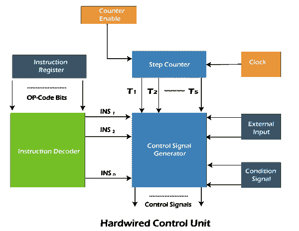
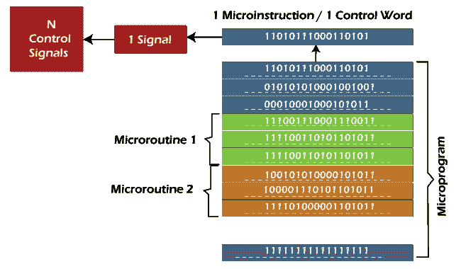
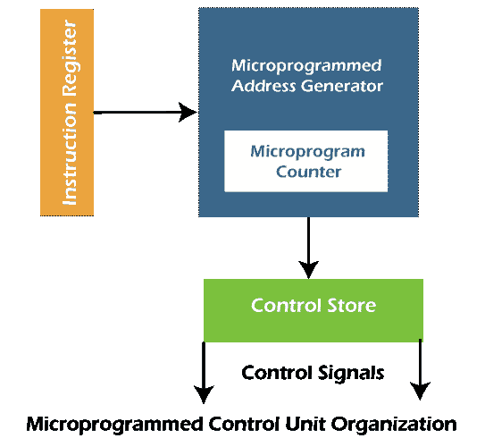

# 硬连线与微编程控制单元

> 原文：<https://www.javatpoint.com/hardwired-vs-micro-programmed-control-unit>

在系统或计算机中，大多数任务都是在处理器或中央处理器(中央处理器)的帮助下控制的，中央处理器是计算机的主要组成部分。中央处理器通常有两个主要系统:**控制单元** (CU)和**算术逻辑单元** (ALU)。控制单元(CU)用于在发送定时和控制信号的帮助下同步任务。另一方面，数学和逻辑运算可以借助算术逻辑单元来处理。微编程控制单元和硬连线控制单元可称为两种类型的控制单元。我们可以在这两个控制单元的帮助下执行指令。

在**硬连线控制单元**中，操作的执行要快得多，但是实现、修改和解码都很困难。相比之下，实现、修改、解码**微编程控制单元**非常容易。微编程控制单元也能够处理复杂的指令。在微编程和硬连线控制单元产生的控制信号的帮助下，我们能够获取和执行指令。

### 控制信号

为了产生控制信号，两个控制信号基本上都被设计。处理器硬件的功能是在这些控制信号的帮助下运行的。控制信号用于了解各种类型的事物，描述如下:

*   控制信号用于知道将要执行什么操作。
*   它用于了解处理器执行的操作顺序。
*   它用于了解操作必须执行的时间以及许多其他类型的事情。

### 硬连线控制单元

在产生控制信号的帮助下，硬连线控制单元能够以正确的时间和正确的顺序执行指令。与微编程相比，硬连线 CU 通常更快。在该控制单元中，控制信号是借助于 PLA 电路和状态计数器产生的。这里中央处理器需要所有这些控制信号。在硬件的帮助下，产生硬连线控制信号，并且它基本上使用电路方法。

硬连线控制单元的图像描述如下，其包含电路形式的各种组件。我们将逐一讨论，以便正确理解“控制信号的产生”。

*   **指令寄存器**是一种处理器寄存器，用于包含当前正在执行的指令。如我们所见，指令寄存器用于生成操作的操作码位以及操作数的寻址模式。
*   上述生成的操作码位在**指令解码器**的字段中接收。指令解码器解释操作和指令的寻址模式。现在基于指令寄存器中存在的指令和操作的寻址模式，指令解码器将相应的指令信号 INS i 设置为 1。执行每条指令都要用到一些步骤，即**取指令**、**解码**、**操作数** **取**、**算术** **和** **逻辑** **单元**、**内存** **存储**。不同的书可能包含不同的步骤。但总的来说，我们能够在这五个步骤的帮助下执行一条指令。
*   控制单元必须知道当前指令步骤的信息。现在**步数计数器**实现了，用来包含来自 T1 的信号，…，T5。现在基于包含指令的步骤，步骤计数器的信号之一将从 T1 到 T5 设置为 1。
*   现在我们有一个问题，步骤计数器如何知道指令的当前步骤？所以为了知道当前步骤，实现了一个**时钟**。时钟的一个时钟周期将为每个步骤完成。例如，假设如果停止计数器将 T3 设置为 1，那么在完成一个时钟周期之后，步进计数器将 T4 设置为 1。
*   现在我们有一个问题，即如果一条指令的执行由于某种原因被中断，会发生什么？步数计数器还会被时钟触发吗？这个问题的答案是**否**。只要当前步骤的执行完成，**计数器使能**将“禁用”步进计数器，使其停止，然后增加到下一步信号。
*   现在我们有一个问题，即如果指令的执行依赖于某些条件怎么办？在这种情况下，将使用**条件信号**。在各种条件下，信号是在控制信号的帮助下产生的，控制信号可以小于、大于、小于等于、大于等于以及更多。
*   **外部输入**是最后一个。它用于告诉控制信号发生器中断的情况，这会影响指令的执行。

因此，基于由条件信号、步进计数器、外部输入和指令寄存器获得的输入，将在控制信号发生器的帮助下产生控制信号。

### 微编程控制单元

微编程控制单元可以描述为一个简单的逻辑电路。我们可以通过两种方式来使用它，即它能够在生成控制信号的帮助下执行每一条指令，也能够通过微指令进行排序。它将在程序的帮助下产生控制信号。在过去 CISC 建筑的发展过程中，这种方法非常有名。用来产生控制信号的程序称为“微程序”。微程序放在处理器芯片上，这是一种快速存储器。该存储器也称为控制存储器或控制存储器。

微程序用于包含一组微指令。每个微指令或控制字包含不同的位模式。每条微指令包含 n 个位字。基于控制字的位模式，每个控制信号彼此不同。

如上所述，微编程控制单元中的指令执行也是分步骤进行的。所以对于每一步，微程序都包含一个控制字/微指令。如果我们想执行一条特定的指令，我们需要一系列微指令。这个过程被称为微例程。微编程控制单元的图像描述如下。在这里，我们将学习微程序、微例程和控制字/微指令的组织。

现在我们将了解微程序 CU 的组织。然后我们将借助指令执行步骤了解指令执行的流程，描述如下:

*   **指令**取数是**第一步**。在这一步中，指令在微指令地址寄存器的帮助下从指令寄存器中取出。
*   **解码**是**第二步**。在这一步中，从指令寄存器获得的指令将在微指令地址发生器的帮助下被解码。这里我们还将得到一个微例程的起始地址。在这个地址的帮助下，我们可以很容易地执行指令中提到的操作。它还会将起始地址载入微程序计数器。
*   **增量**是第三步。在这个步骤中，对应于微程序起始地址的控制字将被读取。当执行继续进行时，微程序计数器的值将增加，以便它能读出一个微程序的连续控制字。
*   **结束位**是第四步。在这一步中，微程序的微指令包含一个位，称为结束位。当结束位设置为 1 时，微指令的执行将成功完成。
*   这是最后一步，在这一步中，微程序地址生成器将再次回到**步骤 1** ，这样我们就可以获取一条新的指令，这个过程或循环继续进行。

因此，在微程序控制单元中，微程序借助控制存储器或控制存储器来存储。这种控制单元的实现非常容易和灵活，但与硬连线控制单元相比速度较慢。

## 硬连线控制单元和微编程控制单元的区别

微编程控制单元和硬连线控制单元之间有各种不同，描述如下:

| 硬连线控制单元 | 微编程控制单元 |
| 借助硬件电路，我们可以实现硬连线控制单元。换句话说，我们可以说这是一种电路方法。 | 而借助编程，我们可以实现微程序控制单元。 |
| 硬连线控制单元使用逻辑电路，以便能够产生处理器所需的控制信号。 | 微程序控制单元使用微指令，以便产生控制信号。通常，控制存储器用于存储这些微指令。 |
| 在这个控制单元中，控制信号将以硬连线的形式产生。这就是为什么很难修改硬连线控制单元的原因。 | 修改微编程控制单元非常容易，因为修改只在指令级执行。 |
| 以逻辑门的形式，一切都必须在硬连线控制单元中实现。这就是为什么与微编程控制单元相比，这种控制单元的成本更高。 | 与硬连线控制单元相比，微编程控制单元成本较低，因为该控制单元只需要微指令来产生控制信号。 |
| 复杂的指令不能由硬连线控制单元处理，因为当我们为这条指令设计电路时，它将变得复杂。 | 微编程控制单元能够处理复杂的指令。 |
| 由于硬件实现，硬连线控制单元能够使用有限数量的指令。 | 微编程控制单元能够为许多指令产生控制信号。 |
| 硬连线控制单元用于那些也使用精简指令集计算机的计算机。 | 微程序控制单元用于那些也使用 CISC(复杂指令集计算机)的计算机。 |
| 在硬连线控制单元中，硬件仅用于产生所需的控制信号。这就是为什么这个控制单元比微编程控制单元更快。 | 在这个控制单元中，微指令用于产生控制信号。这就是为什么这个控制单元比硬连线控制单元慢。 |

### 微程序控制单元和硬连线控制单元的其他一些区别

现在我们将根据一些参数来描述这些差异，如速度、成本、修改、指令解码器、控制存储器等。这些差异描述如下:

**速度**

在硬连线控制单元中，操作速度非常快。相比之下，微编程控制单元需要频繁的存储器访问。因此，微编程控制单元的运行速度很慢。

**修改**

如果我们想对硬线控制单元做一些修改，我们必须重新设计整个单元。相比之下，如果我们想在微编程控制单元中做一些修改，我们可以通过改变控制存储器中的微指令来实现。在这种情况下，更灵活的控制单元是微编程控制单元。

**成本**

硬件控制单元的实现与微编程控制单元相比非常相似。在这种情况下，微编程控制单元将在实施时节省我们的资金。

**处理复杂指令**

如果我们试图在硬连线控制单元的帮助下处理复杂的指令，我们将很难处理它们。但是如果我们试图在微编程控制单元的帮助下处理复杂的指令，我们将很容易处理它们。在这种情况下，微编程控制单元也更好。

**指令解码**

在硬连线控制单元中，如果我们要执行指令解码，将会非常困难。但是如果我们在一个微程序控制单元中做同样的事情，对我们来说会非常容易。

**指令集大小**

硬连线的 CU 使用一个小指令集。另一方面，微编程控制单元使用大指令集。

**控制存储器**

硬连线控制单元不使用控制存储器来产生控制信号，但是微编程控制单元需要使用控制存储器来产生控制信号。

**应用程序**

硬连线控制单元用于那些基本上使用简单指令集的处理器。这个集合被称为精简指令集计算机。另一方面，微编程控制单元用于那些基本上使用复杂指令集的处理器。这个集合被称为复杂指令集计算机。

### 结论

总之，我们可以说硬连线控制单元是一种用于产生控制信号的时序电路。相比之下，微编程控制单元是一种用于将微指令包含在控制存储器中以便它们能够产生控制信号的单元。这是两个控制单元之间的主要区别。硬连线和微编程控制单元之间的相似之处在于，两个控制单元都产生“控制信号”。

* * *