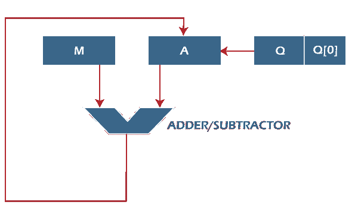
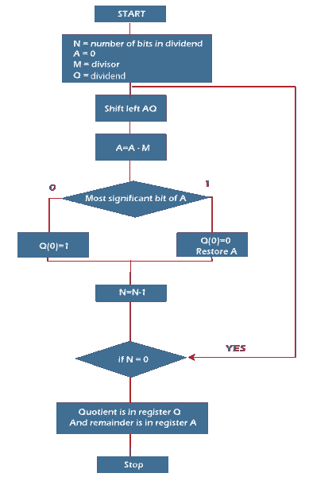

# 无符号整数的恢复除法算法

> 原文：<https://www.javatpoint.com/restoring-division-algorithm-for-unsigned-integer>

恢复除法通常对定点小数执行。当我们对两个数进行除法运算时，除法算法会给我们两个东西，即商和余数。该算法基于 0 < D < N 的假设，借助数字集{0，1}，在还原除法算法中将形成商数字 q。除法算法一般有两种，即快速算法和慢速算法。Goldschmidt 和 Newton-Raphson 是快速除法算法的类型，STR 算法、恢复算法、不执行算法和不恢复算法是慢速除法算法的类型。

在本节中，我们将借助于一个无符号整数来执行恢复算法。我们使用恢复项是因为我们知道寄存器 A 的值在每次迭代后都会被恢复。我们还将尝试使用流程图和应用位操作来解决这个问题。



这里，寄存器 Q 用来包含商，寄存器 A 用来包含余数。这里，除数将被载入寄存器 M，n 位除数将被载入寄存器 q。0 是一个寄存器的起始值。这些类型寄存器的值在迭代时被恢复。这就是为什么它被称为恢复。



现在我们来学习恢复除法算法的一些步骤，描述如下:

**第一步:**在这一步中，相应的值将被初始化到寄存器中，即寄存器 A 将包含值 0，寄存器 M 将包含除数，寄存器 Q 将包含被除数，N 用于指定被除数的位数。

**第二步:**在这一步中，寄存器 A 和寄存器 Q 将被视为一个单元，两个寄存器的值将左移。

**第三步:**之后，从寄存器 a 中减去寄存器 M 的值，相减的结果存储在寄存器 a 中

**步骤 4:** 现在，检查寄存器 A 的最高有效位。如果寄存器 A 的该位为 0，那么寄存器 Q 的最低有效位将被设置为值 1。如果 A 的最高有效位是 1，那么寄存器 Q 的最低有效位将被设置为 0，并恢复 A 的值，这意味着它将在用 m 相减之前恢复寄存器 A 的值

**第五步:**之后，N 值递减。这里 n 用作计数器。

**第六步:**现在，如果 N 的值为 0，我们将打破循环。否则，我们必须再次进入第 2 步。

**第七步:**这是最后一步。这一步，商包含在寄存器 Q 中，余数包含在寄存器 a 中。

**例如:**

在本例中，我们将执行除法恢复算法。

```

Dividend = 11
Divisor = 3

```

| **N** | **M** | **A** | **Q** | **操作** |
| four | 00011 | 00000 | One thousand and eleven | 初始化 |
|  | 00011 | 00001 | 011_ | 向左移动 AQ |
|  | 00011 | Eleven thousand one hundred and ten | 011_ | A = A - M |
|  | 00011 | 00001 | 0110 | Q[0] = 0，恢复 A |
| three | 00011 | 00010 | 110_ | 向左移动 AQ |
|  | 00011 | Eleven thousand one hundred and eleven | 110_ | A = A - M |
|  | 00011 | 00010 | One thousand one hundred | Q[0] = 0 |
| Two | 00011 | 00101 | 100_ | 向左移动 AQ |
|  | 00011 | 00010 | 100_ | A = A - M |
|  | 00011 | 00010 | One thousand and one | Q[0] = 1 |
| one | 00011 | 00101 | 001_ | 向左移动 AQ |
|  | 00011 | 00010 | 001_ | A = A - M |
|  | 00011 | 00010 | 0011 | Q[0] = 1 |

所以我们不要忘记恢复 A 的最高有效位的值，也就是 1。所以，寄存器 A 包含余数 2，寄存器 Q 包含商 3。

* * *