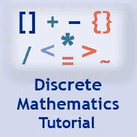

# 离散数学教程

> 原文：<https://www.javatpoint.com/discrete-mathematics-tutorial>

离散数学教程提供离散数学的基本和高级概念。我们的离散数学结构教程是为初学者和专业人士设计的。

离散数学是数学的一个分支，处理的对象只能考虑不同的、分离的值。本教程包括集合、关系和函数、数学逻辑、群论、计数理论、概率、数学归纳法和递归关系、图论、树和布尔代数的基本概念。

* * *

## 离散数学教程索引

* * *

**离散数学教程**

*   [离散数学](discrete-mathematics-tutorial)

**集合理论**

*   [套介绍](sets-introduction)
*   [器械包类型](types-of-sets)
*   [设置操作](sets-operations)
*   [集合代数](algebra-of-sets)
*   [多集](multisets)
*   [包含-排除原理](inclusion-exclusion-principle)
*   [数学归纳法](mathematical-induction)

**关系**

*   [二元关系](binary-relation)
*   [关系的表示](representation-of-relations)
*   [关系的构成](composition-of-relations)
*   [关系类型](types-of-relations)
*   [关系的闭包属性](closure-properties-of-relations)
*   [等价关系](equivalence-relations)
*   [偏序关系](partial-ordering-relations)

**功能&算法**

*   [功能](functions)
*   [功能类型](types-of-functions)
*   [身份功能](identity-functions)
*   [功能组成](compositions-of-functions)
*   [数学函数](mathematical-functions)
*   [算法&功能](algorithms-and-functions)

**逻辑&命题**

*   [命题&复合陈述](propositions-and-compound-statements)
*   [基本逻辑运算](basic-logical-operations)
*   [条件&双条件陈述](conditional-and-biconditional-statements)
*   [同义反复&矛盾](tautologies-and-contradiction)
*   [谓词逻辑](predicate-logic)
*   [正常形式](normal-forms)

**计数技术**

*   [基本计数原理](basic-counting-principles)
*   [排列&组合](permutation-and-combinations)
*   [鸽子洞原理](pigeonhole-principle)

**循环关系**

*   [循环关系](recurrence-relations)
*   [常系数线性递推关系](linear-recurrence-relations-with-constant-coefficients)
*   [特殊解决方案](particular-solution)
*   [总解决方案](total-solution)
*   [生成函数](generating-functions)

**概率论**

*   [概率](probability)
*   [加法定理](addition-theorem)
*   [乘法定理](multiplication-theorem)
*   [条件概率](conditional-probability)

**图论**

*   [图表介绍](introduction-of-graphs)
*   [图形类型](types-of-graphs)
*   [图形表示](representation-of-graphs)
*   [同构同胚图](isomorphic-and-homeomorphic-graphs)
*   [正则和二部图](regular-and-bipartite-graphs)
*   [平面和非平面图形](planar-and-non-planar-graphs)
*   [迪克斯特拉算法](discrete-mathematics-dijkstras-algorithm)
*   [旅行推销员问题](discrete-mathematics-travelling-salesman-problem)

**二叉树**

*   [树木介绍](discrete-mathematics-introduction-of-trees)
*   [二叉树](discrete-mathematics-binary-trees)
*   [遍历二叉树](discrete-mathematics-traversing-binary-trees)
*   [二分搜索法树](discrete-mathematics-binary-search-trees)
*   [最小生成树](discrete-mathematics-minimum-spanning-tree)

**算子&假设**

*   [二进制运算](discrete-mathematics-binary-operation)
*   [二元运算的性质](discrete-mathematics-properties-of-binary-operations)

**群论**

*   [半群](discrete-mathematics-semigroup)
*   [组](discrete-mathematics-group)
*   [子群](discrete-mathematics-subgroup)
*   [正常亚组](discrete-mathematics-normal-subgroup)

**有序集&格**

*   [部分有序集](discrete-mathematics-partially-ordered-sets)
*   [哈塞图表](discrete-mathematics-hasse-diagrams)
*   [格子](discrete-mathematics-lattices)

**布尔代数**

*   [布尔代数](discrete-mathematics-boolean-algebra)
*   [布尔表达式](discrete-mathematics-boolean-expression)
*   [范式](discrete-mathematics-canonical-forms)
*   [逻辑门&电路](discrete-mathematics-logic-gates-and-circuits)
*   [卡诺图](discrete-mathematics-karnaugh-maps)

* * *

## 先决条件

在学习 DMS 教程之前，你必须具备初等代数和数学的基础知识。

## 观众

我们的 DMS 教程旨在帮助初学者和专业人士。本教程是为在任何计算机科学和数学领域攻读学位的学生编写的。它努力帮助学生掌握离散数学的基本概念。

## 问题

我们保证您在本 DMS 教程中不会发现任何问题。但是如果有任何错误，请在联系表格中发布问题。

* * *