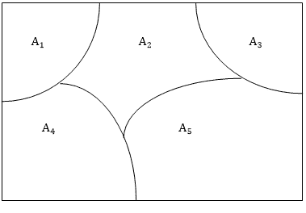

# 集合的类型

> 原文：<https://www.javatpoint.com/types-of-sets>

器械包可以分为许多种类。其中有些是有限的、无限的、子集的、泛的、真的、幂的、单例集的等等。

**1。有限集合:**如果一个集合恰好包含 n 个不同的元素，其中 n 是非负整数，那么这个集合就是有限的。这里，n 被称为“集合的基数”。集合的基数用|A|、# A、卡片(A)或 n (A)表示。

**示例:**

1.  空集θ的基数为 0，用|θ| = 0 表示
2.  偶数正整数集不是有限集。

A set is called a finite set if there is one to one correspondence between the elements in the set and the element in some set n, where n is a natural number and n is the cardinality of the set. Finite Sets are also called numerable sets. n is termed as the cardinality of sets or a cardinal number of sets.

**2。无限集合:**不是有限的集合叫做无限集合。

**可数无限:**如果集合中的元素与 n 中的元素一一对应，那么一个可数无限集合也称为可数集合。有限或可数的集合称为可数的。不可数的集合称为不可数集合。非负偶数整数的集合是可数无限的。

**不可数无穷:**不可数的集合称为不可数无穷集或不可数集或简单不可数。

**例:**可以用十进制形式 0 表示的小于 1 的所有+ve 个实数的集合 R。一个 <sub>1</sub> ，一个 <sub>2</sub> ，一个 <sub>3</sub> .....其中 a <sub>1</sub> 为整数，0 ≤ a <sub>i</sub> ≤ 9。

**3。子集:**如果集合 a 中的每个元素也是集合 b 中的一个元素，那么 a 称为 b 的子集，可以表示为⊆ B，这里 b 称为 a 的超集。

**示例:**如果 A= {1，2}和 B= {4，2，1}则 a 是 b 或 A ⊆ B 的子集。

**子集的属性:**

1.  每一个集合都是它自己的子集。
2.  空集合 i.e.∅是每个集合的子集。
3.  如果 a 是 b 的子集，b 是 c 的子集，那么 a 就是 c 的子集
4.  具有 n 个元素的有限集合有 2 个 <sup>n 个</sup>子集。

**4。真子集:**如果 A 是 B 的子集，A ≠ B，那么 A 就是 B 的真子集，如果 A 是 B 的真子集，那么 B 不是 A 的子集，即 B 中至少有一个元素不在 A 中

**示例:**

(I)让 A = {2，3，4}
B = {2，3，4，5}

a 是 b 的适当子集。

(ii)零∅是每个集合的适当子集。

**5。不当子集:**如果 A 是 B 的子集，A = B，那么 A 就是 B 的不当子集。

**例**

(i) A = {2，3，4}，B = {2，3，4}

a 是 b 的不当子集。

(二)每一个集合都是自身的不适当子集。

**6。泛集:**如果所有被研究的集合都是一个固定集合 U 的子集，那么这个集合 U 叫做泛集。

**例:**在人类种群研究中，宇宙集由世界上所有的人组成。

**7。空集合或空集合:**没有元素的集合称为空集合或空集合。它被称为 by∅.

**8。单例集:**它只包含一个元素。它由{s}表示。

**例:** S= {x|x∈N，7 < x < 9} = {8}

**9。相等集合:**两个集合 A 和 B 被称为相等，如果两者具有相同的元素，则被写成 A = B。因此，属于 A 的每个元素也是集合 B 的元素，属于集合 B 的每个元素也是集合 A 的元素。

```

A = B ⟺ {x ϵ A  ⟺  x ϵ B}.

```

如果集合 A 中有一些元素不属于集合 B，反之亦然，那么 A ≠ B，即 A 不等于 B

**10。等价集:**如果两个集的基数相等，则称为等价集。

**例:**如果 A= {1，2，6}和 B= {16，17，22}，它们是等价的，因为 A 的基数等于 B 的基数，即|A|=|B|=3

**11 时。不相交集:**如果 A 的元素不在 B 中，B 的元素不在 A 中，那么两个集合 A 和 B 就称为不相交。

**示例:**

R = {a，b，c}
S = {k，p，m}

r 和 S 是不相交的集合。

**12 时。幂集:**任意给定集合 A 的幂是 A 的所有子集的集合，用 **P (A)** 表示。如果 A 有 n 个元素，那么 **P (A)** 有**2<sup>n</sup>T9】个元素。**

**示例:** A = {1，2，3}
P (A) = {∅，{1}、{2}、{3}、{1，2}、{1，3}、{2，3}、{1，2}，{2，3}、{1，2，3}。

## 集合的分区:

让我们成为一个非空集合。S 的划分是将 S 细分为不重叠的非空子集。特别地，S 的一个分区是 S 的非空子集的集合{Ai}，使得:

*   S 中的每个 a 都属于 Ai 中的一个。
*   {Ai}的集合是互不相交的；也就是说，

```
Aj≠ Ak Then Aj ∩ Ak= ∅

```

分区中的子集称为单元。

**图:**将矩形集合 S 的点划分为五个单元的文氏图，A <sub>1</sub> ，A <sub>2</sub> ，A <sub>3</sub> ，A <sub>4</sub> ，A <sub>5</sub>



## 维恩图:

文氏图是集合的图示，其中平面上的一个封闭区域代表集合。

**示例:**


* * *