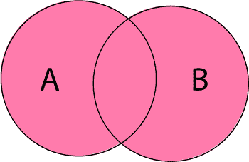
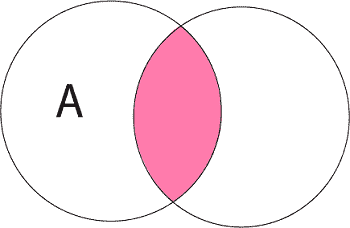
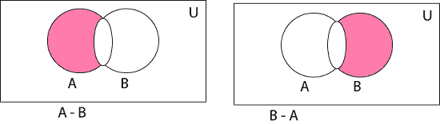
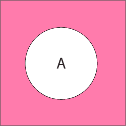
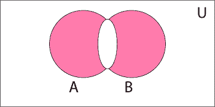

# 集合上的运算

> 原文：<https://www.javatpoint.com/sets-operations>

基本的设置操作有:

**1。集合的并集:**集合 A 和 B 的并集定义为属于 A 或 B 或两者的所有元素的集合，用 A∪B 表示

```

A∪B = {x: x ∈ A or x ∈ B}

```

**例:**设 A = {1，2，3}，B= {3，4，5，6}
A∪B = {1，2，3，4，5，6}。



**2。集合的交集:**两个集合 A 和 B 的交集是属于 A 和 B 的所有元素的集合，用 A∪B 表示

```

A ∩ B = {x: x ∈ A and x ∈ B}

```

**例:**设 A = {11，12，13}，B = {13，14，15 }
A∪B = { 13 }。



**3。集合的差:**两个集合 A 和 B 的差是属于 A 但不属于 B 的所有元素的集合，用 A - B 表示

```

A - B = {x: x ∈ A and x ∉ B}

```

**例:**让 A = {1，2，3，4}和 B = {3，4，5，6}然后 A - B = {3，4}和 B - A = {5，6}



**4。集合的补集:**集合 A 的补集是不属于 A 的泛集合的所有元素的集合，用 A <sup>c</sup> 表示。

```
Ac = U - A = {x: x ∈ U and x ∉ A} = {x: x ∉ A}

```

**例:**让 U 是所有自然数的集合。
A = {1，2，3 }
A<sup>c</sup>= {除 1，2 和 3 之外的所有自然数}。



**5。集合的对称差:**两个集合 a 和 b 的对称差是包含所有在 a 或 b 中但不在两者中的元素的集合，用⨁ B 表示，即

```

A ⨁ B = (A ∪ B) - (A ∩ B)

```

**例:**设 A = {a，b，c，d}
B = {a，b，l，m}
A ⨁ B = {c，d，l，m}



* * *