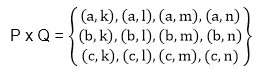

# 集合代数

> 原文：<https://www.javatpoint.com/algebra-of-sets>

并集、交集和补集运算下的集合满足表 1 中列出的各种定律(恒等式)。

**表:集合代数定律**

| **幂等定律** | A ∪ A = A | 甲∪甲=甲 |
| **关联定律** | (一)(甲∪乙)∪丙=甲∪(乙∪丙) | (B)(A∪B)∪C = A∪(B∪C) |
| **交换律** | (一)甲∪乙=乙∪甲 | (二)甲∪乙=乙∪甲 |
| **分配律** | (一)甲∩(乙∪丙)=(甲∪乙)∩(甲∪丙) | (二)甲∩(乙∪丙)=(甲∪乙)∩(甲∪丙) |
| **德摩根定律** | (A)(A∪B)<sup>c</sup>= A<sup>c</sup>∪B<sup>c</sup> | (B)(A∪B)<sup>c</sup>= A<sup>c</sup>∪B<sup>c</sup> |
| **同一性法则** | (a) A ∪ ∅ = A
(b) A ∪ U = U | (c)a′u = a〖t 0〗a′a′a□ |
| **补充定律** | (a)a∪a<sup>c</sup>= u
(b)a∪a<sup>c</sup>=∅ | (c)u<sup>=
【d】<sup>【c】</sup>= u</sup> |
| **对合定律** | (a) (A <sup>c</sup> ) <sup>c</sup> = A |  |

表 1 显示了集合代数定律。

### 示例 1:证明幂等定律:

```

(a) A ∪ A = A  

```

**解决方案:**

```
Since, B ⊂ A ∪ B, therefore A ⊂ A ∪ A
Let   x ∈ A ∪ A ⇒ x ∈ A  or   x ∈ A ⇒  x ∈ A
∴ A ∪ A ⊂ A
As  A ∪ A ⊂ A and  A ⊂ A ∪ A ⇒ A =A ∪ A. Hence Proved.

```

```

(b) A ∩ A = A

```

**解决方案:**

```
Since, A ∩ B ⊂ B, therefore A ∩ A ⊂ A
Let x ∈ A ⇒ x ∈ A  and x ∈ A  
⇒ x ∈ A ∩ A         ∴ A ⊂ A ∩ A
As A ∩ A ⊂ A and A ⊂ A ∩ A ⇒ A = A ∩ A. Hence Proved.

```

### 示例 2:证明关联定律:

```

(a) (A ∪ B) ∪ C = A ∪ (B ∪ C)

```

**解决方案:**

```
Let some x ∈ (A'∪ B) ∪ C
   ⇒  (x ∈ A   or   x ∈ B)    or   x ∈ C
   ⇒   x ∈ A   or   x ∈ B     or  x ∈ C
  ⇒    x ∈ A   or   (x ∈ B    or  x ∈ C)
  ⇒   x ∈ A   or   x ∈ B ∪ C 
  ⇒   x ∈ A ∪ (B ∪ C).
Similarly, if some   x ∈ A ∪ (B ∪ C), then  x ∈ (A ∪ B) ∪ C.
Thus, any 	         x ∈ A ∪ (B ∪ C) ⇔  x ∈ (A ∪ B) ∪ C. Hence Proved.

```

```

(b) (A ∩ B) ∩ C = A ∩ (B ∩ C)

```

**解决方案:**

```
Let some x ∈ A ∩ (B ∩ C) ⇒   x ∈ A and x ∈ B ∩ C 
   ⇒   x ∈ A  and (x ∈ B and x ∈ C)  ⇒   x ∈ A  and x ∈ B and x ∈ C
  ⇒   (x ∈ A  and x ∈ B) and x ∈ C)  ⇒   x ∈ A ∩ B and x ∈ C
  ⇒   x ∈ (A ∩ B) ∩ C.
Similarly, if some   x ∈ A ∩ (B ∩ C), then x ∈ (A ∩ B) ∩ C
Thus, any 	         x ∈ (A ∩ B) ∩ C  ⇔  x ∈ A ∩ (B ∩ C). Hence Proved.

```

### 例 3:证明交换律

```

(a)  A ∪ B = B ∪ A

```

**解决方案:**

```
To Prove 
      A ∪ B = B ∪ A
      A ∪ B = {x: x ∈ A or x ∈ B}
            = {x: x ∈ B or x ∈ A}   (∵ Order is not preserved in case of sets)
      A ∪ B = B ∪ A. Hence Proved.

```

```

(b) A ∩ B = B ∩ A 

```

**解决方案:**

```
To Prove 
      A ∩ B = B ∩ A
      A ∩ B = {x: x ∈ A and x ∈ B}
            = {x: x ∈ B and x ∈ A}   (∵ Order is not preserved in case of sets)
      A ∩ B = B ∩ A. Hence Proved.

```

### 例 4:证明分配律

```

(a) A ∪ (B ∩ C) = (A ∪ B) ∩ (A ∪ C)

```

**解决方案:**

```
To Prove 
	     Let x ∈ A ∪ (B ∩ C)  ⇒ x ∈ A or  x ∈ B ∩ C 
      ⇒   (x ∈ A  or x ∈ A) or (x ∈ B and   x ∈ C)
      ⇒   (x ∈ A  or x ∈ B) and (x ∈ A  or x ∈ C)
      ⇒   x ∈ A ∪ B and   x ∈ A ∪ C
      ⇒   x ∈ (A ∪ B) ∩ (A ∪ C)

Therefore, A ∪ (B ∩ C) ⊂ (A ∪ B) ∩ (A ∪ C)............(i)
Again, Let y ∈ (A ∪ B)  ∩ (A ∪ C) ⇒   y ∈ A ∪ B and y ∈ A ∪ C
      ⇒   (y ∈ A or y ∈ B) and (y ∈ A or y ∈ C)
      ⇒   (y ∈ A and y ∈ A) or (y ∈ B and y ∈ C)
      ⇒   y ∈ A    or    y ∈ B ∩ C
      ⇒   y ∈ A  ∪ (B ∩ C)
Therefore, (A ∪ B) ∩ (A ∪ C) ⊂ A ∪ (B ∩ C)............(ii)

Combining (i) and (ii), we get A ∪ (B ∩ C) = (A ∪ B) ∩ (A ∪ C). Hence Proved

```

```

(b) A ∩ (B ∪ C) = (A ∩ B) ∪ (A ∩ C)

```

**解决方案:**

```
To Prove 
      Let x ∈ A ∩ (B ∪ C)   ⇒   x ∈ A and x ∈ B ∪ C
	⇒  (x ∈ A and x ∈ A) and (x ∈ B  or x ∈ C)
         ⇒  (x ∈ A and x ∈ B) or  (x ∈ A and x ∈ C)
         ⇒   x ∈ A ∩ B or  x ∈ A ∩ C
         ⇒   x ∈ (A ∩ B) ∪ (A ∪ C)

Therefore, A ∩ (B ∪ C) ⊂ (A ∩ B) ∪ (A ∪ C)............ (i)
Again, Let  y ∈ (A ∩ B) ∪ (A ∪ C) ⇒ y ∈ A ∩ B or y ∈ A ∩ C
	  ⇒  (y ∈ A and y ∈ B) or (y ∈ A and y ∈ C)
	  ⇒  (y ∈ A or y ∈ A) and (y ∈ B or y ∈ C)
	  ⇒ y ∈ A and  y ∈ B ∪ C
           ⇒ y ∈ A ∩ (B ∪ C)
Therefore, (A ∩ B) ∪ (A ∪ C) ⊂ A ∩ (B ∪ C)............ (ii)

Combining (i) and (ii), we get A ∩ (B ∪ C) = (A ∩ B) ∪ (A ∪ C). Hence Proved

```

### 例 5:证明德·摩根定律

```
(a) (A ∪B)c=Ac∩ Bc

```

**解决方案:**

```
To Prove (A ∪B)c=Ac∩ Bc
Let x ∈ (A ∪B)c  ⇒  x ∉  A ∪ B			(∵ a ∈ A ⇔ a ∉ Ac)
           ⇒  x ∉  A and x ∉ B
           ⇒  x ∉  Ac and x ∉ Bc
           ⇒  x ∉  Ac∩ Bc
Therefore,  (A ∪B)c ⊂ Ac∩ Bc............. (i)
Again, let x ∈ Ac∩ Bc ⇒ x ∈ Ac and x ∈ Bc
            ⇒ x ∉  A and x ∉ B
            ⇒  x ∉  A ∪ B
            ⇒ x ∈ (A ∪B)c
Therefore, Ac∩ Bc  ⊂ (A ∪B)c............. (ii)
Combining (i) and (ii), we get Ac∩ Bc =(A ∪B)c. Hence Proved.

```

```
(b) (A ∩B)c = Ac∪ Bc

```

**解决方案:**

```
Let x ∈ (A ∩B)c ⇒ x ∉  A ∩ B    (∵ a ∈ A ⇔ a ∉ Ac)
           ⇒ x ∉  A or x ∉ B
           ⇒ x ∈ Ac and x ∈ Bc
           ⇒ x ∈ Ac∪ Bc
∴ (A ∩B)c⊂ (A ∪B)c.................. (i)
Again, Let x ∈ Ac∪ Bc   ⇒ x ∈ Ac or x ∈ Bc
            ⇒ x ∉  A or x ∉ B
            ⇒ x ∉  A ∩ B
            ⇒ x ∈ (A ∩B)c
∴ Ac∪ Bc⊂ (A ∩B)c.................... (ii)
Combining (i) and (ii), we get(A ∩B)c=Ac∪ Bc. Hence Proved.

```

### 例 6:证明同一性定律。

```

(a) A ∪ ∅ = A

```

**解决方案:**

```
To Prove A ∪ ∅ = A
	         Let  x ∈ A ∪ ∅ ⇒ x ∈ A   or  x ∈ ∅
              ⇒ x ∈ A        (∵x ∈ ∅, as ∅ is the null set )
        Therefore, x ∈ A ∪ ∅ ⇒ x ∈ A   
  Hence,     A ∪ ∅ ⊂ A.
We know that A ⊂ A ∪ B for any set B.
 But for B = ∅, we have A ⊂ A ∪ ∅ 
From above, A ⊂ A ∪ ∅ , A ∪ ∅ ⊂ A ⇒ A = A ∪ ∅. Hence Proved.

```

```

(b) A ∩ ∅ = ∅

```

**解决方案:**

```
To Prove A ∩ ∅ = ∅
If  x ∈ A, then x ∉  ∅             (∵∅ is a null set)
Therefore, x ∈ A, x ∉  ∅ ⇒ A ∩ ∅ = ∅. Hence Proved.

```

```

(c) A ∪ U = U

```

**解决方案:**

```
To Prove A ∪ U = U
Every set is a subset of a universal set.
   ∴   A ∪ U ⊆ U
    Also,   U ⊆ A ∪ U
Therefore, A ∪ U = U. Hence Proved.

```

```

(d) A ∩ U = A

```

**解决方案:**

```
To Prove A ∩ U = A
We know   A ∩ U ⊂ A................. (i)
So we have to show that A ⊂ A ∩ U
Let  x ∈ A ⇒ x ∈ A and x ∈ U        (∵ A ⊂ U so x ∈ A ⇒ x ∈ U )         
   ∴     x ∈ A ⇒ x ∈ A ∩ U
   ∴     A ⊂ A ∩ U................. (ii)
From (i) and (ii), we get A ∩ U = A. Hence Proved.

```

### 例 7:证明补充定律

```
(a) A ∪ Ac= U

```

**解决方案:**

```
To Prove A ∪ Ac= U
  Every set is a subset of U
    ∴  A ∪ Ac ⊂ U.................. (i)
We have to show that U ⊆ A ∪ Ac
  Let x ∈ U  ⇒  x ∈ A    or    x ∉  A     
      ⇒  x ∈ A    or   x ∈ Ac    ⇒ x ∈ A ∪ Ac
    ∴ U ⊆ A ∪ Ac................... (ii)
From (i) and (ii), we get A ∪ Ac= U. Hence Proved.

```

```
(b) A ∩ Ac=∅

```

**解决方案:**

```
As ∅ is the subset of every set
     ∴     ∅ ⊆ A ∩ Ac..................... (i)
We have to show that A ∩ Ac ⊆ ∅
Let x ∈ A ∩ Ac  ⇒ x ∈ A and x ∈  Ac       
     ⇒ x ∈ A  and x ∉  A
      ⇒ x ∈ ∅
    ∴      A ∩ Ac ⊂∅..................... (ii)

From (i) and (ii), we get A∩ Ac=∅. Hence Proved.

```

```
(c) Uc= ∅

```

**解决方案:**

```
Let x ∈ Uc   ⇔ x ∉ U ⇔ x ∈ ∅
    ∴ Uc= ∅. Hence Proved.     (As U is the Universal Set).

```

```
(d) ∅c = U

```

**解决方案:**

```
Let x ∈ ∅c ⇔ x ∉ ∅  ⇔ x ∈ U       (As ∅ is an empty set)
	∴ ∅c = U.  Hence Proved.	

```

### 例 8:证明对合定律

```
(a) (Ac )c A.

```

**解决方案:**

```
Let x ∈ (Ac )c ⇔ x ∉ Ac⇔  x ∈ a
     ∴ (Ac )c =A. Hence Proved.

```

## 二元性:

e 的对偶 e∫是将 e 中的∞、∞、u 和∅的每次出现分别用∞、∞、∅和 u 代替而得到的方程。例如，的对偶

```

(U ∩ A) ∪ (B ∩ A) = A is (∅ ∪ A) ∩ (B ∪ A) = A

```

作为对偶原理，注意到如果任何方程 E 是恒等式，那么它的对偶 E∫也是恒等式。

## 扩展原理:

根据可拓学原理，当且仅当 A 和 B 具有相同的成员时，它们是相同的。我们用 A=B 来表示相等的集合

```

 If A= {1, 3, 5} and B= {3, 1, 5}, then A=B i.e., A and B are equal sets.
 If A= {1, 4, 7} and B= {5, 4, 8}, then A≠ B i.e.., A and B are unequal sets.

```

## 两组的笛卡尔乘积:

两个集合 P 和 Q 按该顺序的笛卡儿积是所有有序对的集合，其第一个成员属于集合 P，第二个成员属于集合 Q，用 P×Q 表示，即，

```

P x Q = {(x, y): x ∈ P, y ∈ Q}.

```

**例:**设 P = {a，b，c}和 Q = {k，l，m，n}。确定 P 和 q 的笛卡尔乘积

**解:**P 和 Q 的笛卡尔积为



* * *