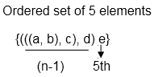

# 多集

> 原文：<https://www.javatpoint.com/multisets>

多集是元素的无序集合，其中一个元素的多重性可以是一个或多于一个或零。元素的多重性是该元素在多集中重复的次数。换句话说，我们可以说一个元素在一个集合中可以出现任意多次。

#### 示例:

```

A = {l, l, m, m, n, n, n, n}
B = {a, a, a, a, a, c}

```

## 多集上的运算

**1。多集的并:**两个多集 A 和 B 的并是一个多集，这样一个元素的重数等于 A 和 B 中一个元素的重数的最大值，用 A ∪ B 表示

#### 示例:

```

Let A = {l, l, m, m, n, n, n, n}
    B = {l, m, m, m, n}, 
A ∪ B = {l, l, m, m, m, n, n, n, n}

```

**2。多集的交集:**两个多集 A 和 B 的交集，是一个多集，使得一个元素的重数等于 A 和 B 中一个元素的重数的最小值，用 A∪B 表示

#### 示例:

```

Let A = {l, l, m, n, p, q, q, r}
    B = {l, m, m, p, q, r, r, r, r}
A ∩ B = {l, m, p, q, r}.

```

**3。多集的差:**两个多集 A 和 B 的差，是这样的多集:如果差为+ve，则一个元素的重数等于 A 中元素的重数减去 B 中元素的重数，如果差为 0 或负，则等于 0

#### 示例:

```

Let A = {l, m, m, m, n, n, n, p, p, p}
    B = {l, m, m, m, n, r, r, r}
A - B = {n, n, p, p, p}

```

**4。多集之和:**两个多集 A 和 B 的和是一个多集，这样一个元素的重数等于 A 和 B 中一个元素的重数之和

#### 示例:

```

Let A = {l, m, n, p, r}
    B = {l, l, m, n, n, n, p, r, r}
A + B = {l, l, l, m, m, n, n, n, n, p, p, r, r, r}

```

**5。集合的基数:**多集的基数是多集中不同元素的数量，不考虑元素的多重性

#### 示例:

```

A = {l, l, m, m, n, n, n, p, p, p, p, q, q, q}

```

多集 A 的基数是 5。

## 有序集合

它被定义为不同对象的有序集合。

#### 示例:

```

Roll no {3, 6, 7, 8, 9}
Week Days {S, M, T, W, W, TH, F, S, S}

```

## 有序对

有序对由两个元素组成，其中一个被指定为第一个成员，另一个被指定为第二个成员。

(a，b)和(b，a)是两个不同的有序对。有序三元组也可以写成{(a，b) c}有序对

有序 Quadrable 是第一个元素为有序三元组的有序对{((a，b，c) d)}。

有序 n 元组是有序对，其中第一个分量是有序(n - 1)元组，第 n <sup>个</sup>元素是第二个分量。

```

 {(n -1), n}

```

#### 示例:



* * *