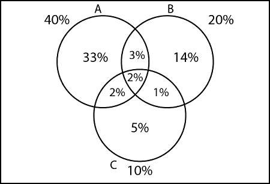

# 包含-排除原则

> 原文：<https://www.javatpoint.com/inclusion-exclusion-principle>

设 A，B 为任意两个有限集合。那么 n(A∪B)= n(A)+n(B)-n(A∪B)

这里“包括”n (A)和 n (B)，我们“排除”n(A∪B)

#### 例 1:

假设 A，B，C 是有限集合。那么 A ∪ B ∪ C 是有限的，n(A∪B∪C)= n(A)+n(B)+n(C)-n(A∪B)-n(A∪C)-n(B∪C)+n(A∪B∪C)

#### 例 2:

在一个有 10000 个家庭的镇上，发现 40%的家庭买报纸甲，20%的家庭买报纸乙，10%的家庭买报纸丙，5%的家庭买报纸甲和报纸乙，3%的家庭买报纸乙和报纸丙，4%的家庭买报纸甲和报纸丙。找出购买的家庭数量

1.  购买所有三种报纸的家庭数量。
2.  只买报纸的家庭数量
3.  仅购买报纸乙的家庭数量
4.  只买报纸的家庭数量
5.  不买甲、乙、丙的家庭数量
6.  仅购买一份报纸的家庭数量
7.  仅购买报纸甲和乙的家庭数量
8.  仅购买报纸乙和丙的家庭数量
9.  仅购买报纸 C 和 A 的家庭数量
10.  购买至少两份报纸的家庭数量
11.  最多购买两份报纸的家庭数量
12.  购买两份报纸的家庭数量

**解决方案:**



1.购买所有三种报纸的家庭数量:

```

n (A ∪ B ∪ C) = n(A) + n(B) + n(C) - n(A ∩ B) - n(A ∩ C) - n(B ∩ C) + n(A ∩ B ∩ C)
n (A ∪ B ∪ C) = 40 + 20 + 10 - 5 - 3 - 4 + 2 = 60%

```

2.只买报纸的家庭数量

```

= 40 - 7 = 33%

```

3.仅购买报纸乙的家庭数量

```

= 20 - 6 = 14%

```

4.只买报纸的家庭数量

```

= 10 - 5 = 5%

```

5.不买甲、乙、丙的家庭数量

```
n (A ∪B ∪C)c = 100 - n (A ∪ B ∪ C)
n (A ∪B ∪C)c = 100 - [40 + 20 + 10 - 5- 3- 4 + 2]
n (A ∪B ∪C)c = 100 - 60 = 40 %

```

6.仅购买一份报纸的家庭数量

```

= 33 + 14 + 5 = 52%

```

7.仅购买报纸甲和乙的家庭数量

```

= 3%

```

8.仅购买报纸乙和丙的家庭数量

```

= 1%

```

9.仅购买报纸 C 和 A 的家庭数量

```

= 2%

```

10.购买至少两份报纸的家庭数量

```

= 8%

```

11.最多购买两份报纸的家庭数量

```

= 98%

```

12.购买两份报纸的家庭数量

```

= 6%

```

* * *