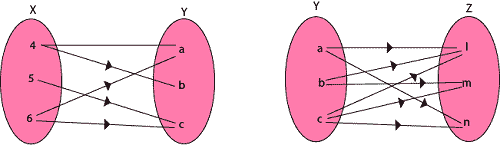
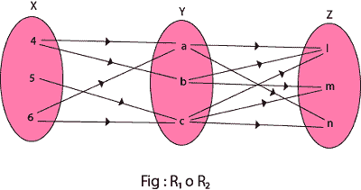
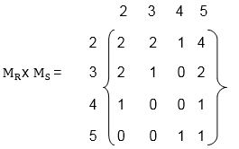
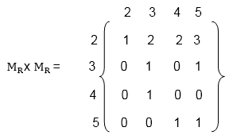
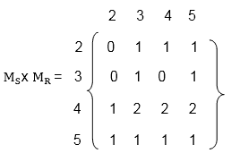

# 关系的合成

> 原文：<https://www.javatpoint.com/composition-of-relations>

设 A、B 和 C 是集合，设 R 是从 A 到 B 的关系，设 S 是从 B 到 C 的关系。也就是说，R 是 A × B 的子集，S 是 B × C 的子集。然后 R 和 S 产生了由 R♀S 表示的从 A 到 C 的关系，定义如下:

```

     a (R◦S)c if for some b ∈ B we have aRb and bSc. 
That is, 
     R ◦ S = {(a, c)| there exists b ∈ B for which (a, b) ∈ R and (b, c) ∈ S} 

```

关系式 R♀S 已知 R 和 S 的组成；它有时简单地用 RS 表示。

设 R 是集合 A 上的关系，即 R 是集合 A 到自身的关系。然后 R♀R，R 与自身的构成，总是被表现出来。还有，R♀R 有时用 R <sup>2</sup> 表示。同理，R<sup>3</sup>= R<sup>2</sup>♀R = R♀R♀R，以此类推。因此，R <sup>n</sup> 被定义为所有正 n。

**例 1:** 设 X = {4，5，6}，Y = {a，b，c}和 Z = {l，m，n}。考虑从 X 到 Y 的关系 R <sub>1</sub> 和从 Y 到 z 的关系 R <sub>2</sub>

```
 R1 = {(4, a), (4, b), (5, c), (6, a), (6, c)}
 R2 = {(a, l), (a, n), (b, l), (b, m), (c, l), (c, m), (c, n)}

```



找到关系**的构成(I)**R<sub>1</sub>o R<sub>2</sub>T6】(ii)R<sub>1</sub>o R<sub>1</sub><sup>-1</sup>

**解决方案:**

(一)组成关系 R <sub>1</sub> 或 R <sub>2</sub> 如图:



**R<sub>1</sub>o R<sub>2</sub>T5】= {(4，l)，(4，n)，(4，m)，(5，l)，(5，m)，(5，n)，(6，l)，(6，m)，(6，n)}**

(二)组成关系 R <sub>1</sub> o R <sub>1</sub> <sup>-1</sup> 如图:


**R<sub>1</sub>o R<sub>1</sub><sup>-1</sup>**= {(4，4)，(5，5)，(5，6)，(6，4)，(6，5)，(4，6)，(6)，(6，6)，(6，6)}

## 关系和矩阵的组成

还有一种求 R♀S 的方法，让 M <sub>R</sub> 和 M <sub>S</sub> 分别表示关系 R 和 S 的矩阵表示，然后

**例**

```

Let P = {2, 3, 4, 5}. Consider the relation R and S on P defined by
    R = {(2, 2), (2, 3), (2, 4), (2, 5), (3, 4), (3, 5), (4, 5), (5, 3)}
    S = {(2, 3), (2, 5), (3, 4), (3, 5), (4, 2), (4, 3), (4, 5), (5, 2), (5, 5)}.

        Find the matrices of the above relations.
Use matrices to find the following composition of the relation R and S.
  (i)RoS       (ii)RoR       (iii)SoR

```

**解:**关系式 R 和 S 的矩阵 a 如图所示:


(I)获取关系 R 和 S 的组成，首先将 M <sub>R</sub> 与 M <sub>S</sub> 相乘，得到矩阵 M <sub>R</sub> x M <sub>S</sub> ，如图:

矩阵 M <sub>R</sub> x M <sub>S</sub> 中的非零条目表示 RoS 中相关的元素。所以，



因此，关系式 R 和 S 的组成 R 或 S 是

```

R o S = {(2, 2), (2, 3), (2, 4), (3, 2), (3, 3), (4, 2), (4, 5), (5, 2), (5, 3), (5, 4), (5, 5)}.

```

(二)首先将矩阵 M <sub>R</sub> 本身相乘，如图



因此，关系式 R 和 S 的组成 R 或 R 是

```

R o R = {(2, 2), (3, 2), (3, 3), (3, 4), (4, 2), (4, 5), (5, 2), (5, 3), (5, 5)}

```

(三)将矩阵 M <sub>S</sub> 乘以 M <sub>R</sub> 得到矩阵 M <sub>S</sub> x M <sub>R</sub> ，如图:



矩阵 M <sub>S</sub> x M <sub>R</sub> 中的非零条目表示 S o R 中相关的元素

因此，关系式 S 和 R 的组成 S 或 R 是

```

S o R = {(2, 4) , (2, 5), (3, 3), (3, 4), (3, 5), (4, 2), (4, 4), (4, 5), (5, 2), (5, 3), (5, 4), (5, 5)}.

```

* * *