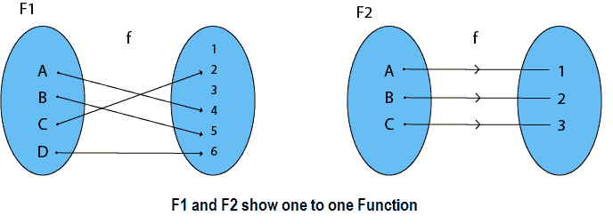
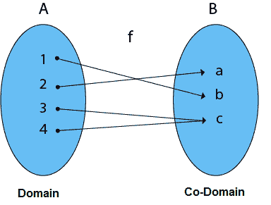
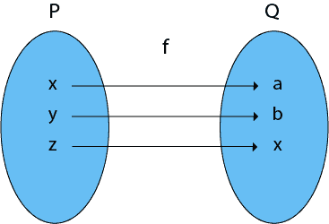
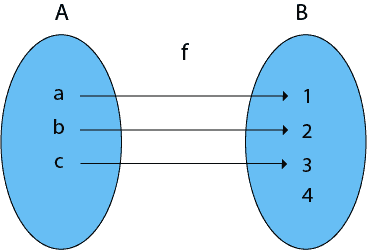
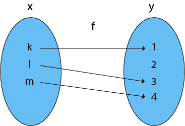
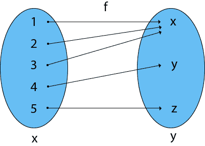
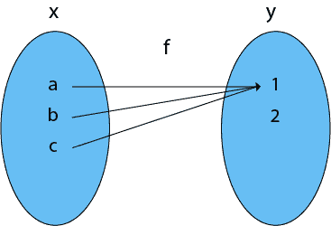
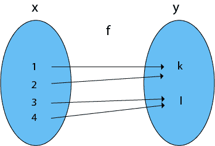

# 函数的类型

> 原文：<https://www.javatpoint.com/types-of-functions>

**1。内射(一对一)函数:**定义域集的一个元素与同定义域集的一个元素相连的函数。



**2。满射(到)函数:**共域集的每个元素都有一个预像的函数。

**例:**考虑，A = {1，2，3，4}，B = {a，B，c}和 f = {(1，B)，(2，A)，(3，c)，(4，c)}。

这是一个满射函数，因为 B 的每一个元素都是某个 A 的图像



#### 注意:在开函数中，范围等于共域。

**3。双射(一对一到)函数:**既有内射(一对一)又有满射(到)的函数称为双射(一对一到)函数。



**示例:**

```

Consider P = {x, y, z}
         Q = {a, b, c}
and f: P → Q such that
         f = {(x, a), (y, b), (z, c)}

```

f 是一个一对一的函数，它也是。所以它是一个双射函数。

**4。进入函数:**其中必须有共域 Y 元素的函数在域 X 中没有预像。

**示例:**

```

Consider, A = {a, b, c}
          B = {1, 2, 3, 4}   and f: A → B such that
          f = {(a, 1), (b, 2), (c, 3)}
In the function f, the range i.e., {1, 2, 3} ≠ co-domain of Y i.e., {1, 2, 3, 4}

```

因此，它是一个进入函数



**5。一一成函数:**设 f: X → Y，如果 X 的不同元素有 y 的不同唯一像，则函数 f 称为一一成函数。

**示例:**

```

Consider, X = {k, l, m}
          Y = {1, 2, 3, 4} and f: X → Y such that
          f = {(k, 1), (l, 3), (m, 4)}

```

函数 f 是一个一对一的函数



**6。多一函数:**设 f: X → Y，如果 X 中有两个或两个以上不同的元素在 y 中有相同的像，则函数 f 称为多一函数。

**示例:**

```

Consider X = {1, 2, 3, 4, 5}
         Y = {x, y, z} and f: X → Y such that
         f = {(1, x), (2, x), (3, x), (4, y), (5, z)}

```

函数 f 是一个多 1 函数



**7。多一进函数:**设 f: X → Y，函数 f 称为多一函数当且仅当既是多一又是进函数。

**示例:**

```

Consider X = {a, b, c}
         Y = {1, 2} and f: X → Y such that
         f = {(a, 1), (b, 1), (c, 1)}

```

因为函数 f 是一个多 1 进制函数，所以它是一个多 1 进制函数。



**8。多对一函数:**设 f: X → Y，函数 f 称为多对一函数，当且仅当既是多对一又是多对一。

**示例:**

```

Consider X = {1, 2, 3, 4}
         Y = {k, l} and f: X → Y such that
         f = {(1, k), (2, k), (3, l), (4, l)}

```

函数 f 是一个多 1(因为两个元素在 Y 中有相同的图像)，它是 on(因为 Y 的每个元素都是某个元素 X 的图像)。所以，这是多合一的功能



* * *