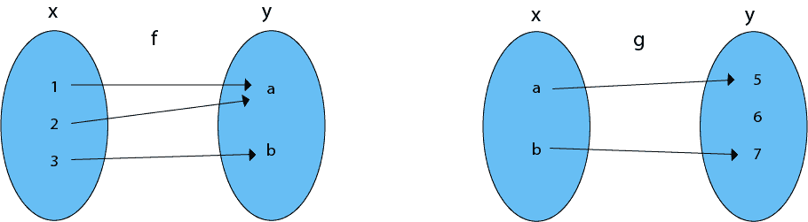
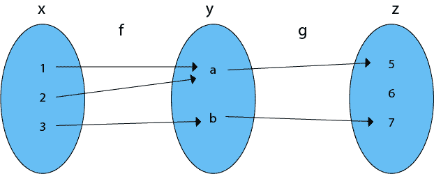

# 函数的组成

> 原文：<https://www.javatpoint.com/compositions-of-functions>

考虑函数，f: A → B 和 g: B → C，f 与 g 的合成是由(gof) (x) = g [f(x)]定义的从 A 到 C 的函数，由 gof 定义。

要求 f 和 g 的组成，先求 f 下 x 的像，再求 g 下 f (x)的像。

**示例 1:**

```

Let X = {1, 2, 3}
    Y = {a, b}
    Z = {5, 6, 7}.

```

考虑函数 f = {(1，a)、(2，a)、(3，b)}和 g = {(a，5)、(b，7)}如图所示。找出 gof 的组成。



**求解:**合成函数 gof 如图:



```
(gof) (1) = g [f (1)] = g (a) = 5, (gof) (2) = g [f (2)] = g (a) = 5
(gof) (3) = g [f (3)] = g (b) = 7.

```

**例 2:** 考虑整数上的所有函数 f、g 和 h，通过 f (n) =n <sup>2</sup> ，g (n) = n + 1 和 h (n) = n - 1。

确定**(一)** hofog **(二)** gofoh **(三)** fogoh。

**解决方案:**

```
(i) hofog (n) = n + 1,
    hofog (n + 1) = (n+1)2 
h [(n+1)2 ] = (n+1)2 - 1 = n2 + 1 + 2n - 1 = n2 + 2n.

(ii) gofoh (n) = n - 1, gof (n - 1) = (n-1)2 
     g [(n-1)2 ] = (n-1)2 + 1 = n2 + 1 - 2n + 1 = n2 - 2n + 2.

(iii) fogoh (n) = n - 1
      fog (n - 1) = (n - 1) + 1
      f (n) = n2.

```

**注:**

*   如果 f 和 g 是一对一的，那么函数(gof) (gof)也是一对一的。
*   如果 f 和 g 是 on，那么函数(gof) (gof)也是 on。
*   复合始终具有联想性质，但不具有交换性质。

* * *