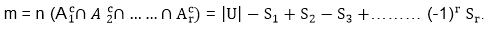

# 鸽子洞原理

> 原文：<https://www.javatpoint.com/pigeonhole-principle>

如果 n 个鸽子洞被 n+1 只或更多的鸽子占据，那么至少有一个鸽子洞被一只以上的鸽子占据。广义鸽子洞原理是:-如果 n 个鸽子洞被 kn+1 或更多的鸽子占据，其中 k 是正整数，那么至少有一个鸽子洞被 k+1 或更多的鸽子占据。

**例 1:** 找出一个班级的最小学生数，确定其中三个是同月出生。

**解决方案:**这里 n = 12 个月是鸽子洞
和 k + 1 = 3
K = 2

**例 2:** 说明如果一个房间里聚集了 13 个人，那么同一个月至少要有两个人过生日。

**解答:**我们给每个人分配了他出生的月份。因为一年有 12 个月。

所以，根据鸽笼原则，必须至少有两个人分配到同一个月。

## 包含-排除原则:

让 A 1 ，A 2 ......A r 是泛集 u 的子集，那么不出现在任何子集 A 1 ，A 2 中的元素的个数 m......美国的 A r

**例:**设 U 为不超过 1000 的正整数的集合。然后|U|= 1000 Find |S|其中 S 是这样一个不能被 3、5 或 7 整除的整数的集合？

**解法:**设 A 为可被 3 整除的整数子集
设 B 为可被 5 整除的整数子集
设 C 为可被 7 整除的整数子集

那么 S = AC∩BC∩CC因为 S 的每个元素不能被 3、5 或 7 整除。

通过整数除法，

| a | = 1000/3 = 333 | b | = 1000/5 = 200 | t1 | | c | = 1000/7 = 142 | a b | = 1000/15 = 66 | bⅲ| c | = 1000/21 = 47 | cⅲa | = 1000/35 = 28 | t5 | aⅲb

因此通过包含-排除原理

| S | = 1000-(333+200+142)+(66+47+28)-9
| S | = 1000-675+141-9 = 457

* * *