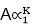
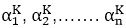
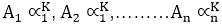
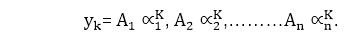
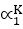
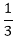
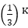
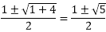
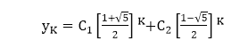

# 常系数线性递推关系

> 原文：<https://www.javatpoint.com/linear-recurrence-relations-with-constant-coefficients>

如果递归关系的度为 1，则称之为线性。

常系数线性递推关系的一般形式是

c0yn+r+c1yn+r-1+c2yn+r-2+⋯+cryn= r(n)

其中 C 0 ，C 1 ，C 2 ......C n 为常数，R (n)为自变量 n 的同一函数。

满足给定方程的任意函数中递归关系的解。

### 常系数线性齐次递推关系；

该方程称为线性齐次差分方程，当且仅当 R (n) = 0，且为 n 阶。

如果 R (n) ≠ 0，则称该方程为线性非齐次差分方程。

**例 1:** 方程 ar+3+6ar+2+12ar+1+8ar= 0 是一个三阶线性非齐次方程。

**例 2:** 方程 ar+2-4ar+1+4ar= 3r+2r是一个二阶线性非齐次方程。

常系数线性齐次差分方程由下式给出

C 0 和 n +C 1 和 n-1 +C 2 和 n-2 ...我...。+C r 和n-r0...我...。方程(一)

其中 **C 0 ，C 1 ，C 2 .....C n** 为常数。

方程(I)的解为形式，其中∧1为特征根，A 为常数。

将等式(1)中的 A∧K的值替换为 y n ，我们有

c【a】【k】+c【1】【a】【k-1】+c【a】【k-2】...我...+crak-r0...我...。方程(二)

简化等式(ii)后，我们有

c0【r】【r】+c【1】【r-1】【r-1】+c【r-2】......................方程(三)

方程(iii)被称为差分方程的特征方程。

如果∧1是特征方程的根之一，那么就是差分方程的齐次解。

为了找到线性齐次差分方程的解，我们有以下讨论的四种情况:

**情况 1:** 如果特征方程有 n 个不同的实根∧1、∧2、∧3，.......∧n。

因此，是等式(I)的所有解。

还有，我们有都是方程(I)的解。解的和也是解。

因此，差分方程的齐次解是

**情况 2:** 如果特征方程有重复的实根。

如果∧1=∧2，那么(A 1 +A 2 K) 也是一个解决方案。

如果∧1=∧2=∧3那么(A1+A2K+A3K2)也是一个解决方案。

同样，如果根∧1重复 n 次，那么。

(A1+A2K+A3K2+......+A n K n-1 ) 

齐次方程的解。

**情况 3:** 如果特征方程有一个虚根。

如果α+iβ是特征方程的根，那么α-iβ也是根，其中α和β是实的。

因此，(α+1β)K和(α-1β)K是方程的解。这意味着

(α+Iβ)KA1+α-Iβ)KA2

也是特征方程的解，其中 A 1 和 A 2 是待确定的常数。

**情况 4:** 如果特征方程有重复的虚根。

当特征方程有重复的虚根时，

(c+c【k】(α+Iβ)k+【c【3】+c【k】(α-Iβ)

是齐次方程的解。

**例 1:** 求解差分方程 ar-3ar-1+2ar-2= 0。

**解:**特征方程由下式给出

          s2-3s+2=0 or (s-1)(s-2)=0
          ⇒ s = 1, 2

因此，方程的齐次解由下式给出

          ar=C1r+C2.2r.

**例 2:** 求解差分方程 9yK+2-6yK+1+yK= 0。

**解:**特征方程为

          9s2-6s+1=0 or (3s-1)2=0
          ⇒ s = and

因此，方程的齐次解由
yK=(C1+C2K)给出。

**例 3:** 求解差分方程 yK-yK-1-yK-2= 0。

**解:**特征方程为 s 2 -s-1=0
s= 

因此，方程的齐次解是

**例 4:** 求解差分方程 yK+4+4yK+3+8yK+2+8yK+1+4yK= 0。

**解:**特征方程为 s4+4s3+8s2+8s+4 = 0
(s2+2s+2)(s2+2s+2)= 0
s =-1 i，-1i

因此，方程的齐次解由下式给出

yK=(C1+C2K)(-1+I)K+(C3+C4K)(-1-I)K

* * *