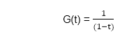
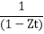
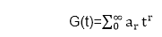
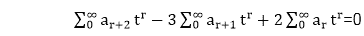
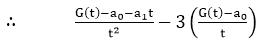
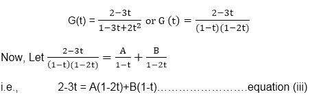
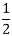
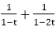

# 生成函数

> 原文：<https://www.javatpoint.com/generating-functions>

生成函数是求解递推关系的一种方法。

让我们考虑一下，序列 a 0 ，a 1 ，a 2 ....实数的 a r 。对于在 t 处含有零值的实数的某些区间，函数 G(t)由级数
G(t)= a 0 ，a1t+a2t2+⋯+artr+定义............方程式(I)

这个函数 G(t)叫做序列 a r 的生成函数。

现在，对于常数序列 1，1，1，1.....生成函数是

它可以表示为

g(t)=(1-t)-1= 1+t+t2+t3+t4+⋯[by 二项式展开式]

将此与等式(I)进行比较，我们得到

a 0 =1，a 1 =1，a 2 =1，依此类推。

例如，常数序列 1，2，3，4，5，..生成函数为
G(t) = ，因为它可以表示为
g(t)=(1-t)-2= 1+2t+3t2+4t3+⋯+(r+1)tr

将此与等式(I)进行比较，我们得到
a 0 =1，a 1 =2，a 2 =3，a 3 =4 等等。

zr(z≠0，z 为常数)的生成函数由
g(t)= 1+ZT+z2t2+z3t3+⋯+zrtrt15】g(t)=【假设| ZT |<1】
所以，g

同样，如果 a (1) r 具有生成函数 G 1 (t)和 a (2) r 具有生成函数 G 2 (t)，那么λ1a(1)T16】r+λ2a(2)这里λ 1 和λ 2 是常数。

## 应用领域:

生成函数可用于以下目的-

*   用于求解递归关系
*   为了证明一些组合恒等式
*   寻找数列项的渐近公式

**例:**求解递归关系 ar+2-3ar+1+2ar= 0

通过生成初始条件为 a 0 =2 和 a 1 =3 的函数的方法。

**解决方案:**让我们假设

将等式(I)乘以 t r 并从 r = 0 到∞，我们得到

(a2+a3a4t23(a1a2】

 +2G(t)=0............方程式(ii)

现在，将一个 0 =2 和一个 1 =3 放入等式(ii)中求解，我们得到

将 t=1 放在等式(iii)的两边，求 a .因此
-1=- A ∴ A = 1

将 t= 放在等式(iii)的两边以找到 b，因此
 =  B ∴ B = 1

因此 G (t) = 。因此，a  r  =1+2 r 。

* * *