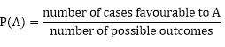
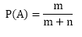
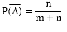
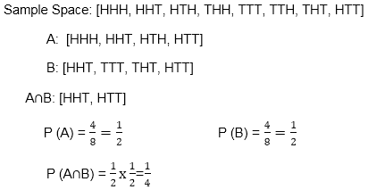

# 可能性

> 原文：<https://www.javatpoint.com/probability>

“概率”一词指某一特定事件发生的可能性。一般来说，以一定的正确概率定量预测一个事件的未来是可能的。概率用于试验结果不确定的情况。

## 概率定义:

事件 A 发生的概率，用 P(A)表示，定义为

因此，如果一个事件可以以 m 种方式发生，而不能以 n 种方式发生，并且 m+n 种方式同样可能发生，那么事件 A 发生的概率由下式给出

A 不发生的概率是

**注:**

1.  一个事件肯定会发生的概率是 1。
2.  不可能为零的事件发生的概率。
3.  如果一个事件发生的概率 P(A)和不发生的概率是 P( A ，那么
    P(A)+ P( A ) = 1，0 ≤ P(A) ≤ 1，0≤ P( A )≤1。

## 与概率相关的重要术语:

**1。试验和事件:**实验的表现称为试验，其结果集称为事件。

**例:**抛硬币取人头是一种尝试。那么事件就是{HT，TH，HH}

**2。随机实验:**是提前知道实验所有可能结果的实验。但是任何具体表现的确切结果并不事先知道。

**示例:**

1.  扔硬币
2.  滚压模具
3.  从一包 52 张牌中抽一张牌。
4.  从包里抽出一个球。

**3。结果:**随机实验的结果称为结果。

**例:** 1。抛硬币是一种实验，得到人头叫结果。
2。掷骰子得到 6 是一个结果。

**4。样本空间:**实验所有可能结果的集合称为样本空间，用 s 表示

**示例:**掷出骰子时，样本空间为 S = {1，2，3，4，5，6}
它由六个结果 1，2，3，4，5，6 组成

#### 注 1:如果模具被轧制 n 次，结果总数将为 6 n 。

#### 注 2:如果 1 个模具轧制 n 次，则 n 个模具轧制 1 次。

**5。事件的补码:**样本空间中所有结果的集合，但不是事件，称为事件的补码。

**6。不可能发生的事件:**永远不会发生的事件。

**例 1:** 在不可能发生的事件中抛双头硬币并得到尾巴。

**例 2:** 掷骰子得到数字> 10，不可能的结果。
P(不可能的结果)=0

**7。确定的结果/确定的结果:**一个肯定会发生的结果

**例 1:** 抛双头币，只取人头。

**例 2:** 掷骰子取数< 6
P(确定结果)= 1
{1，2，3，4，5 6}称为确定事件
P(确定结果)= 1

**8。可能的结果:**可能发生的结果称为可能的结果。

**例 1:** 掷一枚公平的硬币，并得到一个人头。

**例 2:** 擀一个模具，得到一个奇数。

**9。同等可能的事件:**如果不能预期其中一个事件优先于其他事件发生，则称这些事件具有同等的可能性。换句话说，这意味着每一个结果都像任何其他结果一样可能发生。

**例:**掷出骰子时，所有六个面，即 1、2、3、4、5、6 都同样有可能出现。

**10。互斥或不相交事件:**如果事件不能同时发生，则称为互斥事件。

**例:**假设从一副牌中抽出一张牌，那么得到一个杰克和得到一个国王的事件是互斥的，因为它们不能同时发生。

**11 时。穷尽事件:**实验所有可能结果的总数称为穷尽事件。

**例:**抛硬币时，头或尾都可能朝上。因此，有两种可能的结果。因此，抛硬币有两个详尽的事件。

**12 时。独立事件:**如果任何一个事件的发生不影响任何其他事件的发生，则称事件 A 和 B 是独立的。
P(A∪B)= P(A)P(B)。

**例:**一枚硬币掷三次，全部 8 个结果可能性相等
A:“第一次掷结果是人头。”
B:“最后一投结果在 Tails。”

证明事件 A 和事件 B 是独立的。

**解决方案:**

**13。从属事件:**如果一个事件的发生影响到其他事件的发生，则称事件是从属的。

* * *