# 加法定理

> 原文：<https://www.javatpoint.com/addition-theorem>

**定理 1:** 如果 A 和 B 是两个互斥的事件，那么
P(A ∪B)=P(A)+P(B)

**证明:**设 n =穷尽案例总数
n 1 =有利于 a 的案例数
n 2 =有利于 b 的案例数

现在，我们有 A 和 B 两个互斥的事件。因此，n 1 +n 2 是对 A 或 b 有利的病例数

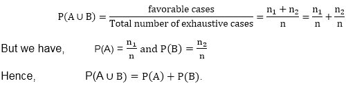

**例:**两个骰子掷一次。求第一次掷骰子得到偶数或总数为 8 的概率。

**解:**一个偶数可以通过 3 种方式上骰子，因为 2、4、6 中的任何一个都可以来。另一个骰子可以有任何数字。这可以通过 6 种方式实现。
∴ P(骰子上的偶数)= 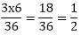

在以下情况下总共可以获得 8 个:

{(2，6)、(3，5)、(4，4)、(5，3)、(6，2)}
∴ P(共 8) = 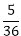
∴总概率= 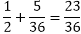

**定理 2:** 如果 A 和 B 是两个不互斥的事件，那么
P(A∪B)= P(A)+P(B)-P(A∪B)。

**证明:**设 n =穷举案例总数
n1=对 A 有利的案例数
n 2 =对 B 有利的案例数
n 3 =对 A 和 B 都有利的案例数

但 A 和 B 并不互相排斥。因此，A 和 B 可以同时发生。所以，n1+n2-n3是对 A 或 b 有利的病例数

所以 P(A ∪B)= 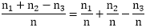
但是我们有，P(A)= 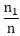，P(B) = 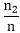和 P(A∪B)=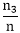

因此，P(A∪B)= P(A)+P(B)-P(A∪B)。

**例 1:** 两个骰子掷一次。求第一次掷骰子得到偶数或总数为 8 的概率。

**解:**p(ist die 上的偶数或总共 8)= p(ist die 上的偶数)+P(总共 8)= p(ist die 上的偶数和总共 8)
∴现在，p(ist die 上的偶数)= 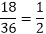

显示总数为 8 的有序对= {(6，2)，(5，3)，(4，4)，(3，5)，(2，6)} = 5
∴概率；p(共 8 个)= 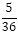

Ist 模具上的偶数，总共 8 个)= 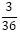

∴所需概率= 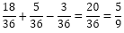

**例 2:** 掷两个骰子。甲、乙、丙、丁、戊、己四个项目

A =在第一个骰子上得到偶数。
B=在第一个骰子上得到一个奇数。
C =获得骰子点数之和≤ 5
D =获得骰子点数之和> 5 但小于 10。
E =得到骰子上的数字之和≥ 10。
F =在一个骰子上得到奇数。

**显示如下:**

1.甲、乙是互斥事件，也是穷尽事件。
2。甲、丙并不互相排斥。
3。c、D 是互斥事件，但不是穷举事件。
4。c、D、E 是一个互斥且穷尽的事件。
5。a '∪B '是一个互斥且穷尽的事件。
6。a、B、F 不是互斥事件。

**解决方案:**

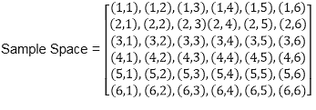

**A:** (2，1)、(2，2)、(2，3)、(2，4)、(2，5)、(2，6)
(4，1)、(4，2)、(4，3)、(4，4)、(4，5)、(4，6)
(6，1)、(6，2)、(6，3)、(6，4)、(6，5)、(6，6)

**B:** (1，1)、(1，2)、(1，3)、(1，4)、(1，5)、(1，6)
(3，1)、(3，2)、(3，3)、(3，4)、(3，5)、(3，6)
(5，1)、(5，2)、(5，3)、(5，4)、(5，5)、(5，6)

**C:** (1，1)、(1，2)、(1，3)、(1，4)、(2，1)、(2，2)、(2，3)、(3，1)、(3，2)、(4，1)

**D:** (1，5)、(1，6)、(2，4)、(2，5)、(2，6)
(3，3)、(3，4)、(3，5)、(3，6)
(4，2)、(4，3)、(4，4)、(4，5)
(5，1)、(5，2)、(5，3)、(5，4)
(6，1)、(6，2)、(6，3)

**E:** (4，6)，(5，5)，(5，6)，(6，5)，(6，6)，(6，4)

**F:** (1，2)、(1，4)、(1，6)
(2，1)、(2，3)、(2，5)
(3，2)、(3，4)、(3，6)
(4，1)、(4，3)、(4，5)
(5，2)、(5，4)、(5，6)
(6，1)、(6，3)、(6，5)

**1。**(a∪b)=∅和(A∪B)=S
A、b 是一个互斥且穷尽的事件。

**2。**(a∪c)不是互斥的
(2，1)、(2，3)、(4，1)≠ ∅

**3。**C∪D 是互斥但不穷尽的事件。
C∩D=∅ C∪ D≠S

**4。** C∩D=∅,D∩E=∅、C∩E=∅是互斥且穷尽的事件。

**5。**A '∪B ' =(A∪B)'是互斥且穷尽的事件。

**6。**(a∪b)=∅是相互排斥的
A、b、f 不是相互排斥的事件。

* * *