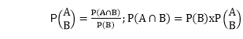
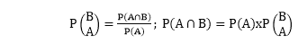
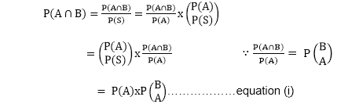
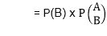
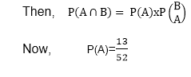
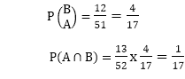

# 条件概率

> 原文：<https://www.javatpoint.com/conditional-probability>

**定理:**如果 A 和 B 是两个相关事件，那么给定 B 已经发生并由 P(A/B)表示的 A 的发生概率由下式给出

类似地，假设 A 已经发生，B 发生的概率由下式给出

**证明:**设 S 为样本空间。
那么，我们有

在等式(I)中交换 A 和 B，我们得到

**示例:**如果抽牌后没有更换牌，从洗牌良好的牌组中找出连续两次抽中每一次抽中一颗心的概率。

**解决方法:**让事件 A 在第一次平局时是一颗心，事件 B 在第二次平局时是一颗心。

当我们在第一场平局中得到一颗心时，第二场平局有 51 个结果，12 个是有利的。

* * *