# 图的表示

> 原文：<https://www.javatpoint.com/representation-of-graphs>

用矩阵表示图 G 有两种主要方法，即邻接矩阵和关联矩阵表示法。

## 无向图的表示:

**1。邻接矩阵表示法:**如果无向图 G 由 n 个顶点组成，那么图的邻接矩阵是 n×n 矩阵 A =[A]ij并由下式定义

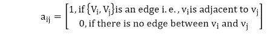

如果在顶点 v i 和 v j 之间存在一条边，其中 I 是一行，j 是一列，那么 a ij 的值=1。

如果顶点 v i 和 v j 之间没有边，则 a ij 的值=0。

**例:**求图 G 的邻接矩阵 M A 如图:

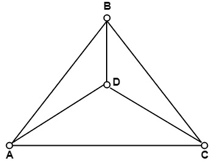

**解:**因为图 G 由四个顶点组成。因此，邻接矩阵会生成一个 4 x 4 的矩阵。邻接矩阵如下图所示:

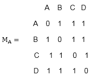

**2。关联矩阵表示法:**如果无向图 G 由 n 个顶点和 m 条边组成，那么关联矩阵是一个 n×m 矩阵 C =[C]ij]并且定义为

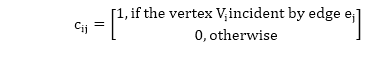

在入射矩阵中，每个顶点有一行，每个边有一列。

无向图(无环)的关联矩阵中的 1 的个数等于图中所有顶点的度数之和。

**例:**考虑如图所示的无向图 G，求其关联矩阵 M I 。

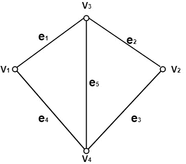

**解:**无向图由四个顶点和五条边组成。因此，关联矩阵是一个 4×5 矩阵，如图:

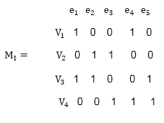

## 有向图的表示:

**1。邻接矩阵表示法:**如果有向图 G 由 n 个顶点组成，那么图的邻接矩阵是一个 n×n 矩阵 A =[A]ij并由下式定义

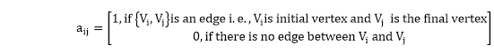

如果顶点 V i 和 V j 之间存在一条边，以 V i 为初始顶点，V j 为最终顶点，则 a ij 的值=1。

如果顶点 V i 和 V j 之间没有边，那么 a ij 的值=0。

有向图的邻接矩阵中的 1 的数目等于边的数目。

**例:**考虑图中所示的有向图，确定其邻接矩阵 M A 。

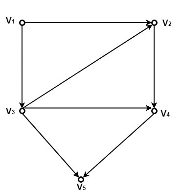

**解:**由于有向图 G 由五个顶点组成。因此，邻接矩阵将是 5×5 矩阵。有向图的邻接矩阵如下:

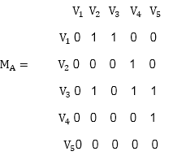

**2。关联矩阵表示法:**如果有向图 G 由 n 个顶点和 m 条边组成，那么关联矩阵是一个 n×m 矩阵 C =[C]ij，定义如下

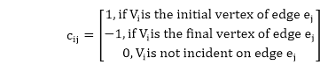

关联矩阵中的 1 的数量等于图中的边的数量。

**例:**考虑如图所示的有向图 G，求其关联矩阵 M I 。

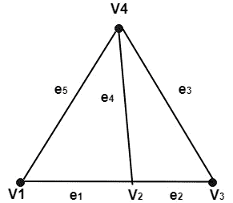

**解:**有向图由四个顶点和五条边组成。因此，关联矩阵是 4×5 矩阵，如图 1 所示:

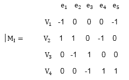

## 多重图形的表示:

仅用邻接矩阵表示。

**(i)多图的邻接矩阵表示:**如果一个多图 G 由顶点组成，那么图的邻接矩阵是一个 n×n 矩阵 A =[A]ij，定义如下

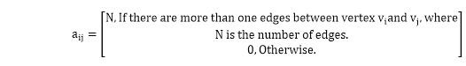

如果顶点 v i 和 v j 之间存在一条或多条边，则 a ij =N，其中 v i 和 v j 之间的边数。

如果 v i 和 v j 之间没有边缘。

**例:**考虑图中所示的多重图，确定其邻接矩阵。

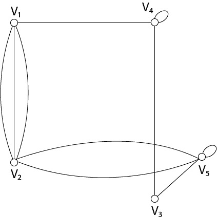

**解:**因为多重图由五个顶点组成。因此邻接矩阵将是一个 5×5 的矩阵。多重图的邻接矩阵如下:

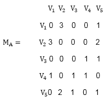

* * *