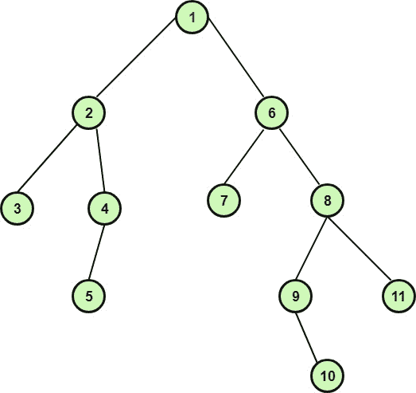
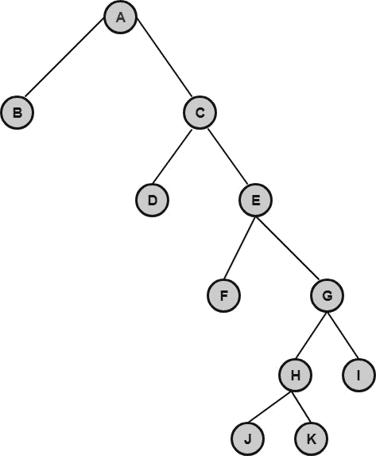
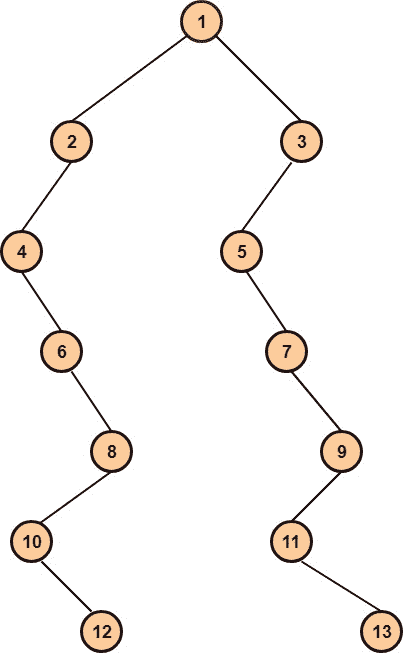
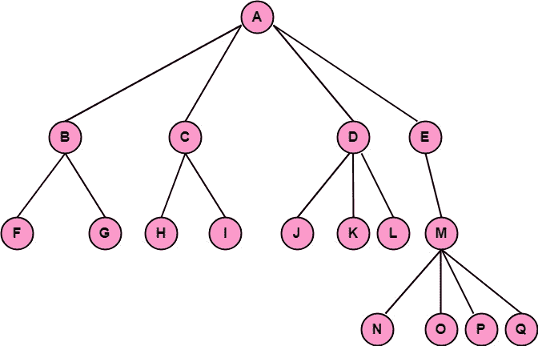
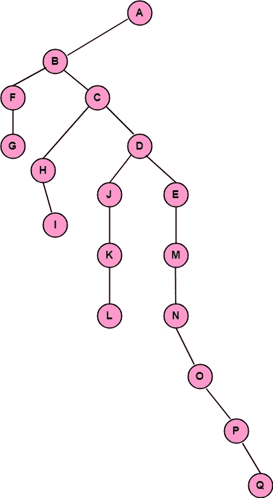

# 遍历二叉树

> 原文：<https://www.javatpoint.com/discrete-mathematics-traversing-binary-trees>

遍历意味着访问树的所有节点。遍历二叉树有三种标准方法。这些措施如下:

1.  前序遍历
2.  后序遍历
3.  有序遍历

**1。先序遍历:**二叉树的先序遍历是一个递归过程。树的前序遍历是

*   参观树根。
*   按顺序遍历左边的子树。
*   按顺序遍历右边的子树。

**2。后序遍历:**二叉树的后序遍历是一个递归过程。树的后序遍历是

*   以后置顺序遍历左边的子树。
*   以后置顺序遍历右子树。
*   参观树根。

**3。有序遍历:**二叉树的有序遍历是一个递归过程。树的有序遍历是

*   按照左子树的顺序遍历。
*   参观树根。
*   按照右子树的顺序遍历。

**示例:**确定二叉树的前序、后序和有序遍历，如图:

**解:**树的前序、后序和中序遍历如下:

| 预订 | one | Two | three | four | five | six | seven | eight | nine | Ten | Eleven |
| 邮件订单 | three | five | four | Two | seven | Ten | nine | Eleven | eight | six | one |
| 整齐 | three | Two | five | four | one | seven | six | nine | Ten | eight | Eleven |

## 算法:

**(a)当给出二叉树的有序和前序遍历时，绘制唯一二叉树的算法:**

1.  我们知道二叉树的根是它的前序的第一个节点。画出树根。
2.  要找到根节点的左子节点，首先，使用有序遍历来找到二叉树左子树中的节点。(在有序遍历中留在根节点的所有节点都是左子树的节点)。之后，通过选择左子树的前序遍历中的第一个节点获得根的左子。画左边的孩子。
3.  同样，使用有序遍历来查找二叉树右子树中的节点。然后通过选择右子树的前序遍历中的第一个节点来获得右子树。画出正确的孩子。
4.  对每个新节点重复第 2 步和第 3 步，直到在预订中没有访问每个节点。最后，我们得到一个唯一的树。

**示例:**当有序和前序遍历给定如下时，绘制唯一二叉树:

| 整齐 | B | A | D | C | F | E | J | H | K | G | 我 |
| 预订 | A | B | C | D | E | F | G | H | J | K | 我 |

**解:**我们知道二叉树的根是前序遍历的第一个节点。现在，检查 A，在有序遍历中，所有在左 A 的节点都是左子树的节点，所有在右 A 的节点都是右子树的节点。读取前序中的下一个节点，对照根节点检查它的位置，如果它在根节点的左边，那么把它画成左子节点，否则画成右子节点。对每个新节点重复上述过程，直到读完所有的前序遍历节点，最后我们得到二叉树，如图:

**(b)当给出树的有序和有序遍历时绘制唯一二叉树的算法:**

1.  我们知道二叉树的根是其后序的最后一个节点。画出树根。
2.  要找到根节点的右子节点，首先，使用有序遍历来找到二叉树右子树中的节点。(在有序遍历中位于根节点右侧的所有节点都是右子树的节点)。之后，通过选择右子树后序遍历中的最后一个节点，获得根的右子。画出正确的孩子。
3.  同样，使用有序遍历来查找二叉树左子树中的节点。然后通过选择左子树的后序遍历中的最后一个节点来获得左子树。画左边的孩子。
4.  对每个新节点重复第 2 步和第 3 步，直到每个节点都没有被按顺序访问。访问最后一个节点后，我们获得了一个唯一的树。

**示例:**为给定的 order 和 Postorder 遍历绘制唯一的二叉树，如下所示:

| 整齐 | four | six | Ten | Twelve | eight | Two | one | five | seven | Eleven | Thirteen | nine | three |
| 邮件订单 | Twelve | Ten | eight | six | four | Two | Thirteen | Eleven | nine | seven | five | three | one |

**解法:**我们知道二叉树的根是后序遍历的最后一个节点。因此，根节点中有一个。

现在，检查有序遍历，我们知道根在中心，因此有序遍历中根节点左边的所有节点都是左子树的节点，根节点右边的所有节点都是右子树的节点。

现在，在后序遍历中从后面访问下一个节点，并检查它在中序遍历中的位置，如果它在根的左边，则将其绘制为左子节点，如果它在右边，则将其绘制为右子节点。

对每个新节点重复上述过程，我们得到如图所示的二叉树:

**(c)将普通树转换为二叉树的算法**

1.  从根节点开始，树的根也是二叉树的根。
2.  树中根节点的第一个子 C 1 (左起)是二叉树中根节点的左子 C 1 ，C 1 的兄弟是 C 1 的右子，依此类推。
3.  对每个新节点重复步骤 2。

**示例:**将下图所示的树转换为二叉树。

**解:**树的根就是二叉树的根。因此 A 是二叉树的根。现在 B 成为二叉树中 A 的左子，C 成为 B 的右子，D 成为 C 的右子，E 成为二叉树中 D 的右子，类似地应用算法，我们得到二叉树如图:

* * *