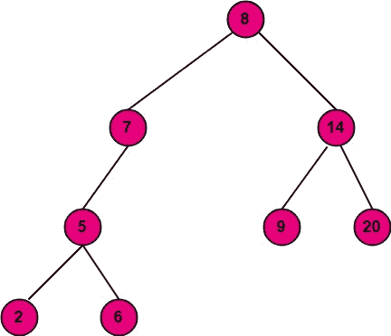
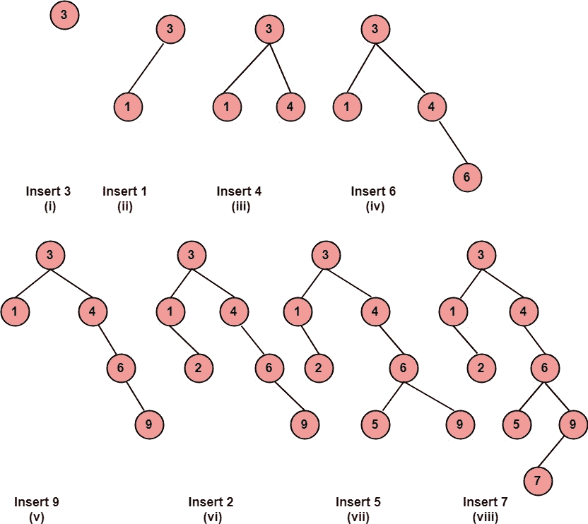
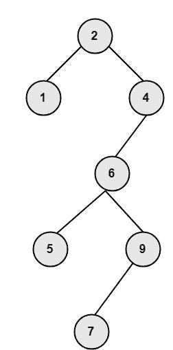

# 二分搜索法树

> 原文：<https://www.javatpoint.com/discrete-mathematics-binary-search-trees>

二分搜索法树的属性是左边的节点比指向它的节点包含更小的值，右边的节点比指向它的节点包含更大的值。

“二叉查找树”中的节点不必指向其值紧接在其之前和之后的节点。

**例:**图中的树是二叉查找树。

**插入一个二叉查找树:**考虑一个二叉树 t，假设我们给了一个 ITEM 的信息要插入到 t 中，ITEM 作为树中的一片叶子被插入。以下步骤解释了在二叉查找树 t 中插入项目的过程

1.  将项目与根节点进行比较。
2.  如果 ITEM>ROOT NODE，则前进到正确的子节点，它将成为正确子树的根节点。
3.  如果 ITEM
4.  重复以上步骤，直到我们遇到一个没有左右子树的节点。
5.  现在，如果 ITEM 大于节点，则 ITEM 作为右子节点插入，如果 ITEM 小于节点，则 ITEM 作为左子节点插入。

**示例:**显示在最初为空的二叉查找树中插入 3、1、4、6、9、2、5、7 后的二叉查找树。

**解:**上述节点在空二叉查找树中的插入如图所示:

**二叉查找树中的删除:**考虑一个二叉树 t。假设我们想从二叉查找树中删除一个给定的项目。要从二叉查找树中删除项目，我们有三种情况，具体取决于被删除节点的子节点数量。

1.  **删除的节点没有子节点:**删除一个没有子节点的节点很简单，用 null 替换节点。
2.  **已删除节点只有一个子节点:**用唯一的子节点替换已删除节点的值。
3.  **删除节点只有两个子节点:**这种情况下，用值最接近被删除节点的节点替换被删除节点。为了找到最近的值，我们向左移动一次，然后尽可能向右移动。该节点称为直接前置节点。现在用直接的前置节点替换被删除节点的值，然后使用 case1 或 case2 删除被替换的节点。

**示例:**显示删除根节点后的图(viii)所示的二叉树。

**解决方法:**要删除根节点，首先用根的最接近元素替换根节点。为此，首先向左移动一步，然后向右尽可能远地移动到节点。然后删除被替换的节点。删除后的树如图:

* * *