# 生成树

> 原文：<https://www.javatpoint.com/discrete-mathematics-minimum-spanning-tree>

连通图 G 的子图 T 称为 G 的生成树，如果 T 是树并且 T 包含 G 的所有顶点

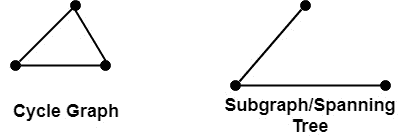

## 最小生成树:

假设 G 是一个连通权重图，即 G 的每条边都被赋予一个非负数，称为边的权重，那么 G 的任何生成树 T 都被赋予一个总权重，该总权重是通过将 T 中边的权重相加而得到的。

G 的最小生成树是总重量尽可能小的树。

**Kruskal 求最小生成树的算法:**该算法求给定连通加权图 g 的最小生成树 T。

1.  输入给定的有 n 个顶点的连通加权图 G，它的最小生成树是 T，我们要求。
2.  根据增加的权重对图 G 的所有边进行排序。
3.  用所有顶点初始化 T，但不包括一条边。
4.  把 T 中每一个直到 n-1 条边加起来才形成一个圈的图 G 相加。

**示例 1:** 确定图 1 所示加权图的最小生成树:

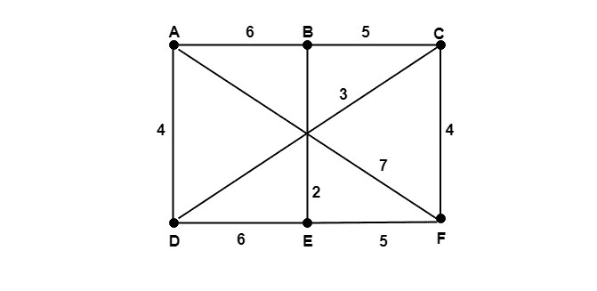

**求解:**使用 kruskal 算法将加权图的所有边按递增顺序排列，并用 G 的所有六个顶点初始化生成树 T，现在开始在 T 中添加 G 的不形成循环且权重最小的边，直到有六个顶点时没有添加五个边。

**边缘** **重量** **增加或不增加**
(B，E) 2 增加
(C，D) 3 增加
(A，D) 4 增加
(C，F) 4 增加
(B，C) 5 增加
(E，F) 5 不增加
(A，B) 6 不增加
(D，E) 6 不增加
(A，F) 7 不增加

**第一步:**

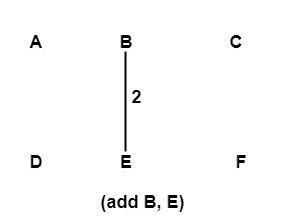

**第二步:**

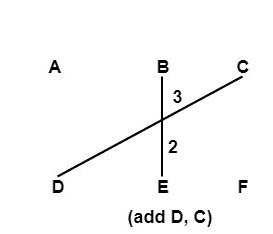

**第三步:**

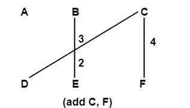

**第四步:**

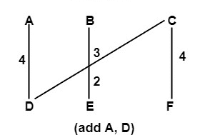

**第五步:**

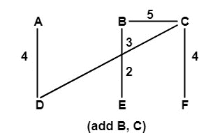

**步骤 6:** 边(A，B)、(D，E)和(E，F)被丢弃，因为它们将形成图中的循环。

因此，输出步骤 5 中的最小生成树形式，总成本为 18。

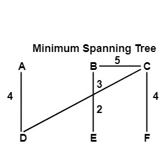

**例 2:** 找出图 G 的所有生成树，找出图中 G 的最小生成树:

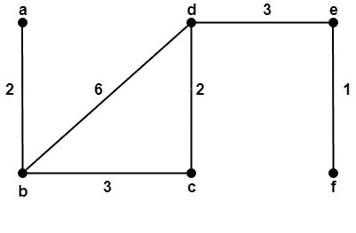

**解:**图 G 共有三棵生成树，如图:

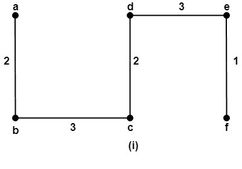
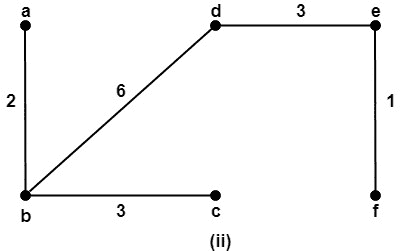
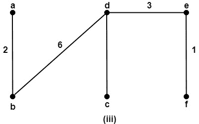

要找到最小生成树，请使用 KRUSKAL 算法。最小生成树如图所示:

**边缘** **重量** **增加或不增加**
(E，F) 1 增加
(A，B) 2 增加
(C，D) 2 增加
(B，C) 3 增加
(D，E) 3 增加
(B，D) 6 未增加

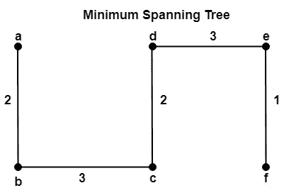

第一个是最小跨度，最小重量= 11。

* * *