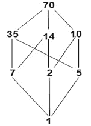

# 布尔代数:

> 原文：<https://www.javatpoint.com/discrete-mathematics-boolean-algebra>

补分配格被称为布尔代数。用(B，∧，∞，'，0，1)表示，其中 B 是定义了两个二进制运算∧ (*)和∨(+)以及一元运算(补)的集合。这里 0 和 1 是 b 的两个不同元素。

由于(B，∧，∧)是一个补分配格，因此 B 的每个元素都有一个唯一的补。

## 布尔代数的性质:

**1。交换性质:**

(一)a+b = b+a
(二)a*b=b *a

**2。分配属性**

(一)a+(b*c)=(a+b)*(a+c)
(二)a*(b+c)=(a*b)+(a*c)

**3。身份属性**

(一)a+0=a
(二)a *1=a

**4。补充法律:**

(一)a+a'=1
(二)a * a'=0

## 子代数:

考虑一个布尔代数(b，*，+，'，0，1)，设 a 为⊆ B .然后(a，*，+，'，0，1)称为 b 的子代数或子布尔代数，如果 a 本身是布尔代数，即 a 包含元素 0 和 1，并且在运算*，+和'下是闭的。

**示例:**考虑布尔代数 D 70 ，其哈斯图如图所示:

显然，A= {1，7，10，70}和 B = {1，2，35，70}是 D 70 的子代数。因为 A 和 B 在操作∧、∞和'下都是闭合的。

#### 注意:布尔代数的子集可以是布尔代数，但它可以是子代数，也可以不是子代数，因为它不能关闭 b 上的运算

## 同构布尔代数:

两个布尔代数 b 和 B 1 如果存在一一对应的 f: B⟶B 1 则称为同构，它保留了 b 中任意元素 a、b 的三个运算+、*和‘，即
f(a+b)= f(a)+f(b)
f(a * b)= f(a)* f(b)和 f(a’= f(a)”。

**示例:**下面是两个不同的布尔代数，其中两个元素同构。

1.第一个是从⊆(集包含)下的幂集 P(S)导出的布尔代数，即让 S = {a}，然后 B = {P(S)，∞，∞，' }是具有两个元素 P(S) = {∅,{a}}.的布尔代数

2.第二个是一个布尔代数{B，∩，∧，' }有两个元素 1 和 p {这里 p 是素数}在运算下除即让 B = {1，p}。所以，我们有 1 ∧ p = 1 和 1 ∨ p = p 也是 1'=p 和 p'=1。

该表显示了布尔代数(B，*，+，'，0，1)的所有基本性质，其中任何元素 a，B，c 都属于 B。B 的最大和最小元素分别用 1 和 0 表示。

1.a ≤b 如果 a+b = b ^ 2。a ≤b iff a * b = a
**3。幂等定律** **4。可交换财产**
(一)a+b=a(一)a+b=b+a
(二)a * a = a(二)a*b=b*a
**5。关联属性** **6。吸收定律**
(I)a+(b+ c)=(a+b)+c(I)a+(a * b)= a
(ii)a *(b * c)=(a * b)* c(ii)a *(a+b)= a
**7。同一性法则** **8。无效定律**
(一)a+0=a(一)a*0=0
(二)a*1=a(二)a+1=1
**9。分配规律** **10。补法**
(一)a*(b+c)=(a*b)+(a*c)(一)0'=1
(二)a+(b*c) = (a+b)*(a+c)(二)1'=0
(三)a+a'=1
(四)a*a'=0
**11。内卷律** **12。德·摩根定律**
(a)' = a(I)(a * b)' =(a '+b ')
(ii)(a+b)' =(a ' * b ')

#### 注:
1。每 a∈b 0≤a≤1 .
2。每个元素 b 都有一个唯一的补码 b’。

## 布尔函数:

考虑布尔代数(B，∞，∧，'，0，1)。如果一个由 n 个变量组成的布尔表达式可以指定从 A ' '到 A 的函数，则该函数称为布尔函数。

对于二值布尔代数，从[0，1] n 到[0，1]的任何函数都是布尔函数。

**示例 1:** 该表显示了从{0，1} 3 到{0，1}的函数 f

| (x，y，z) | f |
| (0, 0, 0) | Zero |
| (0, 0, 1) | Zero |
| (0, 1, 0) | one |
| (0, 1, 1) | Zero |
| (1, 0, 0) | one |
| (1, 0, 1) | one |
| (1, 1, 0) | Zero |
| (1, 1, 1) | one |

**示例 2:** 该表显示了从{0，1，2，3} 2 到{0，1，2，3}的函数 f。

| (x，y) | f |
| (0, 0) | one |
| (0, 1) | Zero |
| (0, 2) | Zero |
| (0, 3) | three |
| (1, 0) | one |
| (1, 1) | one |
| (1, 2) | Zero |
| (1, 3) | three |
| (2, 0) | Two |
| (2, 1) | Zero |
| (2, 2) | one |
| (2, 3) | one |
| (3, 0) | three |
| (3, 1) | Zero |
| (3, 2) | Zero |
| (3, 3) | Two |

#### 注意:函数总是可以用表格的形式来描述。表达函数的另一种方式是通过表达式指定函数。

* * *