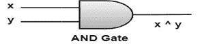
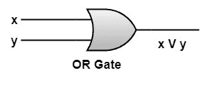
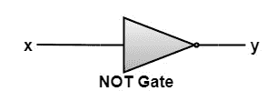
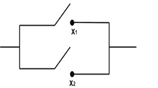

# 逻辑门和电路:

> 原文：<https://www.javatpoint.com/discrete-mathematics-logic-gates-and-circuits>

## 布尔表达式的示意图或图形表示:

布尔表达式可以用逻辑电路图形化表示。这些逻辑电路可以使用称为门的固态器件来构建，门能够切换电压电平。如果 x 和 y 是变量，那么基本表达式 x ∧ y (AND)、x ∨ y (OR)和x’(NOT)如下图所示:

**与门:**与门接收输入 x 和 y，并产生表示为 x ∧ y 的输出，如逻辑表所示

| x | y | 页:1 |
| Zero | Zero | Zero |
| Zero | one | Zero |
| one | Zero | Zero |
| one | one | one |

**或门:**或门接收输入 x 和 y，并产生表示为 x V y 的输出，如逻辑表所示

| x | y | 页:1 |
| Zero | Zero | Zero |
| Zero | one | one |
| one | Zero | one |
| one | one | one |

**非门:**非门接收输入 x 并产生输出 y，如逻辑表所示，用 x’表示

| x | x ' |
| Zero | one |
| one | Zero |

我们可以将这些设备互连起来，形成一个电子电路，实现任何给定的布尔表达式。

## 布尔代数在开关理论中的应用；

最简单的开关设备是“不关”开关。开关是一种装置，是一种电路，它允许或不允许电流流过电路。

开关有两种状态“否”或“关”(关闭或打开)

*   如果开关闭合，电流将通过它。
*   如果开关打开，电流就不会流过。
*   开由 1 表示

关闭由 0 表示。

包含布尔表达式开关的电路，如果开表示为真或 1，关表示为假或 0。

## 串联和并联:

开关有两种连接方式。

1.串联 2。并联接法

**1。串联:**两个开关 x 1 和 x 2 只有当两个开关都接通(闭合)时电流才能通过，如果两个开关或其中任何一个都断开(断开)时电流不流动，则称为串联。象征性地，两个开关 x 1 和 x 2 的串联用 x 1 ∧ x 2 或 x 1 * x 2 表示。

它用图表表示如下:

**2。并联:**两个开关 x 1 和 x 2 如果任意一个开关都接通(闭合)时有电流流过，而两个开关都断开(断开)时没有电流流过，则称为并联。象征性地，两个开关 x 1 和 x 2 的并联用 x 1 ∨ x 2 或 x 1 + x 2 表示。

它用图表表示如下:

* * *