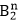
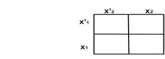
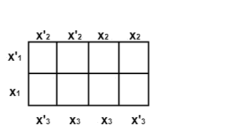
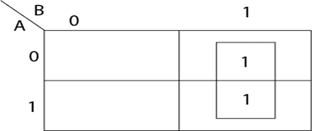
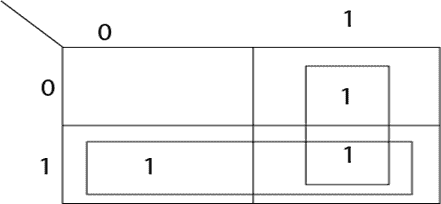
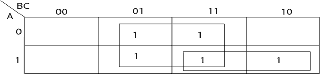
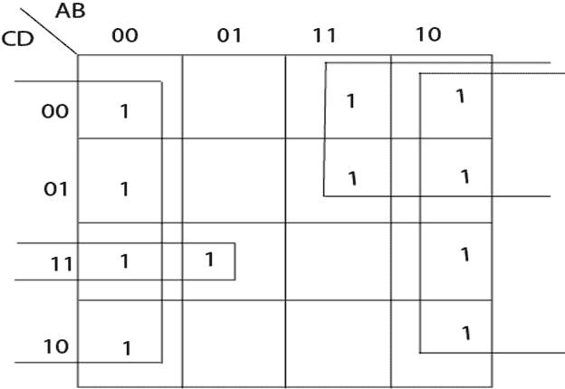

# 卡诺图:

> 原文：<https://www.javatpoint.com/discrete-mathematics-karnaugh-maps>

卡诺图是一个平面区域，细分为 2 个 n 个相等的单元，每个单元代表 n 个变量函数的一个点。每个变量 x 用于以不同的方式将面积分成相等的两半，即一个用于 x，另一个用于 x’。对应于函数值为 1 的参数的单元格包含 1。

**例 1:** 当变量个数 n = 1 时，卡诺图如图所示:

2.当变量数 n =2 时，卡诺图如图所示:

3.当变量数 n =3 时，卡诺图如图所示:

## 用 K-映射简化布尔函数:

布尔函数可以用 k-map 简化。它基于在相邻单元中组合术语的原理。如果两个单元格只有一个变量不同，则称它们相邻。在相邻的单元格中，一个变量是相同的，而另一个变量在一个单元格中以非补充形式出现，在另一个单元格中以补充形式出现。

### 标准操作程序表格的最小化:

可以使用以下算法来获得最小化表达式:

1.  找出那些不能与任何其他元素结合的元素包围它们。
2.  找出那些只能以一种方式组合成两个一组的，并把它们围成一组。
3.  找出能和另外三个结合的，组成一组四个相邻的，用唯一的方法，把它们围成一组。
4.  找出能和其他七个组合在一起的，组成一组八个相邻的，用唯一的方法，把它们围成一组。
5.  在确定了 2、4、8 个基本群之后，如果还有一些没有被圈起来的，那么就要把它们相互结合起来，或者同其他已经圈起来的结合起来，也就是说，我们要把剩下的尽可能大的群和尽可能少的群联系起来。

**示例 1:** 使用 k-map 最小化以下布尔表达式:

f(A，B) = A' B+BA

**求解:**首先绘制 2 变量 k-map，在对应单元格中插入 1，如图:

所需的最小化布尔表达式为 f=B。

**示例 2:** 使用 k-map 最小化以下布尔表达式:

AB + A' B+BA '

**解:**画出双变量 k-map，在对应的单元格中插入 1，如图:

所需的最小化布尔表达式是 f=A+B。

**示例 3:** 使用 k-map 最小化以下布尔表达式:

f(A，B，C) = AB' C+A' BC+AB+A' B' C

**求解:**绘制 3 变量 k-map，在对应单元格中插入 1，如图:

所需的最小化布尔表达式是 f=AB+C '

### 最小化非最小/最大项的布尔函数:

将这些函数最小化的一种方法是将其转换为标准形式，即 SOP 或 POS，然后制作 k-map 并获得最小化的函数。

另一种方法是直接使用以下算法准备 k-map

1.  为最小项输入 1，为最大项输入 0。
2.  为每个术语输入一对 1/0，其中一个变量少于变量总数。
3.  对于两个变量少于变量总数的项，输入四个相邻的 1/0。
4.  以类似的方式重复其他术语。

**示例:**最小化四变量逻辑函数

f (A，b，c，d)= a b c+d a ' BCD+a ' b ' c '+a ' b '+AC '+ab ' c+b

**解:**通过以下方式获得 k 图

(A)在单元格中输入 1，A=1，B=1，C=0，D=1，对应于最小项 A B C 'D

(B)在单元格中输入 1，A=0，B=1，C=1，D=1 对应于最小项 A' BCD

(C)在两个单元格中输入 1，其中 A=0，B=0，C=0 对应于术语 A' B' C '

(D)在两个单元格中输入 1，A=0，B=0，D=0 对应术语 A' B' D '

(e)在两个单元格中输入 1，其中 A=1，B=0，C=1 对应于术语 AB' C

(f)在四个单元格中输入 1，A=1，C=0 对应术语“交流”

(g)在八个单元格中输入 1，B=0 对应于术语 B’

The minimized expression is B'+ AC'+A' CD.

* * *