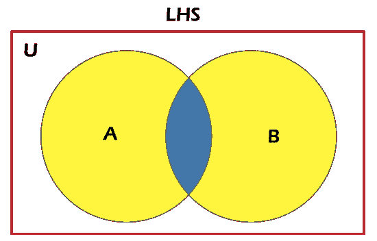
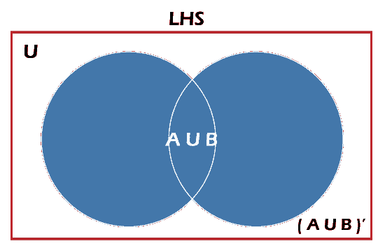
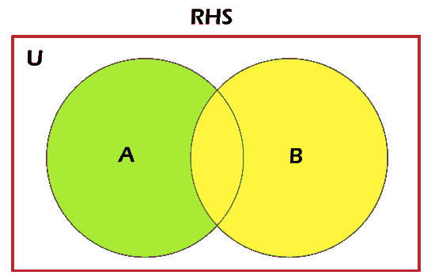
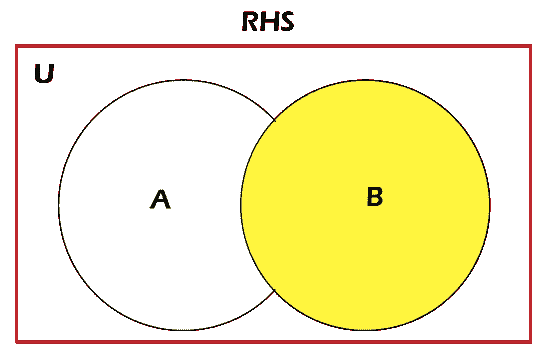

# 德·摩根定律的证明

> 原文：<https://www.javatpoint.com/proof-of-de-morgans-law>

德·摩根定律阐明了数学陈述和概念是如何通过它们的对立面联系在一起的。在集合论中，德·摩根定律描述了两个集合并的补总是等于它们的补的交集。并且两个集合的交集的补数总是等于它们补数的并集。在本文中，我们将学习如何用一些例子来证明德·摩根定律。我们也可以在布尔逻辑中使用计算机工程中的德·摩根定律。

### 德·摩根定律的陈述与证明

在对德·摩根定律进行研究之前，首先，我们需要了解什么是设定？顾名思义，集合是对象或元素的定义明确的集合。德摩根定律非常简单易懂。它由不同的操作组成，如集合的并集、交集和补集，可以在两个集合上执行。在通用集合中，我们考虑与特定上下文相关的所有对象或元素。通用集合表示为 u

让我们借助一个例子来理解这个概念；考虑一个泛集 U，泛集的子集是 A 和 b。

对于任意两个有限集合 A 和 B

1)德·摩根的联合定律

=(A∪B)' = A '∪B '

2)德·摩根相交定律

=(A∪B)' = A '∪B '

### 德·摩根联合定律

=(A∪B)' = A '∪B '……(1)

其中一个集合的补被给出为

a ' = { x:x∞∪和 x ∉A}

哪里，

它表示补语

借助文氏图，我们很容易理解这个概念。

第一个等式的左边产生集合 A 和集合 B 的补数。这意味着集合 A 和集合 B 的并集是集合 A 或集合 B 中所有元素的集合。给定的图描绘了集合 A 和集合 B 的文氏图

在上图中，突出显示的蓝色区域代表 A。A’的补码是除突出显示的蓝色区域之外的所有元素的集合。给定的图描绘了 A 和 b 的补码的文氏图

类似地，第一个方程的右边可以用给定的文氏图来表示。给定的图表描述了 a 的补码。

绿色部分代表集合 A，黄色部分代表它的补码 A’

类似地，B 的分量可以表示为

黄色部分表示集合 B，白色部分表示其补码:B’

现在，我们将图像 3 和 4 相互结合，得到给定的维恩图

因此，

长度硫化氢=硫化氢

数学上，

甲∪乙=甲或乙

(A ∪B)' =既不是 A 也不是 B

不在于甲

'乙'不在于乙

A '∪B ' =不在 A 也不在 B。

设 J = (A U B)'和 K = A '∪B '

让我们成为 J 的任意元素，然后 s ∈ J = s ∈ (A U B)。'

= s ∉ （A U B）

∉和∉

= s ∈ A '和 s ∈ B '

= s∈A '∪b '

= s ∈ K

因此，j·⊂·k ……(一)

再次，假设 t 是 K 的任意元素，那么 t∈K = t∈A '∪b '

= t ∈ A '和 t ∈ B '

∉和∉

= t′(a 或 b)

= t ∈ (A U B)。'

= t ∈ J

因此，k .⊂j ………(二)

现在结合(一)和(二)我们得到；J = K 即(A U B)' = A '∪B '

因此，通过应用文氏图和分析德摩根定律，我们证明了(A)' = A '∪b '

德·摩根定理描述了所有项的补数的乘积等于每个项的分量之和。

### 德·摩根定律的证明:

(A∪B)' = A ' U B '

设 P =(A∪B)'和 Q = A' U B '

假设我们是 M 的任意元素，那么 s∈P = s∈(A∪B)。'

= s∉(a∪b)

s ∉ A 或 x ∉ B

= s ∈ A '或 s ∈ B '

= s ∈ A' U B '

= s ∈ N

因此，⊂·q ……(一)

再次，假设 t 是 Q 的任意元素，那么 t ∈ N = t ∈ A' U B '

= t ∈ A '或 t ∈ B '

= t-a 或 t-b

= t(b)

= t∈(A∪B)。'

= t ∈ M

因此，Q ⊂ P……(二)

现在结合(一)和(二)我们得到；P = Q 即(A∪B)' = A ' U B '

### 基于德·摩根定律的问题

**问题 1:**

如果 U = {2，3，4，5，6，7，8，9}，A = {5，6，7}和 B = {6，7，9}。展示一下

(A∪B)' = A '∪B '。

**解决方案:**

我们知道，

U = {2，3，4，5，6，7，8，9}

A = {5，6，7}

B = {6，7，9}

A ∪ B = {5，6，7 }∞{ 6，7，9}

= {5, 6, 7, 9}

因此，(A ∪ B)' = {2，3，4，8 }……………………(一)

现在，A = {5，6，7}所以，A' = {2，3，4，8，9}

并且，B = {6，7，9}所以，B' = {2，3，4，5，8} A '∞；B ' = { 2，3，4，8，9 }∞{ 2，3，4，5，8 }

因此，A '∪B ' = { 2，3，4，8 }……………………(二)

结合等式(I)和(ii)我们得到:

(A∪B)' = A '∪B '

**问题 2:**

如果 U = {a，b，c，d，e}，P = {a，b，c}和 Q = {b，c，e}。

德摩根定律的证明:(P∪Q)' = P ' U Q '。

**解决方案:**

我们知道，

U = {a，b，c，d，e}

P = {a，b，c}

Q = {b，c，e}

(p-q)= { a，b，c }；{ b，c，e}/p >

= {b，c}

因此，(P∪Q)' = { a，d，e} …………(i)

同样，P = {a，b，c}所以，P' = {d，e}

而 Q = {b，c，e}那么，Q' = {a，d}

P' ∪ Q' = {d，e }∞{ a，d}

因此，P' ∪ Q' = {a，d，e} …………..㈡

结合等式(I)和(ii)，我们得到:

(p ' q)' = p ' u q . '。

**问题 3:**

如果 U = {1，3，5，6，7，9，11，13}，A = {5，7，11}和 B = {7，11，13}。展示一下

(A∪B)' = A '∪B '。

**解决方案:**

我们知道，

U = {1，3，5，6，7，9，11，13}

A = {5，7，11}

B = {7，11，13}。

A ∪ B = {5，7，11 }∞{ 7，11，13}。

= {5, 7, 11, 13}

因此，

(甲∪乙)' = {1，3，6，9} ………………(一)

现在 A = {5，7，11}

所以，A' = {1，3，6，9，13}

并且，B = {7，11，13}。所以，B' = {1，3，5，6，9}

a '∞B ' = { 1，3，6，9，13 }∞{ 1，3，5，6，9}

因此，A '∪B ' = { 1，3，6，9 }………………(二)

结合等式(I)和(ii)我们得到:

(A∪B)' = A '∪B '

**问题 4:**

如果 U = {p，q，r，s，t}，A = {p，q，r}和 B = {q，r，t}。

德摩根定律的证明:(A∪B ' = A ' U B '。

**解决方案:**

我们知道，

U = {p，q，r，s，t}

A = {p，q，r}

B = {q，r，t}。

(A∪B)= { p，q，r }∞{ q，r，t}

= {q，r}

因此，(A∪B)' = { p，s，t} ………… (i)

同样，A = {p，q，r}所以，A' = {s，t}

并且，B = {q，r，t}

所以，B' = {p，s} A' ∪ B' = {s，t} ∪ {p，s}

因此，

A' ∪ B' = {p，s，t }………………(二)

结合等式(I)和(ii)，我们得到:

(A∪B)' = A ' U B '。

* * *