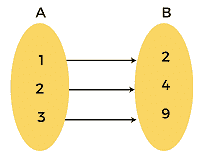
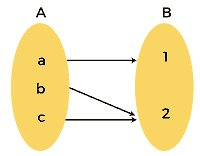
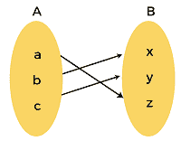

# 离散数学中的双射函数

> 原文：<https://www.javatpoint.com/bijective-function-in-discrete-mathematics>

双射函数也可以称为一对一对应函数或双射。一对一函数(注入函数)和一对一对应都是不同的东西。所以我们不应该对这些感到困惑。如果一个函数 f: X → Y 同时满足满射函数(到函数上)和内射函数(一对一函数)的性质，那么这个函数就称为双射函数。

在双射中，集合的每个元素都有它的伙伴，没有一个被遗漏。所以我们可以说集合的成员有完美的“一一对应”。双射函数也可以称为**反函数**，因为它们包含反函数的性质。符号 **f -1** 用于表示双射的逆。在反函数中，每个“b”都有一个匹配的“a”，每个“a”都指向一个唯一的“b”，这意味着 f(a) = b。因此 f -1 (b) = a。

### 双射函数的性质

如果一个双射函数包含一个函数 f: X → Y，那么 x ∈ X 的每个函数和 y ∈ Y 的每个函数都使得 f(x) = y，所以我们可以说元素‘a’是元素‘b’的原像。与元素“b”相同的是元素“a”的图像。现在我们将学习双射函数的基本性质，描述如下:

如果我们试图映射两个函数，X 和 Y，那么它将变成双射，如果它包含以下属性:

*   每个 X 元素必须与至少一个 Y 元素配对。
*   x 元素不能与一个以上的 Y 元素配对。
*   每个 Y 元素必须与至少一个 X 元素配对。
*   y 元素不能与一个以上的 X 元素配对。

### 差异:

这里我们将学习内射(一对一)、满射(上)和双射(一对一对应)之间的区别，描述如下:

| 没有。 | 内射函数 | 满射函数 | 双射函数 |
| one | 如果定义域的不同元素映射到它的共主的不同元素，那么函数就是内射的。 | 如果 A 的一个以上的元素映射 b 的相同元素，则函数将是满射的 | 双射函数包含内射函数和满射函数。 |
| Two | 这个函数也可以称为一对一函数。 | 这个函数也可以被称为 on 函数。 | 这个函数也可以称为一对一对应。 |
| three |  |  |  |

### 证明函数是双射的

在这一节中，我们将证明所描述的函数是否是双射的。如果需要确定两者之间的双射，那么首先我们要定义一个映射 f: A → B，之后我们会得出结论|A| = |B|来说明 f 是双射。借助于写 f 的逆，我们可以证明函数 f 是双射的，或者我们可以分两步说，描述如下:

1.  f 是满射的
2.  f 是内射的

如果我们有两个集合 A 和 B，并且它们有相同的大小，在这种情况下，集合之间不会有双射，函数也不会是双射的。双射可以描述为域 A 的元素与共主域 b 的元素“配对”，其实会有 n！A 和 B 之间的双射如果|A| = |B| = n。

### 双射函数的例子

这里我们将解释双射函数的各种例子。

**例 1:**

在这个例子中，我们必须证明函数 f(x) = 3x - 5 是从 R 到 R 的双射。

**解决方案:**

在双射函数的基础上，一个给定的函数 f(x) = 3x -5，如果它同时包含满射函数和内射函数，那么它就是双射函数。

### 证明函数是内射的

如果我们想证明给定的函数是内射的，那么我们已经证明了 f(a) = c 和 f(b) = c 然后 a = b。

为此，我们将假设

f(a) = c and f(b) = c

因此，我们可以这样写:

c = 3a -5 and c = 3b -5

因此，我们可以这样写:

3a - 5 = 3b - 5

当我们简化这个方程时，我们将得到以下结果:

a = b

所以，我们可以说给定的函数 f(x)= 3x -5 是内射的。

### 证明函数是满射的

如果我们想证明一个给定的函数是满射的，那么我们必须首先证明在任何点“a”的范围内在子域“s”中存在一个点“b”。这意味着 f(b) = a。

为此，我们将假设

a = 3x - 5

因此，b 的值将是这样的:

b = (a + 5)/3

因为，上面的数字是实数，也是域中显示的。所以我们可以说这个函数是满射的。

因此，函数 f(x) = 3x - 5 满足 on 函数和一对一函数的条件。所以我们可以说给定的函数是双射的。

**例 2:**

在这个例子中，我们将有一个函数 f: A → B，其中集合 A = {x，y，z}和 B = {a，B，c}。我们必须证明这个函数是否是双射的。

**解决方案:**

我们知道 f: A → B 是这样的

f = {(x, a), (y, b), (z, c)}

如我们所见，上述函数满足上函数和一对一函数的性质。这就是为什么给定的函数是双射函数。

**例 3:**

在这个例子中，我们必须证明函数 f(x) = x 2 是否是正实数集合的双射函数。

**解决方案:**

对于正实数，给定的函数 f(x) = x 2 既是内射的又是满射的。这就是为什么它也是双射的。

但是对于所有的实数 R，同一个函数 f(x) = x 2 有 2 和-2 的可能性。所以 f(2) = 4，f(-2) = 4，不满足双射的性质。这就是为什么我们可以说，对于所有实数，给定的函数不是双射的。

**例 4:**

在这个例子中，我们必须证明函数 f:{一年中的一个月} {1，2，3，4，5，6，7，8，9，10，11，12 }是否是双射函数。

**解决方案:**

给定的函数将是双射的，如果我们把函数定义为 f(M) =数字‘n’，这样 M 被用来定义第 n 个月。

* * *