# 离散数学中的有向图和无向图

> 原文：<https://www.javatpoint.com/directed-and-undirected-graph-in-discrete-mathematics>

为了学习离散数学中的有向图和无向图，我们将首先学习图。之后，我们将学习有向图和无向图。该图描述如下:

## 图表

该图是一组**顶点**和**边的数学和图形表示。**由边与节点或顶点相连的非空集合组成。**节点**可以描述为对应于对象的顶点。**边**可以称为对象之间的连接。**箭头** (→)用于表示**边。**根据箭头方向，图形会遍历。图的边有时包含权重，用于显示顶点之间每个连接的强度。

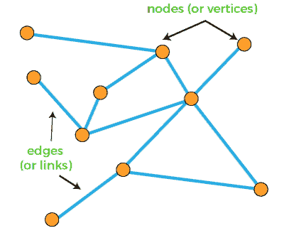

基于边，不同类型的图有不同的形式定义。因此，产生了各种术语。在各种应用中，节点和边有不同的定义。**例如:**借助于图，我们可以对社交网络的友谊进行建模。在图中，人将借助节点来表示，友谊将借助边来表示。

借助图形，我们能够对各种各样的系统进行建模。机场和网页链接就是一个很好的例子。对于机场，机场将由节点表示，机场之间的灯光将由边缘表示。在使用图表时，我们应该了解一些对我们有用的定义。这些定义描述如下:

*   **自循环**可以描述为一条连接顶点和自身的边。**子图**是构成有向图的有向图边的一种子集。
*   如果一个图的两条边与同一个有序的顶点对相连，这些边将在**平行。**一条边的数量也可以称为**一个循环的长度**或路径。顶点的外度数可以描述为指向它的边的数量。顶点的度数可以描述为指向它的边的数量。
*   有向图中的**有向路径**可以描述为一系列顶点和一条有向边。其中，边从序列中的每个顶点指向序列中的后继顶点。有向路径将不包含重复的边。如果没有重复的顶点，那么**有向路径**将是**简单。**
*   如果有向路径中的第一个和最后一个顶点相同，并且至少包含一条边，那么有向路径将被称为**有向循环。**如果有向循环中除了第一个和最后一个顶点的必要重复之外没有重复的顶点，那么**有向循环**将是**简单的。**如果没有有向循环，有向图将被称为**有向无环图(DAG)。**
*   假设有两个顶点，“x”和“y”。如果存在从“x”到“y”的有向路径，则顶点“x”可以从顶点“y”到达。如果顶点“x”和“y”都是**相互可达的，**这些顶点将被称为**强连通。**互连是指顶点‘x’具有从顶点‘y’开始的有向路径，顶点‘y’也具有从顶点‘x’开始的有向路径。
*   如果每个顶点都有一条到其他顶点的有向路径，则有向图将是**强连通的。**如果有向图是**非强连通的，**它将包含一组强连通分量。这些类型的分量是极大强连通子图。

### 图形的类型:

现在我们将描述两种类型的图:有向图和无向图。

**有向图:**

有向图也称为有向图，它是一组顶点和边的集合。这里的边将是有向边，每条边将与有序的顶点对连接。在图中，有向边或箭头从对中的第一个/原始顶点指向第二个/目标顶点。在 V 顶点图中，我们将通过名称 0 到 V-1 来表示顶点。如果有向图中有两个顶点 x 和 y 与一条边(x，y)相连，则这条边(y，a)在该图中不一定也可用。

根据有向图的定义，同一个源节点和目的节点不允许有多个箭头，但是一些作者考虑了边界定义，他们说同一个源节点和目的节点可以在有向图中包含多个箭头，因为他们允许箭头集是多集。更具体地说，我们可以将这些类型的实体称为有向多重图。

基于有向图的上述定义，有向图允许有环。这意味着它们可以包含直接连接节点和自身的箭头。如果有向图有环，该图将被称为环有向图。在下面的有向图中，只有有向边。它包含从一个顶点到任何其他顶点的有向边和一个环。

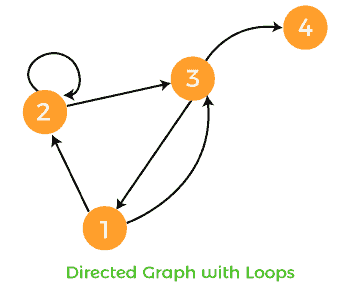

一些作者允许更窄的定义，即有向图不允许包含循环。更具体地说，如果有向图没有环，该图将被称为**简单有向图。**在下面的有向图中，只有有向边。它包含从一个顶点到任何其他顶点的有向边，并且不允许循环。

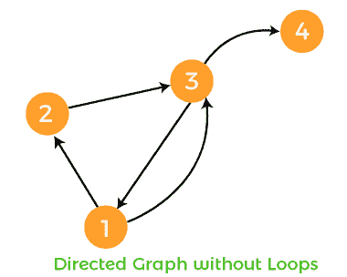

因此，我们可以说一个简单的有向图没有任何类型的循环，而任何状态都能够包含到多个状态的多个顶点(转换)。所以在顶点 x 和 y 上，有向图只能做一次从顶点 x 到顶点 y 的过渡，反之亦然。

**例 1:**

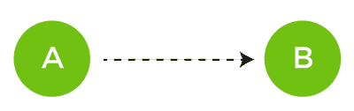

在这个例子中，图形能够从顶点 X 遍历到顶点 Y，但是它不能从顶点 Y 遍历到顶点 X

**例 2:**

在这个例子中，我们将考虑下面的图，其中 G = {N，E}。现在我们要找出这个图中的顶点和边集。

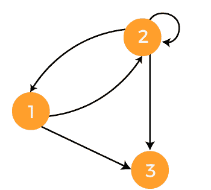

对于上面的图，顶点集和边集描述如下:

G = {{1，2，3}，{(1，2)，(2，1)，(2，2)，(2，3)，(1，3)}}

**例 3:**

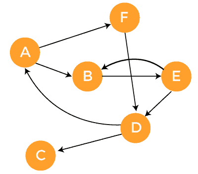

上述有向图的相邻矩阵描述如下:

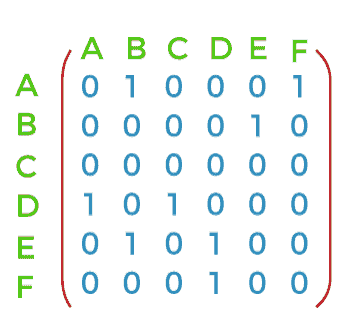

有向图的邻接表描述如下:

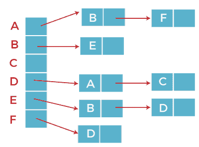

**无向图**

无向图也被称为双向图。它是一组连接在一起的对象(也称为顶点或节点)。这里的边是双向的。这两个节点用一条线连接，这条线被称为边。无向图将表示为 G = (N，E)。其中 N 表示边的集合，E 表示边的集合，是元素 N 的无序对，有向图和无向图的主要区别是有向图用箭头或有向边连接两个节点。箭头在有向图中从原始顶点指向目标顶点。而在无向图中，两个节点与两个方向边相连。

无向图与有向图相比限制更大，因为如果关系具有层次性，那么无向图将不允许对它们建模。无向图在实践中很常见。借助于无向图，我们可以很容易地对许多现实世界的关系进行建模。例如，关系“是的朋友”可以称为典型的对称关系。这种关系是对称的，因为如果有“玛丽是哈利的朋友”的情况，那么“哈利是玛丽的朋友”也是真的。

**例 1:**

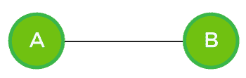

在这个例子中，该图能够从顶点 X 遍历到顶点 Y，它也将从顶点 Y 遍历到顶点 X。它可以在两个方向上遍历。

**例 2:**

在这个例子中，我们将假设一个图，其中 G = {N，E}。其中 N = {1，2，3，4}，E = {(1，2)，(1，4)，(3，4)，(2，3)}。现在我们要为这些顶点和边画一个图。

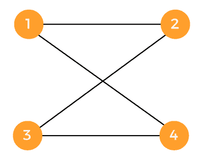

借助给定的顶点和边，还有另一种绘制无向图的方法:

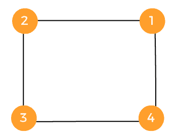

**例 3:**

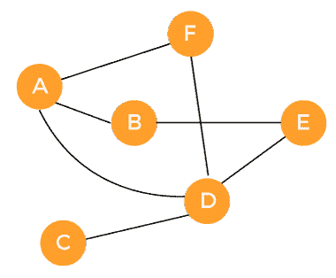

上述无向图的邻接矩阵描述如下:

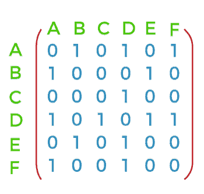

无向图的邻接表描述如下:

在计算机科学领域，最流行的无向图可以用计算机网络中连接的拓扑来表示。如果图中的一个系统与另一个系统相连，那么第二个系统也将与无向图中的第一个系统相连。

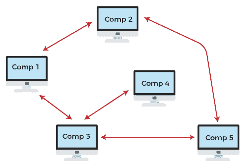

数字社交网络的拓扑结构也是无向图的一个著名例子。其中，某个人的每个朋友都是那个人的朋友。但也有一条人行通道。这意味着路径的两个交叉点可以双向移动。

### 有向图和无向图之间的选择

在这里，我们将描述一些有助于我们选择有向图还是无向图的点。

如果网络是稀疏的，在这种情况下，与相应的无向图相比，有向图将提供更多的信息。这意味着，如果稀疏有向图被视为无向图，丢失信息的机会就会增加。

本质上非互易且也是方向的关系可以用方向图来建模。关系“是的孩子”是有向图的一个著名例子，因为借助于这个关系，我们可以构建系谱树。

无向图用于建模那些关系类型，对于这些关系类型，图的存在与否很重要，但是它们本质上是不可传递的。人行路径是无向图的一个很好的例子，因为在人行路径中，我们可以双向行走。这就是为什么在无向图的帮助下，路径能够建模。

在某些情况下，我们可以借助有向图对同一系统进行建模。在另一种情况下，它将被建模为无向图。如果我们正在学习后代，这个家族可以借助于有向图来表示。在另一种情况下，如果我们对学习氏族从属关系感兴趣，可以借助无向图来表示。

程序员必须根据问题在有向图和无向图之间仔细选择，因为这两个图都是对现实世界现象的数学抽象。在这个关系的基础上，我们将使用图来建模它。如果是倒数，那么我们就用无向图。否则，我们将使用有向图。

* * *