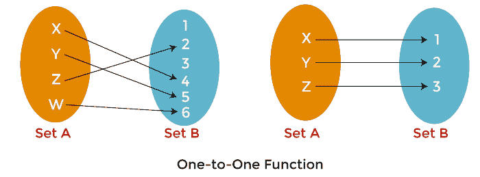
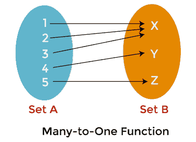
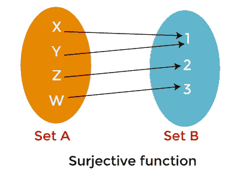
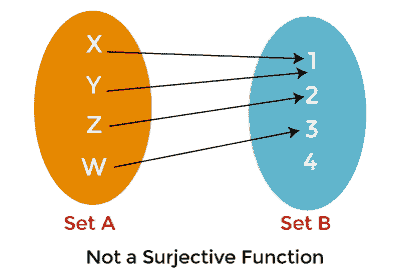
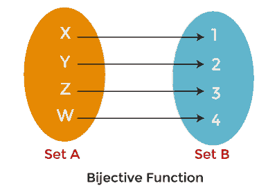
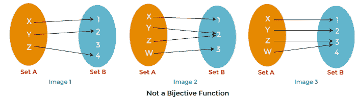
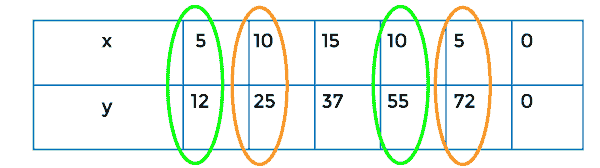

# 离散数学中函数与关系的区别

> 原文：<https://www.javatpoint.com/function-vs-relation-in-discrete-mathematics>

功能和关系非常相似。要了解关系和函数之间的区别，我们必须先了解函数和关系，然后才能了解它们之间的区别。

## 关系

在离散数学中，这种关系可以描述为有序对的集合。它用于将对象从一个集合关联到另一个集合，并且这些集合必须是非空的。关系可以包含两个或两个以上的集合。假设有两组，例如 A 和 B。集合 A 包含一个对象 A，集合 B 包含一个对象 B，如果存在有序对(A，B)的关系，这些对象将相互关联。借助于子集的笛卡儿积，可以形成关系 R。

现在我们假设两个任意集合 A 和 B，A 和 B 的笛卡儿积可以描述为有序对(A，B)的集合，其中 a ∈ A 和 b ∈ B，A 和 B 的积被指定为 A 交叉 B，借助定义，我们将得到以下结果:

```

A ? B = {{(a, b)} I a ∈ A and b ∈ B} 
A ? B ≠ B ? A

```

笛卡尔乘积能够处理有序对，这就是为什么注意集合被考虑的顺序很重要。现在我们将使用 n(A)来表示集合 A 中的元素数量，描述如下:

```

n(A ? B) = n(A) ? n(B)

```

### 关系类型:

在离散数学中，关系可以有各种类型，我们将在定义集合之间的联系的基础上区分这些关系。

**空关系:**

如果集合的元素之间没有关系，那么这种关系就被称为空关系。空关系描述如下:

```

R = Ø 

```

**普遍关系:**

在这个关系中，集合 A 的每一个元素都和集合 b 的每一个元素有关系，这就是为什么这个关系也被称为泛关系，泛关系和空关系也被称为平凡关系。

**身份关系:**

在同一性关系中，A 的每一个元素都只和它自己有关系。身份关系描述如下:

```

A : A → A

```

**逆关系:**

假设有两个集合，集合 A 和集合 B，它们有一个从 A 到 B 的关系，这个关系将被描述为 R∈ A B，当我们用集合中的第二个元素替换每一对的第一个元素时，将得到逆关系。逆关系描述如下:

```

R -1 = {(b, a) : (a, b) ∈ R} 

```

**自反关系:**

如果集合 A 的每个元素都与其自身相关，那么这种关系将被称为自反关系。反射性这个词意味着在一个集合中，每个元素的图像都有自己的反射。

**对称关系:**

假设集合 A 中有两个元素，即 A、b，集合 A 上的关系 R 将被称为对称关系，如果元素‘A’与‘b’有关系为真，那么‘b’与‘A’有关系也将为真。对称关系描述如下:

```

If (a, b) ∈ R then (b, a) ∈ R, for all a and b ∈ A

```

**传递关系:**

假设集合 A 中有三个元素，即 A、b、c，集合 A 上的关系 R 将被称为传递关系，如果‘A’与‘b’有关系，‘b’与‘c’有关系，那么‘A’也将与‘c’有关系。传递关系描述如下:

```

If (a, b) ∈ R , (b, c) ∈ R , then (a, c) ∈ R for all a, b, c ∈ A

```

**等价关系:**

如果一个关系满足对称、传递和自反的性质，它将被称为等价关系。

#### 注:所有关系都不是函数，但所有函数都是关系。

### 关系示例:

我们将更多地以现实生活中的例子来理解概念关系。假设我们要做一条毯子。为此，我们需要面料，这将有助于建立一个毯子。我们将通过缝制布样来制作毛毯。面料方面，我们会去海边看看这些样品的销售情况。我们不知道买一件、两件或三件需要多少布料，也不知道，我们以 4 美元的价格买了三件样品。在此成本之后，如果我们想购买色板，每个色板需要额外花费 2 美元。我们买的色板数量和我们花的钱是相互关联的。这可以称为关系的一个例子。

在一个称为输入和输出的关系中有两组元素，它们以某种方式相互关联。在我们的示例中，输入将被描述为成本，输出将被描述为样本数量。这种关系也可以借助有序对来表示，如下所示:

```

{(4, 1), (4, 2), (4, 3), (6, 4), (8, 5), (10, 6), (12, 7)}

```

这意味着当我们有 4 作为上述关系中的输入时，我们有 1、2 或 3 作为输出。这个关系表明，如果我们花 4 美元，我们能够得到 1、2 或 3 块布料。同样，如果我们有 8 作为输入，那么我们有 5 作为输出。这意味着，如果我们花 8 美元购买样品，我们将获得 5 个织物样品。

## 功能:

输入元素集与输出元素集有一种关系，这种关系称为函数。在函数中，对于集合 A 中的每一个元素，集合 B 中只会有一个输出元素**例如:**假设有两个集合:集合 A 和集合 B，这两个集合借助某种方式相互连接，即给定集合 A 的元素与给定集合 B 的一个元素有关系，或者集合 A 的所有元素只与集合 B 的一个元素有关系，所以我们可以说这种类型的关系是函数。使用这个例子，我们已经明确了函数中的集合 A 和集合 B 不能有一对多的关系。为了量化为一个函数，我们需要满足两个条件，描述如下:

*   在第一个条件中，每一个 a ∈ A 都必须与 b ∈ B 有联系，这意味着函数 f 的定义域必须是 A，而不是 A 的子集。
*   在第二个条件中，有一个唯一性的要求，将表达如下:

```

(a, b) ∈ f and (a, c) ∈ f ⇒ b = c

```

### 函数的类型

在离散数学中，函数可以是各种类型的。这里我们将根据关系描述函数，如下所示:

**一对一功能:**

**一对一函数**也可以称为**内射函数。**如果定义域集的一个元素与同定义域集的一个元素相连，那么一个函数将被称为一对一。我们也可以把一对一写成 1-1。在一对一功能中，答案永远不会重复。



在上图中，我们有两个集合:集合 A 和集合 B，域将由集合 A 描述，共域 B 将由集合 B 描述，这里我们可以看到图像 1 和图像 2 中集合 A 的每个元素都与集合 B 的唯一元素有联系，在图像 1 中，X 与 4 相连，Y 与 5 相连，Z 与 2 相连，W 与 6 相连。同样的事情发生在图 2 中。这就是为什么这个函数被称为一对一。

**例 1:**

这里我们假设有一个函数 f(x) = x - 4。证明这个函数是不是一对一函数。

**解决方案:**

如果 x = 1，那么 f(1)= 3

如果 x = 5，那么 f(5) = 2

如果 x = 7，那么 f(7) = 3

如果 x = 19，那么 f(19) = 15

这里我们可以看到，给定的函数为每个输入值生成不同的输出。这就是为什么函数 f(x) = x - 4 可以被称为一对一函数。

**例 2:**

这里我们假设有一个函数 f(x) = x <sup>2</sup> 。证明这个函数是不是一对一函数。

**解决方案:**

如果 x = 3，那么 f(3) = 6

如果 x = -3，那么 f(-3) = 6

这里我们可以看到，给定的函数对于值 3 和-3 生成相同的答案 6。这就是为什么函数 f(x) = x <sup>2</sup> 不能一一调用的原因。

**多对一功能:**

如果一个域集的多个元素与同域集的相同元素相连，那么一个函数将被称为**多对一**函数。这意味着同域的单个元素可以与域中的多个元素连接。多对一函数总是包含重复的答案。



在上图中，我们有两个集合:集合 A 和集合 b，域由集合 A 描述，共域由集合 b 描述，这张图显示集合 A 的许多元素与集合 b 的单个元素映射，元素 1、2 和 3 与同一个元素 x 连接，这就是为什么这个函数是多对一的原因。

**示例:**

我们将假设存在函数 f(x) = x <sup>2</sup> 。证明这个函数是否是多对一函数。

**解决方案:**

如果 x = 2，那么 f(2) = 4

如果 x = -2，那么 f(-2) = 4

这里我们可以看到，给定的函数对于值 2 和-2 生成相同的答案 4。所以我们可以说函数 f(x) = x2 是多对一的函数，因为对于不同的值，这个函数会产生相同的答案。

**至功能:**

**到**的函数也称为**满射函数。**如果共域集的每个元素都与域集的至少一个或多个元素相连，则函数将被称为本体函数。



在上图中，我们有两个集合:集合 A 和集合 B，这里我们可以看到集合 B 的每个元素都映射了集合 A 的至少一个元素，集合 A 中的元素 X 和 Y 与集合 B 中的元素 1 相连，Z 与 2 相连，W 与 3 相连。这就是为什么上面的函数是 on。



在这张图片中，我们又有了两套。这里我们可以看到，集合 B 的一个元素没有和集合 a 的任何一个元素连接，和上图一样，元素 X 和 Y 和 1 连接，Z 和 2 连接，W 和 3 连接，但是集合 B 中的元素 4 和集合 a 没有连接，这就是为什么我们可以说上面的函数没有上。

**示例:**

假设有一个函数 f 包含两组 A 和 B，其中 A = {2，5，7，8}，B = {4，9}，f = {(2，4)，(5，9)，(7，4)，(8，9)}。现在证明这个函数是上函数。

**解决方案:**

所以从我们的问题来看

A = {2，5，7，8}

B = {4，9}

f = {(2，4)，(5，9)，(7，4)，(8，9)}

因此，集合“B”上的所有元素在集合“A”上都有一个域元素。这意味着集合“A”2、5、7 和 8 上的元素分别包含与集合“B”4 和 9 上的元素相同的范围。这就是为什么我们可以说函数 f: A → B 是一个上函数。

**一对一对应功能**

**一一对应函数**也可以称为**双射函数。**这个函数是内射函数(一对一函数)和满射函数(上函数)的组合。如果定义域集的每一个元素都与同定义域集的一个元素恰好相连，那么一个函数将被称为一一对应函数，反之亦然。在双射函数中，从集合 A 到集合 B，有一个从集合 B 到集合 A 的反函数，在双射函数中，集合的每个元素都与自身有关系。



上图显示共域(集合 B)的每个元素都与域(集合 A)的不同元素相关。元素 X 连接元素 1，Y 连接元素 2，Z 连接元素 3，W 连接元素 4。这就是为什么上面的函数是一一对应的。



上图显示该函数不是一一对应的，因为图 1 中的集合 B 中有一些元素，与集合 A 的元素没有联系，集合 B 中的元素 3 与集合 A 的任何元素都没有联系，在图 2、3 中，集合 A 的多个元素与集合 B 的一个元素有联系，图 2 中的元素 Y、Z 具有相同的值 2。与图像 3 相同，元素 Z、W 具有相同的值 3。这就是为什么我们可以说上面的函数不是双射函数。

满足双射函数需要四个条件:

*   集合 A 的每个元素都将与集合 b 的一个元素相连。
*   在集合 A 上，元素只能与集合 b 的一个元素配对
*   集合 B 的每个元素都将与集合 a 的一个元素相连
*   在集合 B 上，元素只能与集合 a 的一个元素连接。

**双射函数的性质**

双射函数有很多性质，描述如下:

*   在双射函数中，定义域和共定义域集中的元素数量相同。
*   双射函数的共域和值域之间将有相同的量。
*   双射函数中会有反函数。
*   常数函数和双射函数不能相同。
*   如果借助双射函数来表示一个图，那么它将永远是一条直线。
*   双射函数具有许多性质，如对称、传递和自反。

**示例:**

假设有一个函数 f 包含两个集合 A 和 B，其中 A = {2，3，4，5}，B = {u，v，x，y}，f: A → B，现在证明这个函数是双射函数。

**解决方案:**

为此，

f(2) = u

f(3) = x

f(4) = v

f(5) = y

所以函数 f 是开的，也是一对一的。这就是为什么这个函数是双射函数。

### 其他类型的功能:

还有许多其他类型的功能，描述如下:

**常数函数:**常数函数可以写成 f(x) = c。

**反函数:**反函数可以写成 f <sup>-1</sup> (x)。

**绝对值函数:**反函数可以写成 f(x) = |x|。

**恒等式:**恒等式可以写成 f(x) = x。

**线性函数:**线性函数可以写成 f(x) = mx + c。

### 功能示例:

同样作为关系的例子，在这个例子中，我们将再次制作一个毯子。但是这一次，当我们去商店买色板的时候，那一天，商店没有销售。这就是为什么样品的成本是每件 2 美元。正因为如此，投入和产出之间的关系将会不同。这种关系也可以借助如下有序对来表示:

```

{(2, 1), (4, 2), (6, 3), (8, 4), (10, 5), (12, 6)}  

```

在我们的例子中，输入也被描述为成本，输出也被描述为样本的数量，就像关系的例子一样。然而，这种关系被称为特殊类型的关系。这个例子和我们在关系中描述的例子有主要区别，我们可以借助关系中的前三个有序对来解释。

当在样本上进行销售时，我们看到前三个有序对包含相同的输入，第一个关系中有不同的输出。但是如果我们在没有销售的情况下考虑这种关系，我们会看到每个输入只包含一个输出。在这种情况下，当一个输入只有一个输出时，这种关系称为函数。借助这个例子，我们可以说我们购买的色板数量是成本的函数。

## 函数与关系的区别

关系和功能都是不同的概念。关系不能是函数，但所有的函数都是关系。关系和函数有主要区别，即一个关系能够为至少一个输入生成多个输出，但在函数的情况下，它只能为每个输入生成一个输出。这个因素是区分它们的基础。例如:在这里，我们将假设有一个学生在数学课上收集了一些数据。数据表描述如下:

| X | five | Ten | Fifteen | Ten | five | Zero |
| Y | Twelve | Twenty-five | Thirty-seven | Fifty-five | seventy-two | Zero |

在上表中，对于一个输入(5)，我们可以看到两个地方有不止一个输出(12，72)。



这就是为什么上面的有序对集合显示了一个关系，而它不是一个函数。

一个关系可以被描述为一组有序的元素对，它可以被称为二元关系或二元关系。该关系也是笛卡尔乘积的子集。为了形成模型概念，使用了关系。关系为我们提供了一种意义感，比如“等于”、“大于”或“除”。

该函数可以描述为一个有序的三重集，包含 A、B 和 F，其中 A 用来表示域，B 用来表示共域，F 用来表示有序对的集合。每个有序对的第一个元素来自集合 A，这个有序对的第二个元素来自同域(集合 B)，它伴随着必要条件的帮助。函数将不包含一个多关系，这意味着一个对象不能与多个对象有连接。该函数将包含多个一的关系，这意味着许多对象可以与一个对象有联系。

实数集包含在定义域和同定义域中。项目的属性将在关系的帮助下显示。这里有些东西是以某种方式联系在一起的。这就是它被称为“关系”的原因。这并不意味着我们没有任何可以用来区分函数和关系的中介。

一个项目可以是一个函数，用来混合两个参数值，生成一个输出。关系和函数还有一个区别，即函数必须包含一个定义域，这个定义域由两个或两个以上集合的笛卡儿积产生结果，但关系也产生同样的东西并不是强制性的。一个函数中两个给定集合的每个输入将只产生一个输出。输入元素和输出元素之间的关系将借助关系来表示。

我们听过这样一个术语，所有的关系都不是函数，但是所有的函数都是关系。但是现在我们将像这样详细描述它:

一个函数可以被描述为一个有序对，它只为每个 a 的值生成一个 b 的值。这种关系可以描述为任何有序对的集合。假设有一组有序对(关系)，并且每一个 a 也有一个 b 值。在这种情况下，关系是一个函数。所以我们可以说，一个函数是一组有序的对，对于每个 a 的值只产生一个 b 的值。如果有这样一种情况，每一个 a 只有一个 b 值，那么这个关系可以永远是一个函数。

与此相反，如果有序对(关系)的集合包含一个以上的输入(a)的输出(b)，在这种情况下，关系不是函数。这将证明第二种说法是正确的，即所有关系都不是函数。我们还将借助下面的例子来证明这两种说法。在第一个示例中，该表用于描述作为函数的关系。在第二个示例中，该表用于描述不是函数的关系。在第三个例子中，我们必须确定给定的关系是否是函数。

**示例 1:** 作为函数的关系描述如下:

| A | B |
| Zero | Zero |
| one | one |
| Two | Two |
| three | three |

这里，对于 A 的每个值，有一个 b 的值。这意味着 0 包含 0，1 包含 1，2 包含 2，3 包含 3。这就是为什么这个关系是一个函数。

**例 2:** 不是函数的关系描述如下:

| A | B |
| Zero | Zero |
| one | one |
| Two | Two |
| Two | one |

这里，对于输入值 A，有多个值 b。这意味着对于值 2，有值 2 和 1。这就是为什么这个关系不是函数。

**例 3:** 我们要确定下面的关系是不是函数。

| A | B |
| -3.5 | -3.6 |
| -1 | -1 |
| four | Three point six |
| Seven point eight | Seven point two |

在上表中，集合 A 的每个值都包含 b 的单个值，这就是为什么上面的关系是一个函数。

* * *