# 离散数学中的初等矩阵

> 原文：<https://www.javatpoint.com/elementary-matrix-in-discrete-mathematics>

要学习初等矩阵，我们必须先学习矩阵和单位矩阵。之后，我们就可以理解初等矩阵的概念了。

## [数]矩阵

矩阵可以描述为一组数字，这些数字按行和列排列。这些数字被称为矩阵的条目或元素。方括号用于覆盖这些类型的元素。假设有 n 行和 m 列。在这种情况下，矩阵将被称为 n 乘 m 矩阵，可以写成“n * m”。还有一个方阵 n*n，可以描述为 n 行 n 列 n 阶的集合。

**例如:**在这个例子中，我们将展示一个 3*3 的矩阵。

**解:** 3*3 矩阵表示有 3 行 3 列。这意味着总共 9 个元素。3*3 矩阵描述如下:

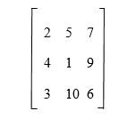

## 身份矩阵

单位矩阵可以描述为任意阶的方阵，其中主对角线的所有元素都包含值 1，而其他所有元素都包含值 0。恒等式矩阵的阶数总是 n，所以我们可以说恒等式矩阵的维数是 n * n，这意味着这个矩阵中的行数和列数总是相等的。不同维数的单位矩阵的表示如下所述:

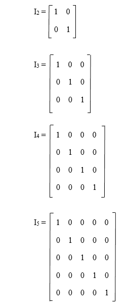

## 初等矩阵

初等矩阵也是方阵的一种。初等矩阵和单位矩阵是相似的。唯一不同的是，在基本矩阵的单位矩阵上，三个元素之间会有一个基本的行或列操作。基本矩阵中的行操作描述如下:

**R1:** 将一行的元素乘以非零实数。

**R2:** 交换两行

**R3:** 将一行的常数 k 乘以另一行。

这里，R1、R2、R3 用于表示行操作。当我们对任何矩阵应用行操作时，它将被称为基本行操作。相比之下，基本矩阵中的列运算描述如下:

C1:用一个非零实数乘以一列的元素。

C2:交换两列

C3:将常数 k 乘以一列加到另一列。

这里 C1、C2、C3 被用来代表纵队作战。当我们将列运算应用于任何矩阵时，它将被称为基本列运算。

我们知道初等矩阵是由单位矩阵得到的，单位矩阵总是平方的。这就是为什么初等矩阵也总是正方形的。

**示例:**在本例中，我们将展示四个基本矩阵以及用于生成这些矩阵的操作。

**解决方案:**

1.  将第二行单位矩阵(I 2 )乘以-3，生成如下矩阵。
    T3】
2.  以下矩阵将通过交换第二行和第四行单位矩阵(I 4 )生成。
    T3】
3.  将一个单位矩阵的第三行(I 3 )加三次到第一行，生成下面的矩阵。
    T3】
4.  以下矩阵将通过将单位矩阵(I 3 )的第一行乘以 1 来生成。
    T3】

可逆矩阵的一般线性群可以在初等矩阵的帮助下生成。当基本矩阵执行左乘法或预乘法时，将表示基本行操作。当初等矩阵执行右乘法或后乘法时，将表示初等列运算。高斯消去法采用初等行运算，使矩阵简化为行梯次形式。高斯·乔丹消元法也采用初等行运算，使矩阵进一步简化为行梯次形式。基本行操作的示例描述如下:

**示例:**在本例中，我们将考虑一个矩阵 A，其给出如下:

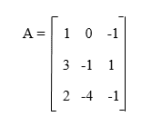

在这个矩阵 A 中，我们将执行如下基本行操作:

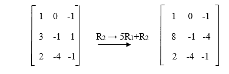

在此基本行操作中，基本矩阵将按以下方式对应:

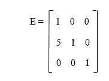

我们可以看到，当对恒等式矩阵 I 进行相同的初等行运算时，我们会得到下面的矩阵，EA 与矩阵 A 上的初等行运算相乘的结果是相同的。E 和 A 的乘积描述如下:

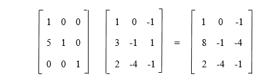

对于其他基本行操作，也是如此。我们还可以对每个初等矩阵进行逆运算。如果我们对一个初等矩阵求逆，它也将是初等矩阵。我们可以通过对单位矩阵执行反向行操作来证明这个概念。反向行操作描述如下:

*   R i → kR i 的反方向将是 R i → 1/k R i 。
*   RI→kRj+RI的反方向将是 RI→- kRj+RI。
*   R i ↔ R j 的反方向将是 R i ↔ R j 。

我们可以通过使用初等矩阵来执行初等行变换。它还被用来提供一个构造工具，可以用来找出逆矩阵，也可以确定 LU 分解。初等矩阵及其逆的例子描述如下，我们可以通过矩阵相乘来检查每个矩阵。如果矩阵是逆的，它们的乘积将是 I。

初等矩阵有一个很重要的事实，即如果矩阵 A 是可逆的，我们也可以把它写成初等矩阵的乘法。

### 初等矩阵的性质

所有的初等矩阵都是非奇异的。所有非奇异初等矩阵的逆也将是初等矩阵。基本矩阵有各种属性，如下所示:

1.如果有一个交换两行的矩阵，那么这个矩阵的逆就是它自己。

**例如:**假设有一个矩阵，描述如下:

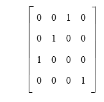

该矩阵的逆矩阵描述如下:

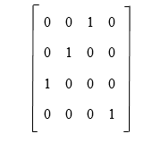

矩阵的计算描述如下:

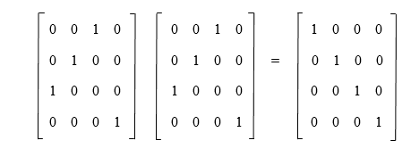

2.如果有一个用于模拟(mR i ) ↔ (R i 的初等矩阵，那么这类矩阵的逆矩阵也将是模拟(1/m R i ) ↔ (R i 的初等矩阵。

**例如:**假设有一个矩阵，描述如下:

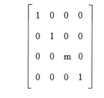

该矩阵的逆矩阵描述如下:

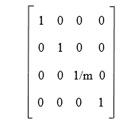

矩阵的计算描述如下:

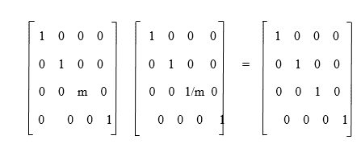

3.如果有一个用于模拟(rj+MrI)↔(rj)的初等矩阵，那么这类矩阵的逆矩阵也将是模拟(rj-MrI)↔(rj的初等矩阵。

**例如:**假设有一个矩阵，描述如下:

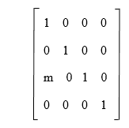

该矩阵的逆矩阵描述如下:

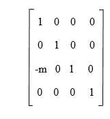

矩阵的计算描述如下:

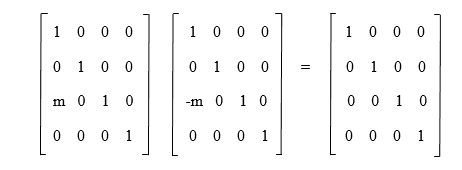

### 初等矩阵的例子

**例 1:** 在这个例子中，我们要确定给定的矩阵 A 是否是初等的。

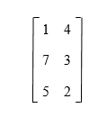

**解:**我们知道，初等矩阵永远是方阵，上面的矩阵不是方阵。这就是为什么我们可以说矩阵 A 不是初等矩阵。

**例 2:** 在这个例子中，我们要确定给定的矩阵 A 是否是初等矩阵。

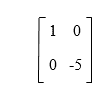

**解:**恒等式矩阵(I 2 的 2*2 大小描述如下:

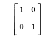

如果一个单位矩阵的第二行(I 2 )乘以-3，我们就能得到上面的矩阵 A。所以我们可以说矩阵 A 是一个初等矩阵。

**例 3:** 在这个例子中，我们要确定给定的矩阵 A 是否是初等矩阵。

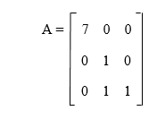

**解:**3 * 3 大小的恒等式矩阵(I 3 )描述如下:

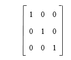

如果我们将 I 3 的第一行乘以 7，我们能够得到以下矩阵:

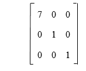

我们可以看到，这个矩阵不等于给定的矩阵 A，因为矩阵 A 的第三行和生成的矩阵不一样。我们也不能执行单行或列操作，以便从单位矩阵 I3 中得到给定的矩阵 A。这就是为什么我们可以说初等矩阵不是由给定的矩阵 a 来描述的。

* * *