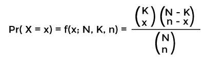
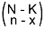
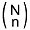
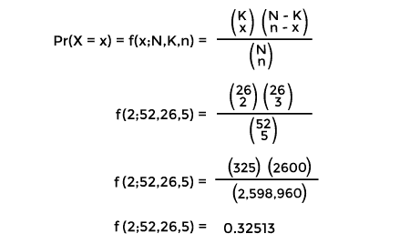

# 离散数学中的超几何分布

> 原文：<https://www.javatpoint.com/hypergeometric-distribution-in-discrete-mathematics>

超几何分布可以描述为超几何随机变量的**概率分布**。在超几何分布中，我们将考虑一个**属性**和一个**人口**。在这里，属性用于采取两种状态中的一种，并且这些状态必须是互斥的。这两个州中的一个包含了人口中的每一个成员。**例如:**“25 岁以下或 25 岁以上”、“考试不及格或及格”、“是不是律师”，还有更多可能是属性。人口抽样没有替代。这意味着抽签不能是独立的:每次抽签都会影响下一次。这就是为什么，如果有任何平局，它将减少人口规模。在超几何分布中，我们通常必须在两个组之间进行选择，并且我们将在不替换组成员的情况下进行选择。

假设有一组 N 个项目，我们随机选择 N 个项目，不进行替换。一类项目用 K 表示(为了方便，称为成功)，第二类项目用 N-K 表示(为了方便，称为失败)。在这种情况下，超几何分布将由随机分布 x 的概率质量函数来描述。超几何分布的形式如下:

在哪里

n 用来表示人口数量。

k 用来表示人口中成功的数量

x 用于显示观察到的成功数量

n 用于表示抽取的数量。

我们可以通过多种方式选择 K 个可能成功中的 x 个，然后在中选择(N - K)个可能失败中的(n - x 个)，最后计算出总的个可能的 N 人抽奖，从而得出上述公式。

二项式分布和超几何分布有很多相似之处。只有当我们要对 5%或不到 5%的人口进行抽样时，二项式分布才会被认为是假设分布的极好近似。因此，要理解超几何分布，既要了解二项式分布，也要了解组合公式。

假设我们收集了 50 个灯泡，其中 5 个灯泡有缺陷，45 个灯泡没问题。超几何分布是一种概率分布，在这种分布中，我们将随机抽样 50 个灯泡中的 4 个灯泡，而不更换灯泡。而二项式分布也是一种概率分布，我们将对 4 个灯泡进行抽样，替换有缺陷的灯泡。二项式分布在观测信息不能重复出现的情况下是有用的。例如，纸牌游戏或扑克游戏，其中遵守牌意味着我们抽的牌不能再回到我们手中。二项式分布在许多相同的情况下也是有用的，比如它被用来包括统计显著性和风险管理。

### 超几何分布的例子

**示例 1:** 在本例中，我们将假设我们在一副普通扑克牌的帮助下玩纸牌游戏。假设我们从一副牌中随机选择 5 张牌，不进行替换。我们必须找出得到两张红卡的概率，这两张红卡可以是红心，也可以是钻石。

**解:**本例为超几何实验，包含以下数值:

N = 52，因为一副牌总共包含 52 张牌。

K = 26，因为一副牌总共包含 26 张红牌。

n = 5，因为从一副牌中随机选择的牌是 5。

x = 2，因为我们选择 2 张红牌。

当我们将这些值放入超几何分布时，我们将得到以下值:

所以我们可以说 0.32513 是随机选择 2 张红牌的概率。

**例 2:** 假设一个袋子里有 21 个球，其中有 13 个橙色球和 8 个绿色球。如果我们从袋子里抽出 5 个球，我们必须确定结果的超几何分布。

**解决方案:**

在这个例子中，人口总数是 13 + 8 = 21。这里我们有 13 个具有所需属性的对象(橙色)和 5 个绘图。所以，

N = 52，因为一个包总共包含 21 张卡片。

K = 13，因为一个包总共包含 13 个橙色球。

n = 5，因为从袋子里抽出了 5 个球。

x = 0，1，2，3，4，5

当我们将这些值放入超几何分布的公式中时，我们将得到以下值:

### 超几何分布的性质

这里，我们将描述用于提供超几何分布相关信息的各种重要值，描述如下:

*   在分布中，**期望的**或**平均值**用于提供与来自大量重复试验的平均 1 的期望相关的信息。平均值也可以称为平均值。
*   一个分布的**中值**可以描述为一个中心趋势。它是任何群体的中间值。它基本上被用作一半数据较多而另一半数据较少的点。
*   分布的**模式**用于提供集合中出现概率最高的数据的大致概念。
*   分布的**方差**可以被称为数字之间的分布的统计测量，其存在于数据集中。方差基本上衡量的是平均数和集合中每个数之间的距离。还可以找出集合中每个数与其他数之间的距离。方差的平方根可以借助标准差来表示。标准差也能够发现投资回报的一致性。

均值、众数和方差主要用于超几何分布，但众数并不常用。

* * *