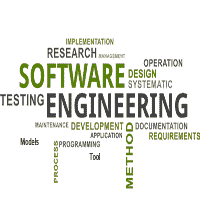
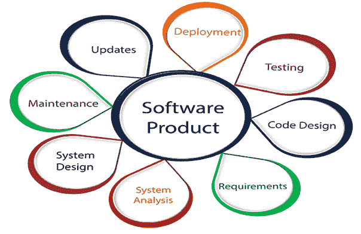
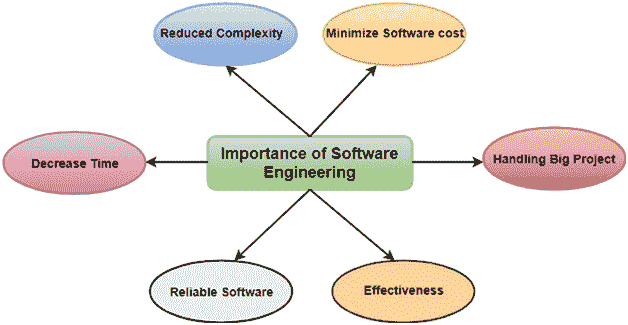

# 软件工程教程

> 原文：<https://www.javatpoint.com/software-engineering-tutorial>

软件工程教程提供软件工程的基本和高级概念。软件工程教程旨在帮助初学者和专业人士。

软件工程提供了设计和开发软件的标准程序。

我们的软件工程教程包含软件工程的所有主题，如软件工程模型、软件开发生命周期、需求工程、软件设计工具、软件设计策略、软件设计级别、软件项目管理、软件管理活动、软件管理工具、软件测试级别、软件测试方法、质量保证与质量控制、手动测试、软件维护、软件重新设计和软件开发工具，如 CASE Tool。

## 什么是软件工程？

术语**软件工程**是两个词的产物，**软件**，和**工程**。

**软件**是集成程序的集合。

软件是由开发人员用各种特定的计算机语言编写的精心组织的指令和代码组成的。

计算机程序和相关文档，如需求、设计模型和用户手册。

**工程**是将**科学**和**实用**知识应用到**发明、设计、构建、维护**，以及**改进框架、流程等**。

**软件工程**是一个工程分支，使用定义明确的科学原理、技术和程序，与软件产品的进化相关。软件工程的结果是一个有效和可靠的软件产品。

## 为什么需要软件工程？

由于以下原因，需要软件工程:

*   管理大型软件
*   为了更大的可扩展性
*   成本管理
*   管理软件的动态特性
*   为了更好的质量管理

## 软件工程的需求

软件工程的必要性出现是因为用户需求和程序工作的环境有更高的进展速度。

*   **巨大的编程:**制造一堵墙比制造一栋房子或建筑更简单，同样，随着编程的度量变得广泛，工程必须逐步给它一个科学的过程。
*   **适应性:**如果软件过程不是基于科学和工程的思想，那么重新创建新软件将比扩展现有软件更简单。
*   **成本:**由于硬件行业已经展示了自己的技能，庞大的制造业已经让计算机和电子硬件的成本下降。但是如果不适应适当的过程，编程的成本仍然很高。
*   **动态本质:**编程的持续增长和适应本质在很大程度上取决于客户端工作的环境。如果软件的质量不断变化，需要在现有的基础上进行新的升级。
*   **质量管理:**更好的软件开发流程提供更好、更优质的软件产品。

## 优秀软件工程师的特征

**优秀软件工程师应该具备的特征如下:**

接触系统方法，即熟悉软件工程原理。

良好的项目范围技术知识(领域知识)。

良好的编程能力。

良好的沟通能力。这些技能包括口头、书面和人际交往技能。

积极性高。

良好的计算机科学基础知识。

智力。

团队合作能力

纪律等。

## 软件工程的重要性

**软件工程的重要性如下:**

1.  **降低复杂度:**大软件总是很复杂，很难进步。软件工程有一个很好的解决方案来减少任何项目的复杂性。软件工程把大问题分成各种小问题。然后开始逐一解决每一个小问题。所有这些小问题都是相互独立解决的。
2.  **最小化软件成本:**软件需要大量的硬件，软件工程师是高薪专家。开发带有大量代码的软件需要大量的人力。但是在软件工程中，程序员投射一切，减少所有不需要的东西。反过来，与任何不使用软件工程方法的软件相比，软件生产的成本变得更低。
3.  **减少时间:**任何不按项目制作的东西总是浪费时间。如果你正在制作伟大的软件，那么你可能需要运行许多代码来获得明确的运行代码。这是一个非常耗时的过程，如果处理不好，那么这可能需要很多时间。所以如果你是按照软件工程的方法制作软件，那么会减少很多时间。
4.  **处理大项目:**大项目不是一两天就能完成的，需要很大的耐心、计划和管理。投资任何公司六到七个月，都需要大量的计划、指导、测试和维护。谁也不能说他已经把一个公司的四个月交给了任务，项目还在第一阶段。因为公司给计划提供了很多资源，应该可以完成。所以要处理一个大项目没有任何问题，公司必须走软件工程的方法。
5.  **可靠的软件:**软件应该是安全的，意味着如果您已经交付了软件，那么它至少应该在给定的时间或订阅量内工作。如果软件中有任何错误，公司有责任解决所有这些错误。因为在软件工程中，测试和维护是必不可少的，所以不用担心它的可靠性。
6.  **有效性:**如果按照标准做了什么，有效性就来了。软件标准是公司提高效率的主要目标。因此，在软件工程的帮助下，软件变得更加有效。

* * *

## 软件工程教程索引

* * *

**教程**

*   [教程](software-engineering-tutorial)
*   [软件流程](software-processes)
*   [【SDLC】](software-engineering-software-development-life-cycle)
*   [SDLC 模型](software-engineering-sdlc-models)
*   [需求工程](software-engineering-requirement-engineering)

**车型**

*   [瀑布模型](software-engineering-waterfall-model)
*   [RAD 型号](software-engineering-rapid-application-development-model)
*   [螺旋模型](software-engineering-spiral-model)
*   [V 型](software-engineering-v-model)
*   [增量模型](software-engineering-incremental-model)
*   [敏捷模型](software-engineering-agile-model)
*   [迭代模型](software-engineering-iterative-model)
*   [大爆炸模型](software-engineering-big-bang-model)
*   [原型模型](software-engineering-prototype-model)

**软件管理**

*   [项目管理](software-project-management)
*   [活动](software-project-management-activities)
*   [项目管理工具](software-project-management-tools)

**软件度量**

*   [软件度量](software-engineering-software-metrics)
*   [尺寸导向指标](software-engineering-size-oriented-metrics)
*   [霍尔斯特德的软件指标](software-engineering-halsteads-software-metrics)
*   [功能点(FP)分析](software-engineering-functional-point-fp-analysis)
*   [扩展功能点(EFP)指标](software-engineering-extended-function-point-efp-metrics)
*   [数据结构指标](software-engineering-data-structure-metrics)
*   [信息流指标](software-engineering-information-flow-metrics)
*   [圈复杂度](software-engineering-cyclomatic-complexity)
*   [软件度量的案例工具](software-engineering-case-tools-for-software-metrics)

**项目规划**

*   [软件项目规划](software-project-planning)
*   [软件成本估算](software-cost-estimation)
*   [COCOMO 车型](cocomo-model)
*   [普特南资源分配模型](putnam-resource-allocation-model)

**风险管理**

*   [风险管理](software-engineering-risk-management)
*   [风险管理活动](software-engineering-risk-management-activities)
*   [项目调度](software-engineering-project-scheduling)
*   [人员规划](software-engineering-personnel-planning)

**软件需求**

*   [软件需求规格](software-requirement-specifications)
*   [需求分析](software-engineering-requirement-analysis)
*   [数据流图](software-engineering-data-flow-diagrams)
*   [数据字典](software-engineering-data-dictionaries)
*   [实体关系图](software-engineering-entity-relationship-diagrams)

**信噪比配置**

*   [软件配置管理](software-configuration-management)
*   [供应链管理流程](scm-process)
*   [软件质量保证](software-quality-assurance)
*   [项目监控&控制](project-monitoring-and-control)

**软件质量**

*   [软件质量](software-engineering-software-quality)
*   [ISO 9000 认证](software-engineering-iso-9000-certification)
*   [SEICMM](software-engineering-institute-capability-maturity-model)
*   [PCM](software-engineering-people-capability-maturity-model)
*   [六适马](software-engineering-six-sigma)

**软件设计**

*   [软件设计](software-engineering-software-design)
*   [软件设计原则](software-engineering-software-design-principles)
*   [耦合和内聚](software-engineering-coupling-and-cohesion)
*   [功能导向设计](software-engineering-function-oriented-design)
*   [面向对象设计](software-engineering-object-oriented-design)
*   [用户界面设计](software-engineering-user-interface-design)

**编码**

*   [编码](software-engineering-coding)
*   [编程风格](software-engineering-programming-style)
*   [结构化编程](software-engineering-structured-programming)

**软件可靠性**

*   [软件可靠性](software-engineering-software-reliability)
*   [软件故障机制](software-engineering-software-failure-mechanisms)
*   [软件可靠性测量技术](software-engineering-software-reliability-measurement-techniques)
*   [软件可靠性指标](software-engineering-software-reliability-metrics)
*   [软件容错](software-engineering-software-fault-tolerance)

**S .可靠性模型**

*   [软件可靠性模型](software-engineering-software-reliability-models)
*   [杰林斯基&莫兰达车型](software-engineering-jelinski-and-moranda-model)
*   [基本执行时间模型](software-engineering-basic-execution-time-model)
*   [Goel-Okumoto (GO)车型](software-engineering-goel-okumoto-model)
*   [Musa-Okumoto 对数模型](software-engineering-musa-okumoto-logarithmic-model)

**软件维护**

*   [软件维护](software-engineering-software-maintenance)
*   [软件维护问题的原因](software-engineering-causes-of-software-maintenance-problems)
*   [软件维护成本因素](software-engineering-software-maintenance-cost-factors)

* * *

## 先决条件

学习软件工程没有什么先决条件。

## 观众

本教程帮助初学者和专业人士理解软件工程。

## 问题

我们向您保证，您不会在本教程中发现任何错误，但如果有任何错误，请在评论部分发表。

* * *