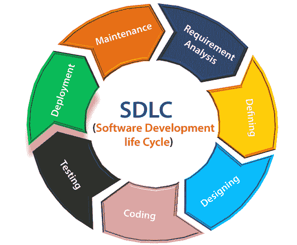

# 软件开发生命周期

> 原文：<https://www.javatpoint.com/software-engineering-software-development-life-cycle>

软件生命周期模型(也称为过程模型)是软件生命周期的图形表示。生命周期模型代表了使软件产品通过其生命周期阶段所需的所有方法。它还捕获了这些方法将被采用的结构。

换句话说，生命周期模型映射了软件产品从开始到退役的各种活动。不同的生命周期模型可能会以不同的方式规划必要的开发活动。因此，不管遵循哪个生命周期模型，基本活动都包含在所有的生命周期模型中，尽管这些活动在不同的生命周期模型中可能以不同的顺序执行。在生命周期的任何阶段，都可能进行不止一项活动。

## SDLC 的需求

开发团队必须为特定的计划确定一个合适的生命周期模型，然后遵守它。

如果不使用一个精确的生命周期模型，软件产品的开发将不会以一种系统的和有纪律的方式进行。当一个团队正在开发一个软件产品时，团队代表必须清楚地了解什么时候该做什么。否则，它将指向混乱和项目失败。这个问题可以用一个例子来定义。假设一个软件开发问题被分成不同的部分，这些部分被分配给团队成员。从那时起，假设团队代表被允许以他们喜欢的任何方式自由开发分配给他们的角色。一个代表可能会开始为他自己编写代码，另一个代表可能会选择首先准备测试文档，而其他一些工程师可能会从分配给他的角色的设计阶段开始。这将是项目失败的完美方法之一。

软件生命周期模型描述了每个阶段的进入和退出标准。只有满足了阶段进入标准，阶段才能开始。因此，如果没有软件生命周期模型，一个阶段的进入和退出标准就无法识别。没有软件生命周期模型，软件项目经理很难监控项目的进度。

## SDLC 循环

软件开发生命周期代表了软件开发的过程。SDLC 框架包括以下步骤:

## SDLC 的阶段如下:

**阶段 1:规划和需求分析**

需求分析是软件开发生命周期中最重要和最必要的阶段。

团队的高级成员利用所有利益相关者和领域专家或行业中的中小企业的投入来执行它。

质量保证要求的规划和与项目相关的风险识别也在这个阶段完成。

业务分析师和项目组织者与客户召开会议，收集所有数据，如客户想要构建什么，谁将是最终用户，产品的目标是什么。在创建产品之前，对产品的核心理解或知识是非常必要的。

**例如**，一个客户想要一个与货币交易相关的应用。在这种方法中，要求必须是精确的，比如做什么样的操作，如何做，用哪种货币做，等等。

一旦完成了所需的功能，就完成了对产品增长可行性的审计分析。如果有任何歧义，将设置一个信号供进一步讨论。

一旦理解了需求，就创建了软件需求规范文档。开发人员应彻底遵循本文档，并且还应由客户审查以供将来参考。

**阶段 2:定义需求**

一旦需求分析完成，下一个阶段肯定是表示和记录软件需求，并让项目涉众接受它们。

这是通过“软件需求规格”文档来完成的，该文档包含了在项目生命周期中要构建和开发的所有产品需求。

**阶段 3:设计软件**

下一阶段是要把软件项目的需求、分析和设计的知识全部记下来。这个阶段是最后两个阶段的产物，就像来自客户的输入和需求收集。

**阶段 4:开发项目**

在 SDLC 的这个阶段，实际的开发开始了，编程也构建好了。设计的实现从编写代码开始。开发人员必须遵循他们的管理和编程工具(如编译器、解释器、调试器等)所描述的编码准则。用于开发和实现代码。

**阶段 5:测试**

代码生成后，将根据需求进行测试，以确保产品能够解决需求阶段提出和收集的需求。

在这个阶段，完成了单元测试、集成测试、系统测试、验收测试。

**阶段 6:部署**

一旦软件通过了认证，并且没有指出任何错误，那么它就被部署了。

然后，基于该评估，该软件可以原样发布，或者在对象片段中具有建议的增强。

软件部署后，开始维护。

**阶段 7:维护**

一旦客户开始使用开发的系统，真正的问题就会出现，需求也会时不时地得到解决。

对开发的产品进行维护的程序称为维护。

* * *