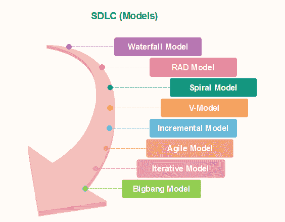

# 软件开发生命周期模型

> 原文：<https://www.javatpoint.com/software-engineering-sdlc-models>

软件开发生命周期(SDLC)是项目管理中使用的精神模型，它定义了信息系统开发项目中包括的各个阶段，从初始可行性研究到完成的应用程序的维护。

有不同的软件开发生命周期模型指定和设计，在软件开发阶段遵循。这些模型也被称为“**软件开发过程模型**”每个过程模型遵循一系列其类型独特的阶段，以确保软件开发步骤的成功。

**以下是 SDLC 生命周期的一些重要阶段:**

### [瀑布模型](software-engineering-waterfall-model)

瀑布是一个普遍接受的 SDLC 模型。在这种方法中，软件开发的整个过程被分成不同的阶段。

瀑布模型是一种连续的软件开发模型，在这种模型中，开发被视为在需求分析、设计、实现、测试(验证)、集成和维护等步骤中稳定地向下流动(像瀑布一样)。

活动的线性排序有一些重要的结果。首先，为了确定一个阶段的结束和下一个阶段的开始，必须在每个步骤结束时采用一些认证技术。一些验证和确认通常会这样做，这意味着将确保该阶段的输出与其输入(即上一步的输出)一致，并且该阶段的输出与系统的总体要求一致。

### [RAD 型号](software-engineering-rapid-application-development-model)

快速应用程序开发过程是采用瀑布模型；它的目标是在短时间内开发软件。RAD 模型基于这样一个概念，即通过使用焦点小组收集系统需求，可以在更短的时间内开发出更好的系统。

*   商业建模
*   数据建模
*   过程建模
*   应用程序生成
*   测试和周转

### [螺旋模型](software-engineering-spiral-model)

螺旋模型是**风险驱动的过程模型**。这个 SDLC 模型帮助团队采用一个或多个过程模型的元素，如瀑布、增量、瀑布等。螺旋技术是设计和开发活动中快速原型和并发性的结合。

螺旋中的每一个周期都是从确定该周期的目标、实现目标的不同选择以及存在的限制开始的。这是周期的第一个象限(左上角象限)。

循环的下一步是根据目标和限制评估这些不同的选择。这一步的评估重点是基于对项目的风险认知。

下一步是制定解决不确定性和风险的策略。这一步可能涉及诸如基准测试、模拟和原型制作等活动。

### [V 型](software-engineering-v-model)

在这种类型的 SDLC 模型测试和开发中，步骤是并行规划的。因此，一边是验证阶段，另一边是验证阶段。通过编码阶段的 v 模型连接。

### [增量模型](software-engineering-incremental-model)

增量模型不是一个单独的模型。这必然是一系列瀑布周期。在项目开始时，需求被分成几组。对于每一组，遵循 SDLC 模型来开发软件。重复 SDLC 过程，每个版本增加更多功能，直到满足所有要求。在这种方法中，每个周期都充当先前软件版本的维护阶段。对增量模型的修改允许开发周期重叠。之后的下一个循环可以在前一个循环完成之前开始。

### [敏捷模型](software-engineering-agile-model)

敏捷方法是一种在任何项目的软件开发生命周期过程中促进开发和测试持续交互的实践。在敏捷方法中，整个项目被分成小的增量构建。所有这些构建都是在迭代中提供的，每次迭代持续一到三周。

任何敏捷软件阶段的特点都在于解决了大量软件项目的几个关键假设:

1.  很难提前想好哪些软件需求会持续，哪些会改变。同样难以预测随着项目的进行，用户优先级将如何变化。
2.  对于许多类型的软件，设计和开发是交叉进行的。也就是说，这两个活动应该一前一后地执行，以便设计模型在创建时得到验证。在使用构造测试配置之前，很难考虑需要多少设计。
3.  分析、设计、开发和测试不像我们希望的那样可预测(从规划的角度来看)。

### [迭代模型](software-engineering-iterative-model)

它是软件开发生命周期的一个特定实现，它关注于初始的、简化的实现，然后逐渐增加复杂性和更广泛的特性集，直到最终的系统完成。简而言之，迭代开发是将大型应用程序的软件开发分解成更小部分的一种方式。

### [大爆炸模型](software-engineering-big-bang-model)

Big bang 模型专注于软件开发和编码中的所有类型的资源，没有计划或计划很少。需求来了就被理解和执行。

这种模式最适用于小规模开发团队一起工作的小项目。它对于学术软件开发项目也很有用。这是一个理想的模型，其中的需求要么是未知的，要么是没有给出最终的发布日期。

### [原型模型](software-engineering-prototype-model)

原型模型从需求收集开始。开发人员和用户满足并定义软件的目的，确定需求等。

然后创建一个快速设计。这种设计侧重于对用户可见的软件方面。然后导致原型的开发。然后，客户检查原型，并对原型进行任何必要的修改或变更。

循环发生在这一步，原型的更好的版本被创建。这些会持续向用户显示，以便在原型中更新任何新的更改。这个过程一直持续到客户对系统满意为止。一旦用户满意，原型就被转换成实际的系统，并考虑质量和安全性。

* * *