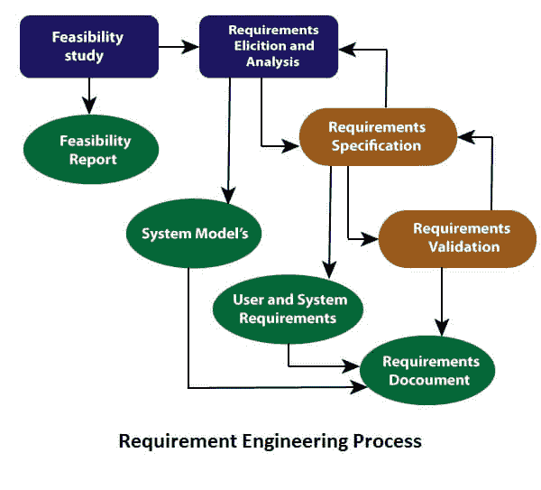
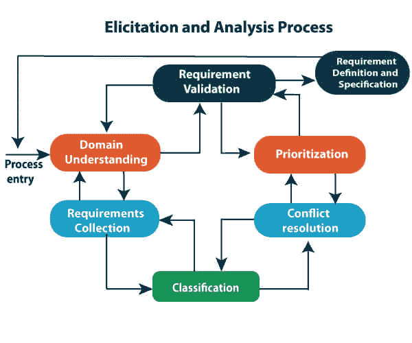

# 需求工程

> 原文：<https://www.javatpoint.com/software-engineering-requirement-engineering>

**需求工程(RE)** 是指在工程设计过程中定义、记录和维护需求的过程。需求工程提供了适当的机制来理解客户的需求，分析需求，评估可行性，协商合理的解决方案，明确地指定解决方案，验证规范，并在需求转化为工作系统时管理需求。因此，需求工程是经过验证的原则、方法、工具和符号的有纪律的应用，以描述提议的系统的预期行为及其相关的约束。

## 需求工程过程

这是一个四步走的过程，包括-

1.  可行性研究
2.  需求获取和分析
3.  软件需求规范
4.  软件需求验证
5.  软件需求管理

### 1.可行性研究:

可行性研究背后的目标是为开发用户可接受的、灵活变化的和符合既定标准的软件创造理由。

**可行性类型:**

1.  **技术可行性** -技术可行性评估在时间和预算内完成客户需求所需的当前技术。
2.  **运营可行性** -运营可行性评估所需软件执行一系列级别以解决业务问题和客户需求的范围。
3.  **经济可行性** -经济可行性决定了必要的软件能否为一个组织产生财务利润。

### 2.需求获取和分析:

这也被称为需求的**集合**。在这里，需求是在客户和现有系统流程(如果有的话)的帮助下确定的。

需求分析从需求获取开始。分析需求以识别不一致、缺陷、遗漏等。我们用关系来描述需求，如果有冲突，我们也会解决。

**启发和分析的问题**

*   让所有，也只有，合适的人参与进来。
*   利益相关者通常不知道他们想要什么
*   利益相关者用他们的术语表达需求。
*   利益相关者可能有冲突的需求。
*   分析过程中的需求变化。
*   组织和政治因素可能会影响系统要求。

### 3.软件需求规范:

软件需求规格说明是一种文档，它是由软件分析师在从各种来源收集需求后创建的——客户收到的用普通语言编写的需求。分析师的工作是用技术语言编写需求，以便开发团队能够理解它们并从中受益。

这一阶段使用的模型包括 ER 图、数据流图(DFDs)、函数分解图(FDDs)、数据字典等。

*   **数据流图:**数据流图广泛用于需求建模。DFD 展示了数据在系统中的流动。该系统可以是公司、组织、一组程序、计算机硬件系统、软件系统或前述的任意组合。DFD 也被称为数据流图或气泡图。
*   **数据字典:**数据字典只是存储 DFDs 中定义的所有数据项信息的存储库。在需求阶段，数据字典应该至少定义客户数据项，以确保客户和开发人员使用相同的定义和术语。
*   **实体关系图:**需求规格说明的另一个工具是实体关系图，通常称为“ ***E-R 图*** ”它是组织数据的详细逻辑表示，使用三种主要结构，即数据实体、关系及其相关属性。

### 4.软件需求验证:

开发需求规格后，本文档中讨论的需求得到验证。用户可能会要求非法的、不可能的解决方案，或者专家可能会误解需求。要求可以是对以下条件的检查-

*   如果他们能切实执行
*   如果它们是正确的，并且根据软件的功能和特别之处
*   如果有任何歧义
*   如果它们满了
*   如果他们能描述

**需求验证技术**

*   **需求评审/检查:**需求的系统化人工分析。
*   **原型化:**使用系统的可执行模型来检查需求。
*   **测试用例生成:**开发需求测试来检查可测试性。
*   **自动化一致性分析:**检查结构化需求描述的一致性。

### 软件需求管理:

需求管理是在需求工程过程和系统开发过程中管理不断变化的需求的过程。

随着业务需求的变化，以及对系统更好的理解，新的需求在过程中出现。

不同观点的需求优先级在开发过程中会发生变化。

系统的业务和技术环境在开发过程中会发生变化。

## 软件需求的先决条件

软件需求的收集是整个软件开发项目的基础。因此，它们应该是清晰的、正确的和明确的。

完整的软件需求规格应该是:

*   清楚的
*   正确的
*   一致的
*   一致的
*   可理解的
*   可更改的
*   能证实的
*   优先处理
*   清楚的
*   起源于
*   可信来源

**软件需求:**很大程度上，软件需求必须分为两类:

1.  **功能需求:**功能需求定义了一个系统或系统元素必须有资格执行的功能，并且必须以不同的形式记录下来。功能需求描述的是与系统功能相关的系统行为。
2.  **非功能需求:**这可以是指定可以用来决定操作的标准的必需品，而不是系统的特定行为。
    非功能性需求分为两大类:
    *   **执行质量**比如安全性和可用性，这些在运行时是可以观察到的。
    *   **进化品质**像软件系统静态结构中体现的可测试性、可维护性、可扩展性和可扩展性。

* * *