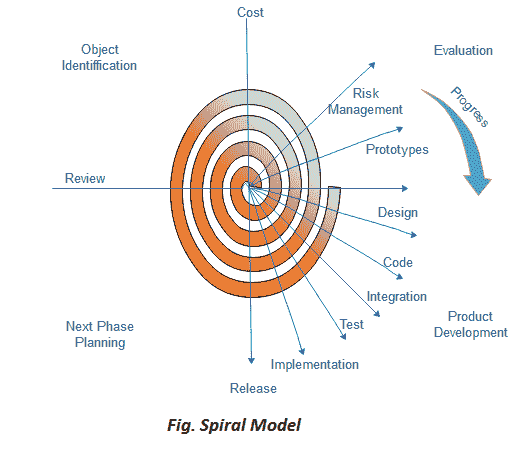

# 螺旋模型

> 原文：<https://www.javatpoint.com/software-engineering-spiral-model>

最初由 Boehm 提出的螺旋模型是一个进化的软件过程模型，它将原型的迭代特性与线性顺序模型的受控和系统方面相结合。它实现了软件新版本快速开发的潜力。使用螺旋模型，软件是在一系列增量版本中开发的。在早期的迭代中，附加版本可能是纸质模型或原型。在后来的迭代中，越来越多的完整版本的工程系统被生产出来。

**螺旋模型如图:**

**螺旋中的每个周期分为四个部分:**

**目标设定:**螺旋中的每个周期都从确定该周期的目标、实现目标的各种可能选择以及存在的限制开始。

**风险评估和降低:**周期的下一个阶段是根据目标和约束计算这些不同的备选方案。此阶段的评估重点是项目的风险认知。

**开发和验证:**下一阶段是开发解决不确定性和风险的策略。这个过程可能包括诸如基准测试、模拟和原型制作等活动。

**规划:**最后规划下一步。该项目被审查，并选择是否继续进一步的螺旋周期。如果决定保留，就要为项目的下一步制定计划。

开发阶段取决于剩余的风险。例如，如果性能或用户界面风险被认为比程序开发风险更重要，那么下一个阶段可能是进化开发，包括开发更详细的原型来解决风险。

螺旋模型的**风险驱动**特性允许它适应面向规范、面向原型、面向仿真或其他类型方法的任何混合。该模型的一个基本要素是，螺旋的每个周期都由一个评审完成，该评审包括该周期内开发的所有产品，包括下一周期的计划。螺旋模型适用于开发和增强项目。

## 何时使用螺旋模型？

*   当需要频繁释放时。
*   当项目很大时
*   当需求不清晰和复杂时
*   当随时需要改变时
*   大型和高预算项目

## 优势

*   大量风险分析
*   对大型任务关键型项目有用。

## 不足之处

*   使用起来可能是一个昂贵的模型。
*   风险分析需要非常特殊的专业知识
*   对于较小的项目效果不好。

* * *