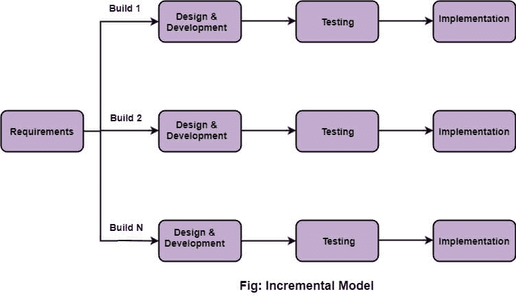

# 增量模型

> 原文：<https://www.javatpoint.com/software-engineering-incremental-model>

增量模型是软件开发的过程，其中需求被分成软件开发周期的多个独立模块。在这个模型中，每个模块都经历了需求、设计、实现和测试阶段。该模块的每个后续版本都会在前一版本的基础上增加功能。这个过程一直持续到整个系统完成。

## 增量模型的各个阶段如下:

**1。需求分析:**在增量模型的第一阶段，产品分析专家识别需求。需求分析团队了解系统功能需求。为了在增量模型下开发软件，这个阶段起着至关重要的作用。

**2。设计&开发:**在 SDLC 增量模型的这一阶段，系统功能和开发方法的设计已经成功完成。当软件开发新的实用性时，增量模型使用风格和开发阶段。

**3。测试:**在增量模型中，测试阶段检查每个现有功能以及附加功能的性能。在测试阶段，各种方法被用来测试每个任务的行为。

**4。实现:**实现阶段启用开发系统的编码阶段。它包括在设计和开发阶段设计的最终编码，以及在测试阶段测试功能。完成此阶段后，工作产品的数量会增加，并升级到最终的系统产品

## 当我们使用增量模型时？

*   当要求更高的时候。
*   一个项目有很长的开发时间表。
*   当软件团队没有很好的技能或训练时。
*   当客户要求快速发布产品时。
*   您可以首先开发优先需求。

## 增量模式的优势

*   错误很容易被识别。
*   更易于测试和调试
*   更灵活。
*   管理风险很简单，因为它是在迭代过程中处理的。
*   客户端很早就获得了重要的功能。

## 增量模型的缺点

*   需要良好的规划
*   总成本很高。
*   需要定义良好的模块接口。

* * *