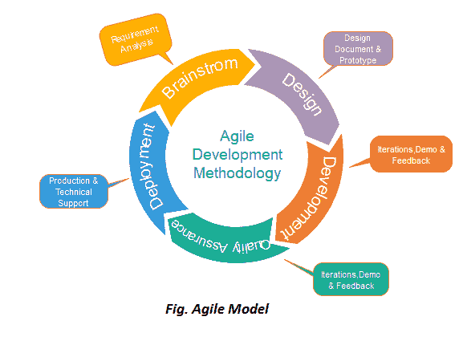

# 敏捷模型

> 原文：<https://www.javatpoint.com/software-engineering-agile-model>

敏捷的含义是敏捷或多才多艺。“**敏捷过程模型**”是指基于迭代开发的软件开发方法。敏捷方法将任务分解成更小的迭代，或者不直接涉及长期规划的部分。项目范围和要求是在开发过程开始时制定的。关于迭代次数、持续时间和每次迭代范围的计划都是事先明确定义的。

每个迭代都被认为是敏捷过程模型中的一个短时间“框架”，通常持续一到四周。将整个项目划分为更小的部分有助于将项目风险降至最低，并降低总体项目交付时间要求。每一次迭代都需要一个团队在整个软件开发生命周期中工作，包括计划、需求分析、设计、编码和测试，然后向客户展示一个工作产品。

## 敏捷模型的阶段:

敏捷模型中的以下阶段如下:

1.  需求收集
2.  设计需求
3.  构建/迭代
4.  测试/质量保证
5.  部署
6.  反馈

**1。需求收集:**在这个阶段，您必须定义需求。您应该解释业务机会，并计划构建项目所需的时间和精力。根据这些信息，您可以评估技术和经济可行性。

**2。设计需求:**当你确定了项目，与涉众一起定义需求。您可以使用用户流程图或高级 UML 图来展示新特性的工作，并展示它将如何应用于您现有的系统。

**3。构建/迭代:**当团队定义需求时，工作开始。设计师和开发人员开始着手他们的项目，目的是部署一个有效的产品。该产品将经历不同的改进阶段，因此它包括简单、最小的功能。

**4。测试:**在这个阶段，质量保证团队检查产品的性能并寻找缺陷。

**5。部署:**在这个阶段，团队为用户的工作环境发布产品。

**6。反馈:**产品发布后，最后一步就是反馈。在这种情况下，团队接收关于产品的反馈，并通过反馈工作。

## 敏捷测试方法:

*   混乱
*   透明的
*   动态软件开发方法(DSDM)
*   特征驱动开发
*   精益软件开发
*   极限编程

### 混乱

SCRUM 是一个敏捷开发过程，主要关注在基于团队的开发条件下管理任务的方法。

it 部门有三个角色，他们的职责是:

*   **Scrum Master:**Scrum 可以组建主团队，安排会议，为流程扫除障碍
*   **产品负责人:**产品负责人制作产品积压单，对延迟进行优先排序，并负责每次重复的功能分配。
*   **Scrum Team:** 团队管理自己的工作，组织工作完成冲刺或周期。

### 极限编程

当客户不断改变需求或要求时，或者当他们不确定系统的性能时，使用这种方法。

### 水晶:

这个方法有三个概念-

1.  特许:这一阶段涉及多种活动，如组建开发团队、执行可行性分析、制定计划等。
2.  循环交付:在这种情况下，还有两个循环，它们是:
    *   团队更新发布计划。
    *   集成产品交付给用户。
3.  总结:根据用户环境，这个阶段执行部署，部署后。

### 动态软件开发方法(DSDM):

DSDM 是一个软件开发的快速应用程序开发策略，并给出了一个敏捷的项目分布结构。DSDM 的基本特征是用户必须积极连接，团队被赋予决策权。DSDM 使用的技术有:

1.  时间拳击
2.  莫斯科规则
3.  样机研究

**DSDM 项目包含 7 个阶段:**

1.  项目前期
2.  可行性研究
3.  商业研究
4.  功能模型迭代
5.  设计和构建迭代
6.  履行
7.  项目后

### 功能驱动开发:

该方法侧重于“设计和构建”功能。与其他智能方法相比，FDD 描述了每个函数应该单独获得的工作的小步骤。

### 精益软件开发:

精益软件开发方法遵循“及时生产”的原则。精益方法表明了软件开发速度的提高和成本的降低。精益开发可以概括为七个阶段。

1.  消除浪费
2.  放大学习
3.  推迟承诺(尽可能晚地决定)
4.  早产
5.  赋予团队权力
6.  建筑完整性
7.  优化整体

## 何时使用敏捷模型？

*   当需要频繁更改时。
*   当有一个高度合格和经验丰富的团队时。
*   当客户准备好随时与软件团队开会时。
*   当项目规模较小时。

## 敏捷方法的优势(优点):

1.  频繁交货
2.  与客户面对面交流。
3.  高效设计并满足业务需求。
4.  任何时候的改变都是可以接受的。
5.  它减少了总开发时间。

## 敏捷模型的缺点:

1.  由于缺乏正式的文档，它会造成混乱，并且在各个阶段做出的关键决定可能会在任何时候被不同的团队成员误解。
2.  由于缺乏适当的文档，一旦项目完成，开发人员被分配到另一个项目，完成项目的维护可能会成为一个困难。

* * *