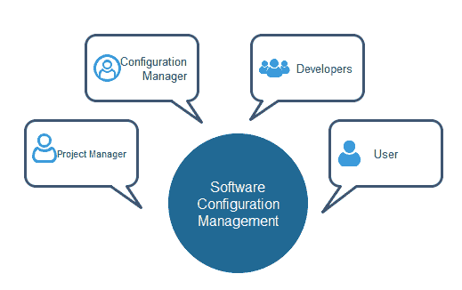

# 活动

> 原文：<https://www.javatpoint.com/software-project-management-activities>

软件项目管理由许多活动组成，包括项目计划、产品范围的确定、不同条件下的成本估算、任务调度等。

**活动列表如下:**

1.  项目规划和跟踪
2.  项目资源管理
3.  范围管理
4.  评估管理
5.  项目风险管理
6.  调度管理
7.  项目沟通管理
8.  结构管理

现在我们将讨论所有这些活动-

**1。项目规划:**它是一套多个流程，或者我们可以说它是一个在产品开始构建之前执行的任务。

**2。范围管理:**描述项目的范围。范围管理很重要，因为它清楚地定义了什么可行，什么不可行。范围管理创建项目以包含受限的和定量的任务，这些任务可能仅仅被记录下来，并连续避免价格和时间的超支。

**3。估算管理:**这不仅仅是关于成本估算，因为无论何时我们开始开发软件，我们都会计算出它们的规模(代码行)、努力、时间以及成本。

如果我们谈论大小，那么代码行取决于用户或软件需求。

如果我们谈论努力，我们应该知道软件的规模，因为根据规模，我们可以快速估计生产软件需要多大的团队。

如果我们谈论时间，当估计规模和努力时，开发软件所需的时间可以很容易地确定。

如果我们谈论成本，它包括所有要素，例如:

*   软件的大小
*   质量
*   五金器具
*   沟通
*   培养
*   附加软件和工具
*   熟练的人力

**4。调度管理:**软件中的调度管理是指按照指定的顺序并在分配给每个活动的时间内完成的所有活动。项目经理定义多个任务，并在考虑各种因素的情况下安排它们。

**对于调度，强制-**

*   找出多个任务，并将它们关联起来。
*   把时间分成单位。
*   为每项工作分配各自的工作单元数量。
*   计算从开始到结束的总时间。
*   将项目分解成模块。

**5。项目资源管理:**在软件开发中，所有的元素都被称为项目的资源。它可以是人力资源、生产工具和图书馆。

资源管理包括:

*   创建一个项目团队，并将责任分配给每个团队成员
*   资源计划的制定源于项目计划。
*   资源调整。

**6。项目风险管理:**风险管理包括识别、分析和准备项目中可预测和不可预测风险的计划等所有活动。

有几点显示了项目中的风险:

*   经验丰富的团队离开项目，新团队加入其中。
*   需求的变化。
*   技术和环境的变化。
*   市场竞争。

**7。项目沟通管理:**沟通是项目成功的必要因素。它是客户、组织、团队成员以及项目的其他利益相关者(如硬件供应商)之间的桥梁。

从策划到收尾，沟通都起着至关重要的作用。在所有阶段，沟通都必须清晰易懂。沟通不畅会在项目中造成重大失误。

**8。项目配置管理:**配置管理就是要控制软件中的变化，比如产品的需求、设计和开发。

主要目标是以更少的错误提高生产率。

**一些原因说明需要配置管理:**

*   几个人在开发不断更新的软件。
*   帮助建立供应商之间的协调。
*   需要适应需求、预算、进度的变化。
*   软件应该在多个系统上运行。

**在配置管理中执行的任务:**

*   识别
*   基线
*   变更控制
*   配置状态会计
*   配置审核和审查

**参与配置管理的人员:**

* * *