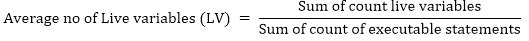
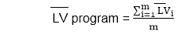
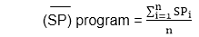
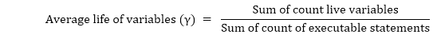
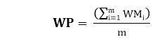
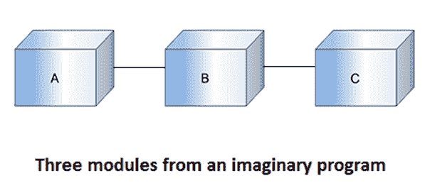
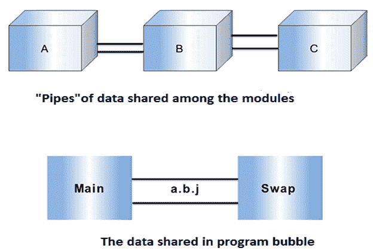

# 数据结构度量

> 原文：<https://www.javatpoint.com/software-engineering-data-structure-metrics>

本质上，软件开发和其他活动的需求是处理数据。一些数据被输入到系统、程序或模块中；有些数据可以在内部使用，有些数据是系统、程序或模块的输出。

### 示例:

| 程序 | 数据输入 | 内部数据 | 数据输出 |
| 工资单 | 姓名/社会保险号/工资率/工作时数 | 预扣税率加班因素保险费率 | 总薪资预扣净薪资分类帐 |
| 试算表 | 项目名称/项目金额/项目之间的关系 | 单元格计算小计 | 项目和总计的电子表格 |
| 软件规划器 | 项目规模/团队中的软件开发人员数量 | 模型参数常数系数 | 估计的项目努力 Est。项目持续时间 |

这就是为什么一组重要的度量标准捕捉了输入的数据量，并在输出表单软件中进行处理。这种数据结构的计数称为数据结构化度量。在这些情况下，浓度取决于每个模块中的变量(和给定的常数)，忽略了输入输出相关性。

有一些数据结构指标来计算完成项目所需的工作量和时间。这些指标包括:

1.  数据量。
2.  模块中数据的使用。
3.  程序弱点。
4.  模块间的数据共享。

**1。数据量:**要衡量数据量，还有许多不同的指标，它们是:

*   **变量数量(VARS):** 在这个度量中，计算程序中使用的变量数量。
*   **操作数(η 2 ):** 在这个度量中，计算程序中使用的操作数。
    T5】η2= VARS+常数+标签
*   **变量的总出现次数(N2):** 在此度量中，计算变量的总出现次数

**2。模块内数据的使用情况:**测量该指标，计算活动变量的平均数量。变量在过程中从第一个引用到最后一个引用都是活动的。

**例如:**如果我们想表征一个有模块的程序的平均活变量数，我们可以使用这个等式。

其中( LV )是从 ith 模块计算的平均实时变量度量。这个方程可以计算 n 个跨度的程序的平均跨度大小( SP )。

**3。程序弱点:**程序弱点取决于其模块弱点。如果模块很弱(内聚性较差)，那么它会增加完成项目所需的工作量和时间。

模块弱点(WM) = LV * γ

程序通常是各种模块的组合；因此，程序弱点可能是一个有用的衡量标准，定义如下:

在哪里

**WMI**:ith 模块的弱点

**WP** :程序的弱点

**m** :程序中模块数量

**4。模块间的数据共享:**随着模块间数据共享的增加(耦合度更高)，模块间的参数传递也没有增加，因此需要更多的努力和时间来完成项目。因此，模块间共享数据是计算工作量和时间的重要指标。

* * *